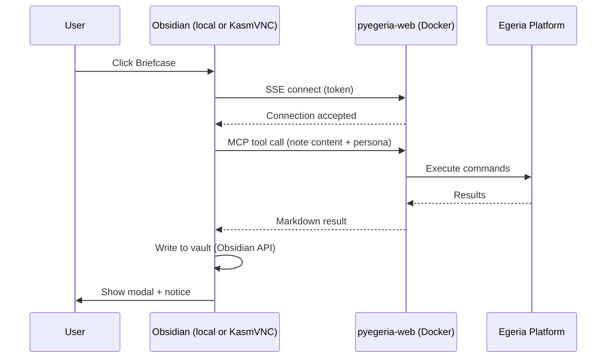
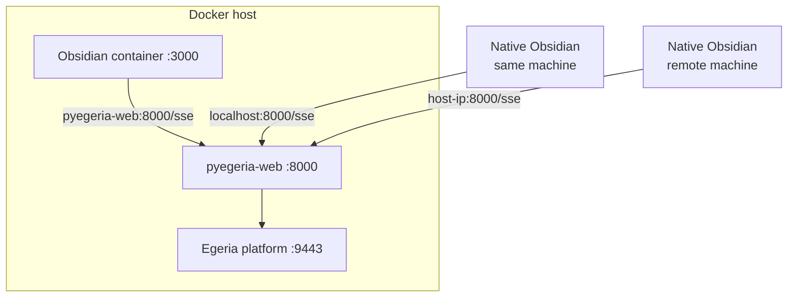

# Configuring and Using the Call Dr. Egeria Obsidian Plugin

**Call Dr. Egeria** is the Obsidian plugin for executing Dr. Egeria markdown commands directly from your notes. It communicates with the backend via the **Model Context Protocol (MCP)** over SSE — no shared Docker volumes required.

---

## How to access Obsidian

The portal (port 8085) offers three paths depending on your setup:

| Scenario | How to open |
|---|---|
| You have Obsidian installed locally | Click **Open in local Obsidian** — launches the vault via the `obsidian://` protocol |
| You don't have Obsidian installed | Click **Open in browser** — opens the containerized Obsidian (KasmVNC) at port 3000 |
| Container is in use (demo mode) | Container shows a timer; fallback link to **Browse vault on GitHub** is shown |

---

## MCP Server URL — by deployment

The single most important setting. Use the correct URL for where Obsidian is running:

| Where Obsidian is running | MCP Server URL |
|---|---|
| Native Obsidian, same machine as Docker | `http://localhost:8000/sse` |
| Native Obsidian, different machine on LAN | `http://<host-ip>:8000/sse` |
| Containerized Obsidian (KasmVNC / quickstart) | `http://pyegeria-web:8000/sse` |

When you deploy the plugin via `npm run deploy:coco`, the containerized URL is written automatically as the default — no manual setup needed inside the container.

---

## Installation

The plugin source is at `obsidian-plugins/call-dr-egeria/`.

### Build

```bash
cd obsidian-plugins/call-dr-egeria
npm install
npm run build
```

### Deploy

```bash
# Container use (coco-workbooks vault, sets pyegeria-web URL as default)
npm run deploy:coco

# Native use against coco-workbooks vault
npm run deploy:coco:local

# Work-Obsidian vault (native)
npm run deploy:work
```

After deploying: **Settings → Community Plugins → Call Dr. Egeria → Reload**.

---

## Configuration

Open **Settings → Call Dr. Egeria Settings (MCP)**:

### MCP Settings
- **MCP Server URL** — See table above. Auto-set by `deploy:coco` for container use.
- **MCP Access Token** — Must match `MCP_ACCESS_TOKEN` in the backend container. Default: `egeria-secret-mcp-token`.

### Egeria Settings
- **User ID / Password** — Your Egeria persona credentials. In demo mode the portal writes these automatically when you acquire the Obsidian session.
- **Platform URL** — Default: `https://host.docker.internal:9443`.
- **View Server** — Default: `qs-view-server`.
- **Default Directive** — `process` (execute), `validate` (check syntax), or `display` (view metadata).
- **Outbox Path** — Where results are saved, relative to vault root. Default: `dr-egeria-outbox`.
- **Input Path** — Optional subfolder within the vault for the current note (e.g. `keeping-safe/martyns-law`).
- **Vault Root** — Absolute path to the vault inside the **pyegeria-web** container (e.g. `/coco-workbooks` or `/work/Work-Obsidian`).
- **Verbose Output** — Disable to hide internal log lines from the results modal.

---

## Persona auto-configuration (demo mode)

In demo mode the portal manages an Obsidian session lock. When you acquire the lock, the portal writes your persona's credentials (`userId`, `userPass`, `mcpToken`) directly into the plugin's `data.json`. The plugin detects this change via a file-watcher and reloads settings automatically — a notice appears: *"Dr. Egeria: session updated — persona is now `{userId}`"*. No manual settings change is needed.

---

## Usage

1. Open a note containing a Dr. Egeria command (e.g. `# View Glossaries`).
2. Click the **Briefcase** icon in the left ribbon, or use **Command Palette → Run Note via MCP**.
3. A notice appears while the backend processes the note.
4. Results appear in a resizable modal. If the directive is `process`, output is also saved to the outbox with a timestamp: `<name>-processed-YYYYMMDD-HHmmss.md`.

---

## Architecture



### Deployment patterns



---

## Troubleshooting

| Symptom | Resolution |
|---|---|
| 403 Forbidden | MCP Access Token mismatch — check plugin settings vs. `MCP_ACCESS_TOKEN` env var |
| Connection refused | `quickstart-pyegeria-web` container not running |
| Timeout | Backend still processing — check outbox after a moment |
| Wrong persona | Portal hasn't written `data.json` yet — check Obsidian lock status in the portal |
| CORS error | Verify MCP Server URL; ensure backend container is up |
| "No active file" | Open a note before triggering the plugin |

---

For advanced MCP integration see [Using MCP in Egeria-Workspaces](Using%20MCP%20in%20Egeria-Workspaces.md).
