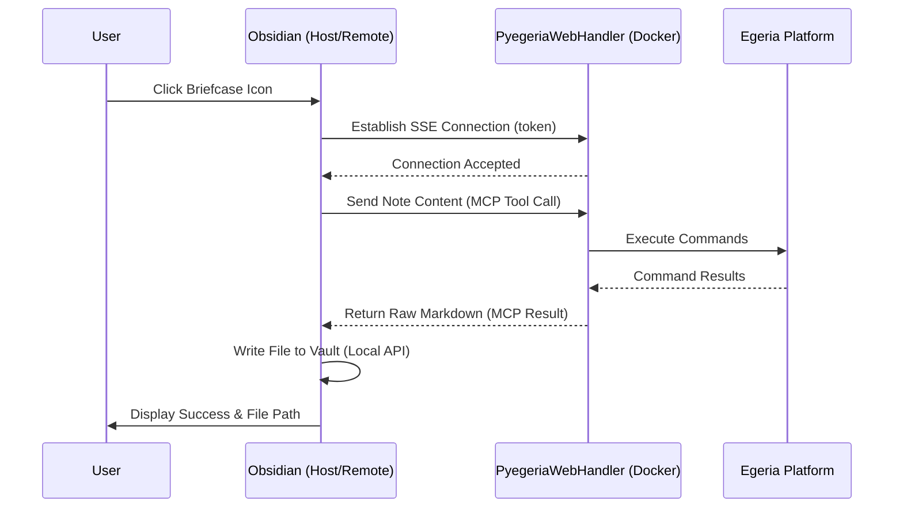
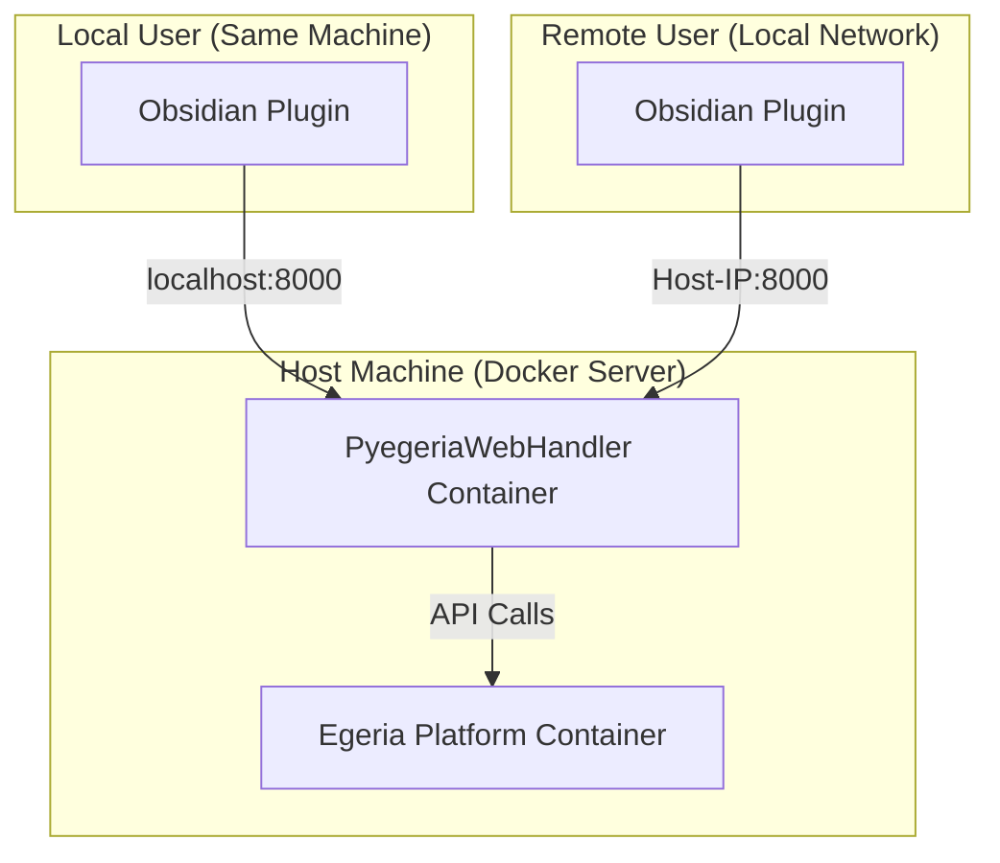

# Configuring and Using the Dr. Egeria Obsidian Plugins

This project provides two plugins for interacting with Egeria from Obsidian. Both allow you to execute Dr. Egeria markdown commands directly from your notes.

---

## 1. "Calling the Dr." (Recommended - V3 Architecture)

The **Calling the Dr.** plugin uses the **Model Context Protocol (MCP)** over SSE. It is the modern, "Content-First" version that does not require your vault to be mounted into Docker.

### Key Benefits
*   **No Permission Issues**: The plugin writes files directly to your vault using the Obsidian API.
*   **Vault Portability**: Works with any vault, anywhere on your machine.
*   **Secure**: Uses a security token and CORS restrictions.

### Configuration
1.  **MCP Server URL**: `http://localhost:8000/sse`
2.  **MCP Access Token**: `coco-secret-mcp-token`
3.  **Egeria Credentials**: Enter your User ID (e.g., `erinoverview`), Password (`secret`), and Platform URL (`https://host.docker.internal:9443`).
4.  **Outbox Path**: The folder where results will be saved (e.g., `dr-egeria-outbox`).

### Usage
1.  Open a note with a Dr. Egeria command (e.g., `# View Glossaries`).
2.  Click the **Doctor's Bag (briefcase)** icon in the left ribbon.
3.  The result will appear in a resizable window, and the output file will be created automatically in your vault's outbox.

---

## 2. "Call Dr. Egeria" (Legacy - V1 Architecture)

The **Call Dr. Egeria** plugin uses a path-based HTTP API. It requires your Obsidian vault to be mounted as a volume in the `pyegeria-web` Docker container.

### Configuration
Requires an **Environment JSON** block in the plugin settings to map the container paths:

**Example (coco-workbooks):**
```json
{
  "Dr.Egeria Inbox": ".",
  "Dr.Egeria Outbox": ".",
  "Pyegeria Root": "/coco-workbooks",
  "Pyegeria Publishing Root": "http://localhost:8085/coco-workbooks/dr-egeria-outbox"
}
```

### Usage
1.  Click the **Phone** icon in the ribbon.
2.  The backend reads the file from the shared volume and writes the result back to the volume.

---

## 🛠 Troubleshooting

### Remote Usage (Cross-Machine)
The "Calling the Dr." plugin can be used from other machines on your local network.
1.  **Find the Host IP**: On the machine running Docker, find its local network IP (e.g., `192.168.1.50`).
2.  **Update Plugin Settings**: In Obsidian on the remote machine, change the **MCP Server URL** to `http://<HOST-IP>:8000/sse`.
3.  **Security**: Ensure your **MCP Access Token** is set to a secure, unique value in both the backend `.env` and the plugin settings.

---

## 🏗 Architecture & Communication

### V3 "Content-First" Architecture (MCP over SSE)
The modern architecture decouples the storage from the processing logic.



### Local vs. Remote Deployment Patterns



---

## 🛠 Troubleshooting

### 401 Unauthorized
*   Ensure your Egeria User ID and Password in the plugin settings match the credentials expected by the Egeria platform.

### Timeouts
*   Some Egeria operations (like broad glossary searches) can take over 90 seconds. 
*   In **Calling the Dr. (V3)**, a timeout message will appear, but the backend often continues processing. Check your outbox folder after a few moments.

### Connection Refused
*   Ensure the `quickstart-pyegeria-web` Docker container is running.
*   Check that `http://localhost:8000` is accessible from your host machine.
