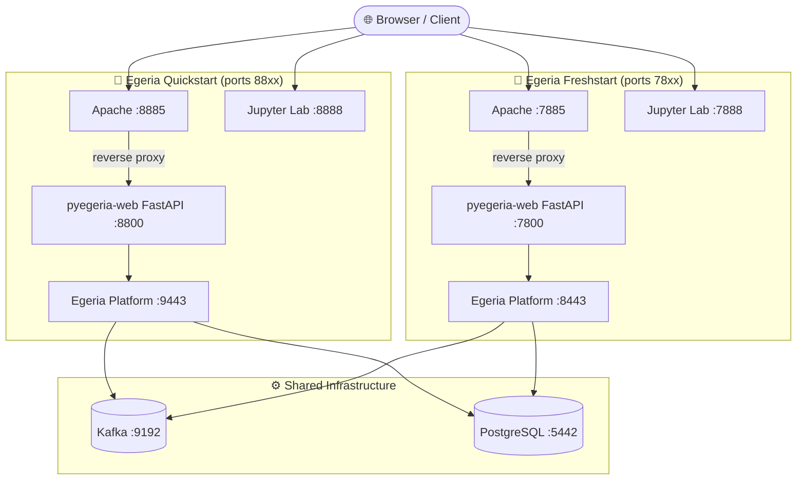
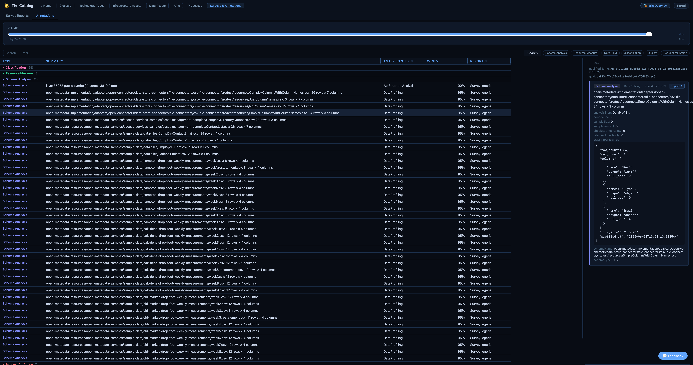
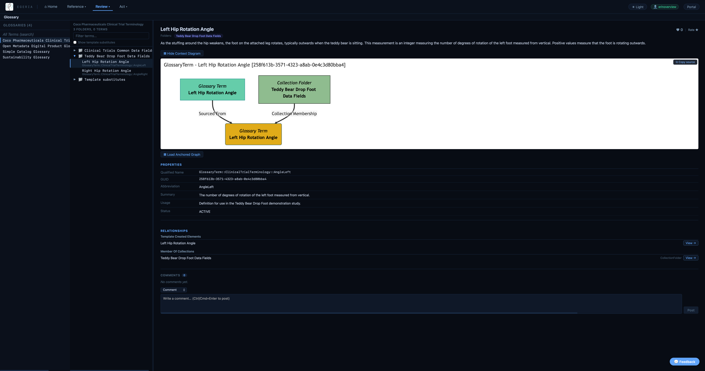
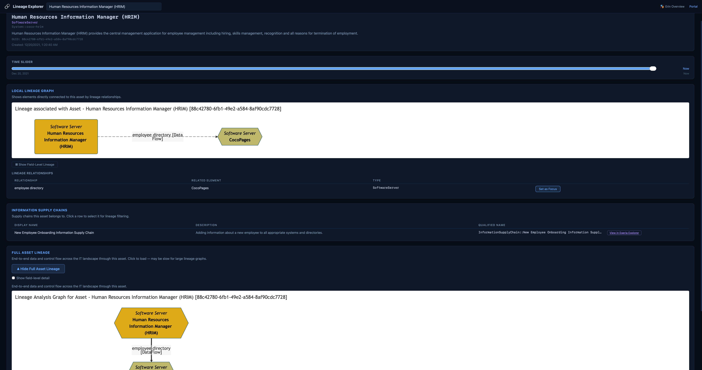
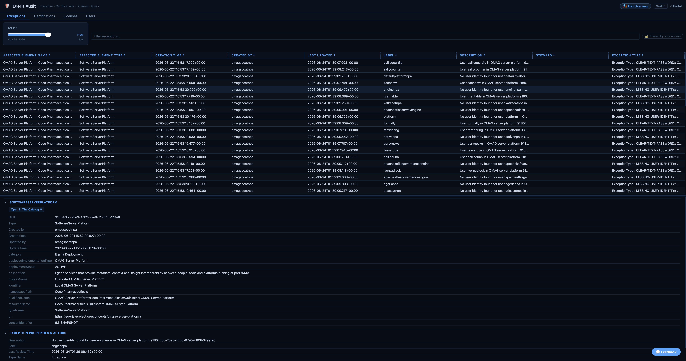
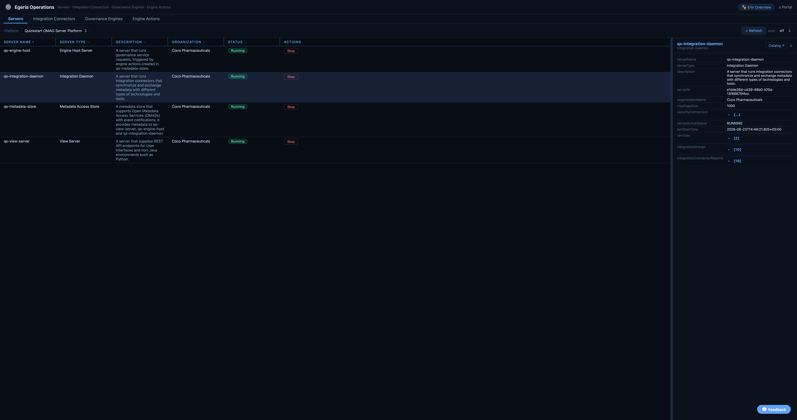
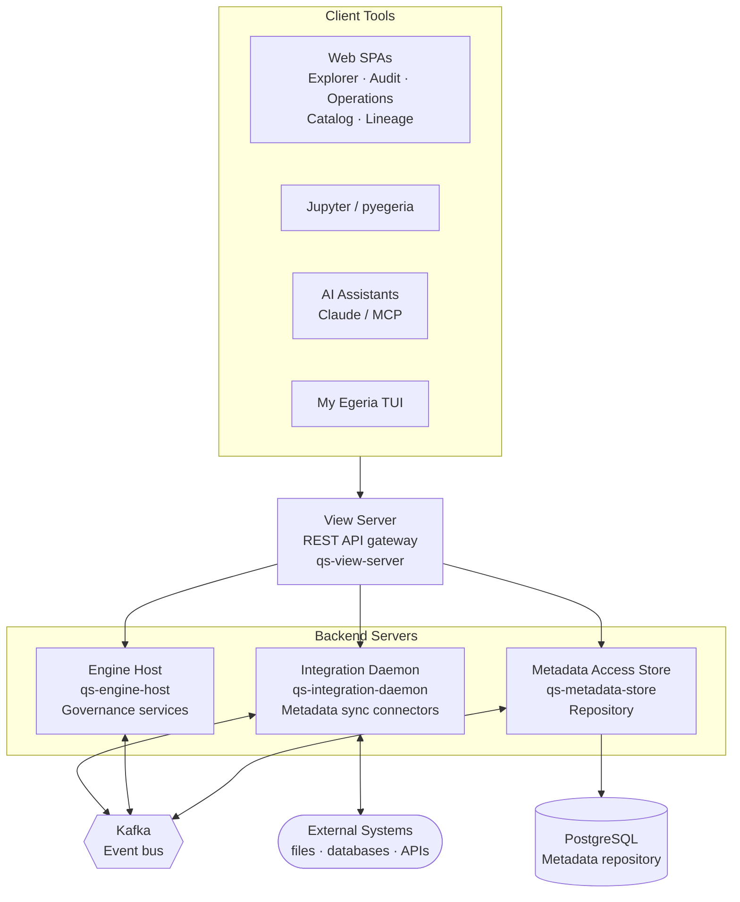

<!-- SPDX-License-Identifier: CC-BY-4.0 -->
<!-- Copyright Contributors to the ODPi Egeria project 2024. -->

# Egeria Workspaces

A fully pre-configured, Docker Compose-based platform for learning, experimenting with, and operating [Egeria](https://egeria-project.org). It exposes a suite of browser-based tools, Jupyter notebooks, and AI-assistant integrations — no manual wiring required.

> This environment is designed for learning and small-team use, not enterprise-wide production. For large-scale deployments see the [Planning Guide](https://egeria-project.org/guides/planning/).
> Community help: [Egeria Slack](https://lfaifoundation.slack.com/join/shared_invite/zt-o65errpw-gMTbwNr7FnNbVXNVFkmyNA%E2%80%8B#/shared-invite/email)

## Try it now — no installation required

Enter the world of [Coco Pharmaceuticals](https://egeria-project.org/practices/coco-pharmaceuticals/) — a fictitious company whose rich metadata landscape brings Egeria's capabilities to life. A live demo is running at **[egeria.pdr-associates.com](https://egeria.pdr-associates.com)**.

Register for a free account, step into the shoes of one of their key employees by selecting a persona, and explore a fully pre-loaded Egeria environment in your browser. No Docker, no setup.

When you're ready to run your own copy, see [Getting started](#getting-started) below.

---

## What you can do here

| Capability | How to access | Description |
|------------|---------------|-------------|
| **Explore the asset catalog** | `/tech-catalog` | Browse infrastructure, data assets, APIs, processes, surveys and annotations registered in Egeria |
| **Explore metadata** | `/egeria-explorer` | Browse the type system, glossary, reference data, digital products, valid values and REST APIs |
| **Audit governance** | `/egeria-audit` | Review governance relationships (exceptions, certifications, licenses, users). Rows are filtered by your governance-zone access |
| **Operate the platform** | `/egeria-operations` | Monitor servers, integration connectors, governance engines and engine actions with live auto-refresh |
| **Trace lineage** | `/lineage` | Trace data flow and dependencies across the metadata landscape |
| **Run notebooks** | `http://localhost:8888` | Jupyter Lab pre-configured with `pyegeria`; password `egeria` |
| **Interact via TUI** | `/my-egeria` | Terminal-UI portal for browsing your Egeria profile and metadata |
| **Author metadata with AI** | MCP servers | Connect Claude Desktop (or any MCP client) to the `dr-egeria` and `pyegeria` MCP servers to read and write metadata conversationally |
| **Catalog files automatically** | `exchange-*/landing-area/` | Drop files here; the integration daemon classifies and catalogues them automatically |

---

## Getting started

### Requirements

- [Docker Desktop](https://www.docker.com/get-started/) (or podman + podman-compose; see [Monitoring Podman with PyCharm](Monitoring%20Podman%20with%20PyCharm.md))
- Egeria platform image `6.0` or later (use tag `stable` or a specific post-6.0 tag if you have older cached images)

### Start the platform

```bash
# Coco Pharmaceuticals demo environment (recommended for learning)
./quick-start-local

# Clean-slate environment (your own data)
./fresh-start-local
```

Both scripts automatically bring up the shared Kafka / PostgreSQL / OpenLineage proxy stack before starting the environment-specific containers.

Then open the web portal:
- **Quickstart:** `http://localhost:8885`
- **Freshstart:** `http://localhost:7885`

#### Force a clean rebuild

```bash
# Pull latest images and rebuild from scratch
NO_CACHE=1 ./quick-start-local

# Force-refresh only the Egeria platform base image
./quick-start-local --refresh-platform
```

`NO_CACHE` accepts `1 / true / yes / on`; unset or `0 / false / no / off` uses the cache.

---

## Environments

Three deployment modes are available, all sharing the same Kafka, PostgreSQL and OpenLineage proxy infrastructure.

### Egeria Demo — hosted, no setup needed

> **[egeria.pdr-associates.com](https://egeria.pdr-associates.com)**

Enter the world of [Coco Pharmaceuticals](https://egeria-project.org/practices/coco-pharmaceuticals/) — a fictitious company whose rich metadata landscape brings Egeria's capabilities to life. Step into the shoes of one of their key employees by selecting a persona, then explore the platform from that person's perspective.

Register for a free account, pick your persona, and start exploring. Includes scheduled data resets and an admin panel. No Docker required.


### Egeria Quickstart — local, pre-loaded with Coco data

The recommended starting point for learning Egeria. Pre-loaded with [Coco Pharmaceuticals](https://egeria-project.org/practices/coco-pharmaceuticals/) personas, data assets, governance metadata and scenario content. No authentication wall — opens directly to the portal.

```bash
./quick-start-local        # single machine
./quick-start-multi-host   # accessible from other hosts on your network
```

Portal: `http://localhost:8885` · Platform: `https://localhost:9443` · Jupyter: `http://localhost:8888`

### Egeria Freshstart — local, clean slate

An empty Egeria environment for setting up your own metadata, governance policies and integrations. Suitable for a small team. Includes registration-gated access and a private data model.

```bash
./fresh-start-local        # single machine
./fresh-start-multi-host   # accessible from other hosts on your network
```

Portal: `http://localhost:7885` · Platform: `https://localhost:8443` · Jupyter: `http://localhost:7888`

### Quickstart vs Freshstart — detailed comparison

Both scripts automatically bring up the shared infrastructure stack. Run them side by side without port conflicts.

|                            | **egeria-quickstart**                                            | **egeria-freshstart**                                                                                                                   |
|----------------------------|------------------------------------------------------------------|-----------------------------------------------------------------------------------------------------------------------------------------|
| Pre-loaded content         | [Coco Pharmaceuticals](https://egeria-project.org/practices/coco-pharmaceuticals/) personas & data | Clean defaults — set up your own environment |
| Server prefix              | `qs-*`                                                           | `fs-*`                                                                                                                                  |
| Authentication             | None (direct portal access)                                      | Registration-gated                                                                                                                      |
| Platform secrets           | Image-bundled (no host mount required)                           | Seeded from `compose-configs/egeria-freshstart/secrets/` templates into `runtime-volumes/freshstart-platform-data/secrets` on first run |
| Exchange tree              | `exchange-quickstart/`                                           | `exchange-freshstart/`                                                                                                                  |
| Runtime data               | `runtime-volumes/quickstart-platform-data/`                      | `runtime-volumes/freshstart-platform-data/`                                                                                             |
| Further information        | [Quickstart README](compose-configs/egeria-quickstart/README.md) | [Freshstart README](compose-configs/egeria-freshstart/README.md)                                                                        |

### Container architecture



---

## Web portal applications

The portal at `http://localhost:8885` (quickstart) or `http://localhost:7885` (freshstart) groups tiles into three sections, all served by the `pyegeria-web` container:


**Primary tools**

| Tile | Path | What it does |
|------|------|--------------|
| 🐱 The Catalog | `/tech-catalog` | Browse infrastructure assets, data stores, APIs and processes registered in Egeria |
| 🔍 Egeria Explorer | `/egeria-explorer` | Browse metadata — types, glossary, lineage, governance blueprints, information supply chains and more |
| 🔗 Lineage Explorer | `/lineage` | Trace data flow and dependencies across the metadata landscape |
| 🛡️ Egeria Audit | `/egeria-audit` | Review exceptions, certifications and licenses; see who has access to Egeria. Rows **filtered by your governance-zone access** |
| 🎛️ Egeria Operations | `/egeria-operations` | Monitor and operate the runtime — servers, integration connectors, governance engines and engine actions |

**Workspaces & assistants**

| Tile | What it does |
|------|--------------|
| 📓 Jupyter Lab | Interactive notebooks for data science and hands-on Egeria API exploration |
| 🗒️ Obsidian Vault | Open the Coco Pharmaceuticals workbook vault in your local Obsidian (or the browser-based shared install) |
| 🖥️ My Egeria | Explore your Egeria profile, roles, teams, actions and data catalog (TUI via `/my-egeria/`) |

**Documentation & API references**

| Tile | Path | What it does |
|------|------|--------------|
| 📚 Egeria Workspaces Docs | `/docs/` | User guides, Dr. Egeria templates, Coco scenario walkthroughs, admin docs |
| ⚙️ Admin | `/admin` | Manage the Obsidian session lock, view audit log, add reservations *(freshstart only)* |
| 📖 Egeria Documentation | `egeria.ai` ↗ | Official Egeria project documentation and community resources |
| 📚 Egeria JavaDocs | external ↗ | Java API reference for the Egeria platform and connectors |
| 🐍 Python API | `/egeria-explorer#python-api` | pyegeria client reference — classes and methods by domain |
| 🔌 REST APIs | `/egeria-explorer#rest-apis` | Live REST API browser — all open metadata services |

### Screenshots

**The Catalog — Data Assets**


**The Catalog — Surveys & Annotations**



**Egeria Explorer — Glossary**



**Egeria Explorer — Type Explorer**


**Lineage Explorer**



**Egeria Audit**



**Egeria Operations — Servers**



**Egeria Operations — Integration Connectors**


**Egeria Operations — Engine Actions**


**Workspaces**


Full tab-by-tab documentation: [PyegeriaWebHandler README](compose-configs/egeria-quickstart/PyegeriaWebHandler/README.md)

---

## AI and MCP integration

### MCP servers

Two MCP servers are available for connecting AI assistants (Claude Desktop or any MCP client) directly to Egeria:

| Server | Alias | What it does |
|--------|-------|--------------|
| **Dr. Egeria MCP** | `dr-egeria` | Author metadata using Dr. Egeria notebook-style commands; dynamic tool discovery, hot-reloading |
| **pyegeria MCP** | `pyegeria` | Lower-level metadata queries and operations via the pyegeria API |

Configure both in `~/.config/Claude/claude_desktop_config.json` — see `exchange-quickstart/claude_desktop_config.json.md` for a combined example. The quickstart examples use `https://localhost:9443` and `qs-view-server`; switch to `https://localhost:8443` and `fs-view-server` for freshstart.

**Example: author and verify a glossary entry**
```
User: "Using dr-egeria, create a glossary called 'Product Catalog', then list all glossaries."

Claude: [dr_egeria_run_block → Create Glossary]
        ✓ Glossary 'Product Catalog' created
        [egeria_list_glossaries]
        • Data Assets · Product Catalog (new) · Business Concepts
```

### Obsidian plugins

Execute Dr. Egeria commands directly from your Obsidian vault:

1. **Calling the Dr. (MCP) — recommended**: MCP-based; dynamic command discovery, hot-reload, content-first architecture (results written via Obsidian API, no Docker permission issues).
   - Source: `obsidian-plugins/calling-the-dr/`
   - Guide: [Calling the Dr. (MCP) Guide](Configuring%20and%20Using%20the%20Calling%20Dr.%20Egeria%20Obsidian%20Plug-in.md)

2. **Call Dr. Egeria (legacy)**: original REST API plugin.
   - Source: `obsidian-plugins/call-dr-egeria/`
   - Guide: [Call Dr. Egeria README](obsidian-plugins/call-dr-egeria/README.md)

For workspace-specific profiles (`work/Work-Obsidian`, `coco-workbooks`): [OBSIDIAN_PROFILES.md](compose-configs/egeria-quickstart/OBSIDIAN_PROFILES.md)

---

## Reference: Servers

Four [OMAG servers](https://egeria-project.org/concepts/omag-server/) run on the platform:

| Server type | Quickstart | Freshstart | Purpose |
|-------------|------------|------------|---------|
| [View Server](https://egeria-project.org/concepts/view-server/) | `qs-view-server` | `fs-view-server` | Egeria REST API — use this name when configuring `pyegeria` |
| [Integration Daemon](https://egeria-project.org/concepts/integration-daemon/) | `qs-integration-daemon` | `fs-integration-daemon` | Runs integration connectors that synchronize metadata between systems |
| [Engine Host](https://egeria-project.org/concepts/engine-host/) | `qs-engine-host` | `fs-engine-host` | Runs governance services |
| [Metadata Access Store](https://egeria-project.org/concepts/metadata-access-store/) | `qs-metadata-store` | `fs-metadata-store` | Hosts the metadata repository |

### Egeria platform architecture



---

## Reference: Host ports

Ports follow a consistent scheme so both environments can run simultaneously without collisions:

- **Quickstart → `88xx`**, **Freshstart → `78xx`** — same last two digits = same function
- Container-internal ports are unchanged; only host-published ports follow this scheme
- Platform, Kafka and PostgreSQL ports are left at their well-established defaults

| Function | Quickstart | Freshstart | Container | Notes |
|----------|------------|------------|-----------|-------|
| Egeria platform (+ JVM debug) | `9443` / `5005` | `8443` / `5006` | same | **fixed — not renumbered** |
| Apache web portal | **`8885`** | **`7885`** | `8085` | main entry point |
| Jupyter (notebook / debug) | **`8888`** / `8889` | **`7888`** / `7889` | `7888` / `5678` | password `egeria` |
| pyegeria-web (FastAPI/MCP) | **`8800`** | **`7800`** | `8000` | |
| my-egeria (`my-profile` TUI) | **`8820`** | *`7820`* (reserved) | `8020` | via Apache `/my-egeria/` |
| ProjectExplorer | *`8830`* (planned) | *`7830`* (reserved) | tbd | see BACKLOG `PORT-7` |
| Obsidian (web / https) | **`8860`** / `8861` | — | `3000` / `3001` | optional |
| Shared Kafka | `9192`–`9194` | `9192`–`9194` | same | **fixed — shared-infra** |
| Shared PostgreSQL | `5442` | `5442` | same | **fixed — shared-infra** |
| Shared OpenLineage proxy | `6000` / `6001` | `6000` / `6001` | same | shared-infra |

> Quickstart Jupyter uses `8888`, which is Jupyter's own default — it will collide only if you run another Jupyter server on the host. See `BACKLOG.md` → *Ports & Networking* for the full rationale.

---

## Reference: Networking (local vs multi-host)

The `-local` scripts add a synthetic `/etc/hosts` entry inside each container mapping your machine's hostname to Docker's `host-gateway`. This is required on Linux (where `host.docker.internal` is not automatic) and is the right choice for any single-machine setup.

The `-multi-host` scripts omit that mapping and expect `HOST_FQDN` to resolve via real DNS — use these only when Egeria needs to be reachable from other machines on your network.

---

## Repository layout

```
egeria-workspaces/
├── compose-configs/
│   ├── shared-infra/          # Shared Kafka, PostgreSQL, OpenLineage proxy
│   ├── egeria-quickstart/     # Coco Pharmaceuticals demo environment
│   │   └── PyegeriaWebHandler/  # FastAPI web app + MCP server + static SPA files
│   ├── egeria-freshstart/     # Clean-slate environment
│   │   └── PyegeriaWebHandler/
│   └── optional-associated-runtimes/  # Airflow+Marquez, Superset, Unity Catalog,
│                                      # DeltaLake/Spark, Milvus, MLflow
├── exchange-quickstart/       # File exchange: Egeria ↔ Jupyter ↔ host (quickstart)
│   ├── coco-data-lake/        # Coco Pharmaceuticals scenario files
│   ├── distribution-hub/      # Egeria-generated output (logs, survey reports)
│   ├── landing-area/          # Drop files here → auto-catalogued by integration daemon
│   └── loading-bay/           # Bulk ingest: glossaries, open-metadata-archives, secrets
├── exchange-freshstart/       # Same structure, isolated for freshstart
├── runtime-volumes/           # Docker bind-mount data — never commit contents
│   ├── quickstart-platform-data/
│   ├── quickstart-apache-web/
│   ├── freshstart-platform-data/
│   └── freshstart-apache-web/
├── obsidian-plugins/          # Obsidian vault plugins for Dr. Egeria
│   ├── calling-the-dr/        # MCP-based plugin (recommended)
│   └── call-dr-egeria/        # Legacy REST plugin
└── work/                      # Your private working files (git-ignored)
```

---

License: CC BY 4.0, Copyright Contributors to the ODPi Egeria project.
