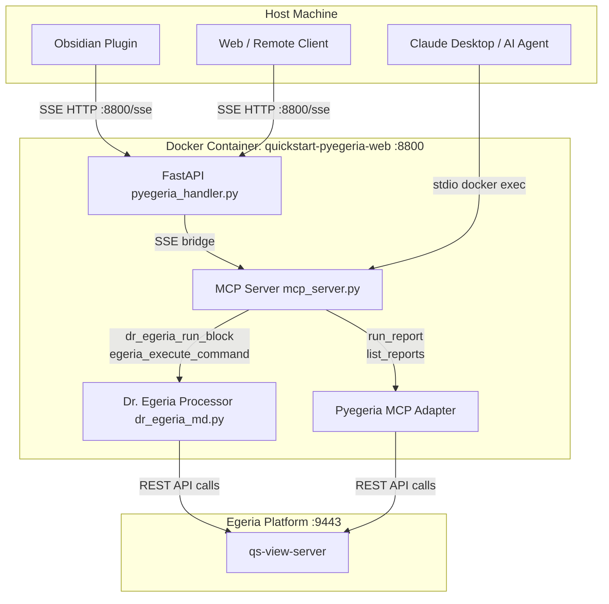

# Using MCP in Egeria-Workspaces

The Egeria-Workspaces environment exposes a Model Context Protocol (MCP) server that gives AI agents and external tools direct access to Dr. Egeria command processing and pyegeria reporting. The same server process supports two transport modes simultaneously: **stdio** (for Claude Desktop and CLI tools) and **SSE** (for Obsidian, web clients, and remote agents).

---

## Available Tools

| Tool | Purpose |
|---|---|
| `dr_egeria_run_block` | Execute one or more Dr. Egeria commands from a full markdown document |
| `egeria_execute_command` | Execute a single named command with individual parameter values |
| `egeria_list_commands` | List all available Dr. Egeria command names |
| `egeria_list_glossaries` | Convenience wrapper: view all glossaries |
| `egeria_list_collections` | Convenience wrapper: view all collections |
| `egeria_refresh_specs` | Reload command specifications without restarting the container |
| `list_reports` | List available structured report templates |
| `find_report_specs` | Search report templates by perspective |
| `describe_report` | Return the parameter schema for a specific report |
| `run_report` | Execute a structured report and return results |

---

## Transport Modes

### stdio — Claude Desktop and CLI tools

The MCP server runs as a subprocess launched by the client via `docker exec`. This is the standard mode for Claude Desktop.

**Claude Desktop configuration** (`claude_desktop_config.json`):

```json
{
  "mcpServers": {
    "egeria": {
      "command": "docker",
      "args": [
        "exec", "-i",
        "-e", "EGERIA_USER=erinoverview",
        "-e", "EGERIA_USER_PASSWORD=secret",
        "-e", "EGERIA_PLATFORM_URL=https://host.docker.internal:9443",
        "quickstart-pyegeria-web",
        "python",
        "/app/mcp_server.py"
      ]
    }
  }
}
```

Credentials in the `args` override the container's environment. Omit them to use the defaults set at container start.

### SSE — Obsidian plugin and remote HTTP clients

The FastAPI application (`pyegeria_handler.py`) bridges SSE connections to the same MCP server. No separate process is needed — the endpoint is always available when the container is running.

| Environment | SSE URL |
|---|---|
| quickstart (host) | `http://localhost:8800/sse` |
| freshstart (host) | `http://localhost:7800/sse` |
| Remote access | `http://<hostname>:8800/sse` |

The server binds to all interfaces (`::`) so it is reachable via mDNS names (e.g. `http://cray.local:8800/sse`).

**Obsidian "Call Dr. Egeria" plugin settings:**
- Transport: `SSE`
- URL: `http://localhost:8800/sse` (or the remote hostname)
- Token: value of `MCP_API_KEY` in the container environment (default: `egeria-secret-mcp-token`)

**MCP Inspector (for debugging):**
```bash
npx @modelcontextprotocol/inspector http://localhost:8800/sse
```

---

## Writing Dr. Egeria Command Blocks

### Using `egeria_execute_command` — single command

This is the simplest way for an AI agent to create or update a single Egeria element. Pass the command name and individual parameter values:

```
command_name: "Create Solution Component"
attributes:   "### Display Name\nMy Component\n\n### Description\nA reusable building block\n\n"
directive:    "process"
```

**Format rules for `attributes`:**
- Each parameter is a `### Parameter Name` heading followed by the value on the next line.
- Values are **plain text** — do NOT prefix them with `> `. Lines starting with `>` are treated as template metadata/provenance and stripped by the processor.
- Separate parameters with a blank line.

Example (Python string):
```python
attributes = "### Display Name\nMy Component\n\n### Description\nA reusable building block\n\n"
```

### Using `dr_egeria_run_block` — multi-command document

This tool accepts a full Dr. Egeria markdown document containing one or more commands. It is what the Obsidian plugin uses when processing a note.

**Format rules:**

```markdown
## Create Solution Component

### Display Name
My Component

### Description
A reusable building block

### Solution Component Type
Service

___
## Create Solution Blueprint

### Display Name
My Blueprint

___
```

- Commands are introduced by `## Verb ObjectType` (H2).
- Parameters are `### Parameter Name` (H3) followed by the value as plain text.
- Each command block ends with `___` (three underscores), or a new `## ` line starts the next command.
- The `directive` parameter controls what happens: `display` (read-only preview), `validate` (check inputs without writing), or `process` (create/update metadata — default).

### Checking available commands

Use `egeria_list_commands` to get the full list of supported command names before composing a block:

```
egeria_list_commands()
→ "Available commands:\n- Add Member to Collection\n- Attach ...\n- Create Data Class\n..."
```

---

## Structured Response Format

Both `dr_egeria_run_block` and `egeria_execute_command` return a **JSON string** (not plain text). Parse it to inspect results.

```json
{
  "success": true,
  "partial": false,
  "output": "## Update Solution Component\n\n### Display Name\nMy Component\n...",
  "validation_errors": [],
  "execution_errors": [],
  "commands_total": 1,
  "commands_succeeded": 1,
  "commands_failed": 0,
  "commands_detail": [
    {
      "step": 1,
      "command": "Create Solution Component",
      "status": "success",
      "guid": "b4d63847-2785-48fa-8f91-82d6567103bb",
      "qualified_name": "My Component::1.0",
      "display_name": "My Component",
      "message": "Executed Create Solution Component (GUID: b4d63847-2785-48fa-8f91-82d6567103bb)"
    }
  ]
}
```

| Field | Type | Description |
|---|---|---|
| `success` | bool | `true` if all commands succeeded |
| `partial` | bool | `true` if some succeeded and some failed |
| `output` | string | Full augmented plan document as markdown |
| `validation_errors` | array | Pre-flight failures; safe to retry after fixing inputs — each `{step, command, message}` |
| `execution_errors` | array | Runtime failures; metadata may be partially applied — each `{step, command, message}` |
| `commands_total` | int | Number of commands processed |
| `commands_succeeded` | int | Commands that completed without error |
| `commands_failed` | int | Commands that failed (validation + execution combined) |
| `commands_detail` | array | Per-command result including `guid`, `qualified_name`, `display_name`, `message` |

**Reading `commands_detail`:** For each successfully processed `Create` or `Update` command, the `guid` and `qualified_name` fields carry the Egeria identifiers of the element that was written. Use these to chain commands (e.g. link a component to a blueprint using its GUID) or to confirm the result.

**Outcome states:**

| `success` | `partial` | Meaning |
|---|---|---|
| `true` | `false` | All commands succeeded — safe to proceed |
| `false` | `true` | Mixed — some succeeded, some failed |
| `false` | `false` | Nothing was written — safe to retry after fixing |

**AI agent pattern:**
1. Call `egeria_list_commands` to confirm the command exists.
2. Call `egeria_execute_command` with `directive="validate"` to check inputs.
3. If `success` is true, call again with `directive="process"`.
4. Read `commands_detail[0].guid` and `commands_detail[0].qualified_name` from the result.

---

## Architecture Overview



---

## Security

The SSE endpoint is protected at two levels:

- **Token authentication**: Requests must include the `MCP_API_KEY` value as either an `X-API-Key` header or a `?token=` query parameter. Default: `egeria-secret-mcp-token`. Set a unique value per environment via the container environment variable.
- **CORS**: Configured to allow all origins (`*`) to accommodate Obsidian (`app://obsidian.md`) and remote HTTP clients.

For stdio transport (Claude Desktop), no token is required — the connection is secured by the `docker exec` process boundary.
