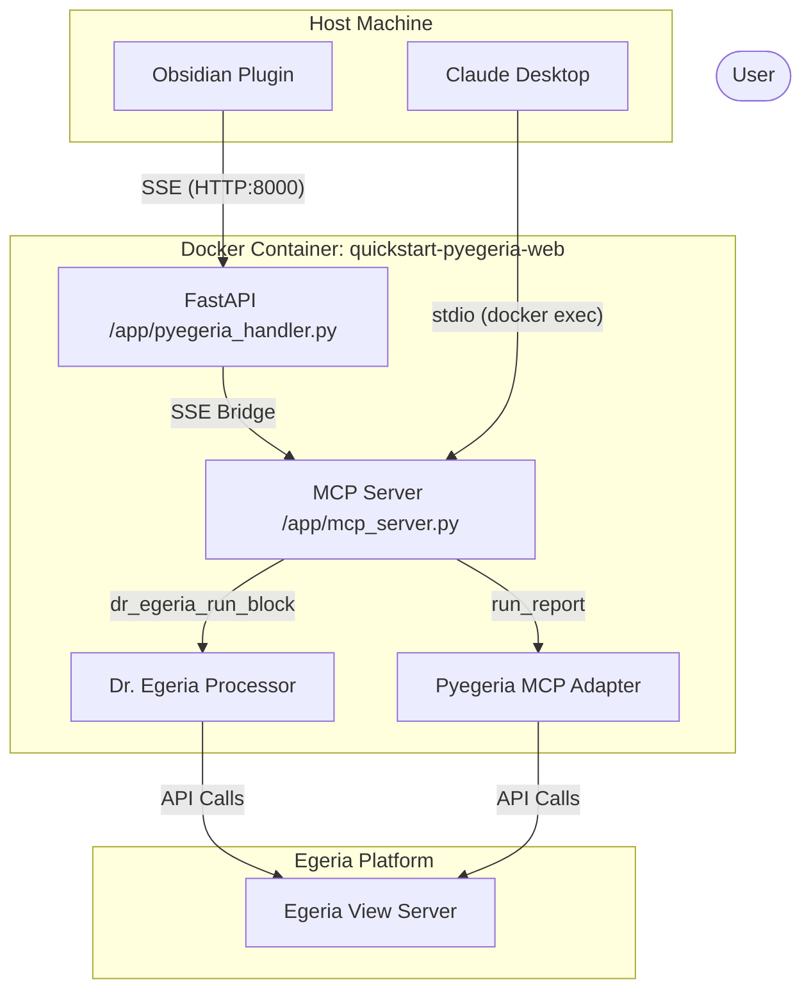

### Using MCP in Egeria-Workspaces

The Egeria-Workspaces environment provides a unified Model Context Protocol (MCP) server that supports both Dr. Egeria markdown commands and core Pyegeria reporting capabilities.

#### Available Tools

| Tool Name | Description |
| :--- | :--- |
| `dr_egeria_run_block` | Executes a Dr. Egeria H1 markdown command block. |
| `list_reports` | Lists all available structured report templates. |
| `find_report_specs` | Searches for reports by perspective. |
| `describe_report` | Returns the technical schema/parameters for a report. |
| `run_report` | Executes a structured report and returns results. |

#### Claude Desktop Configuration

To use the Egeria MCP server in Claude Desktop, add the following to your `claude_desktop_config.json` file. You can optionally include environment variables for your Egeria credentials to avoid being prompted for them during tool calls:

```json
{
  "mcpServers": {
    "egeria": {
      "command": "docker",
      "args": [
        "exec",
        "-i",
        "-e", "EGERIA_USER=erinoverview",
        "-e", "EGERIA_USER_PASSWORD=secret",
        "-e", "EGERIA_PLATFORM_URL=https://host.docker.internal:9443",
        "quickstart-pyegeria-web",
        "python",
        "/app/mcp_server.py"
      ]
    }
  }
}
```

#### Content-First Processing

The Egeria MCP server implements a "Content-First" strategy for the `dr_egeria_run_block` tool. When a client sends a markdown block:
1.  The server saves the content to a temporary file in the container's inbox.
2.  The backend processor is invoked using this temporary file.
3.  The results are returned as a raw markdown string to the client.

This approach ensures that the MCP server can process commands from remote clients (like Obsidian) even if the client's local files are not accessible or mounted into the Docker container.

#### Architecture Overview

The Egeria MCP server supports two primary transport modes:

1.  **SSE (Server-Sent Events)**:
    - **URL**: `http://localhost:8000/sse`
    - **Usage**: Primarily used by the "Calling the Dr." Obsidian plugin.
    - **Remote Access**: Replace `localhost` with the Host machine's IP address. Ensure port 8000 is accessible.

2.  **stdio**:
    - **Command**: `python /app/mcp_server.py` (inside the container)
    - **Usage**: Used by Claude Desktop, CLI tools, and IDEs that launch MCP servers as subprocesses.



#### Configuration Security

The MCP SSE endpoint is protected by:
- **CORS**: Configured to allow all origins (`*`) to facilitate remote access and Obsidian integration.
- **Token Authentication**: Requires an `X-API-Key` or `token` query parameter (default: `egeria-secret-mcp-token`).
