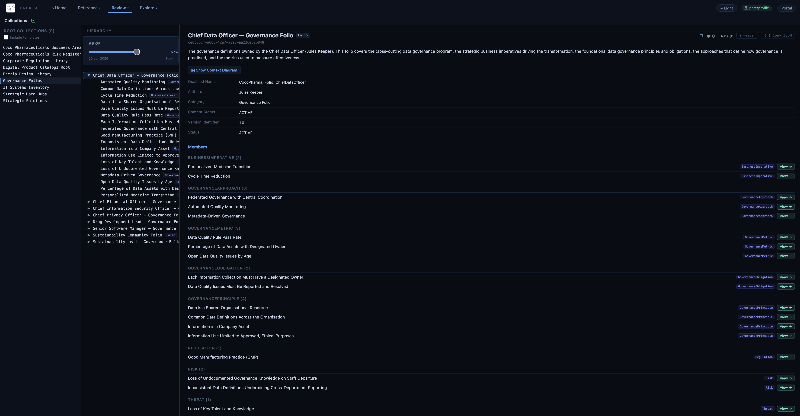

# Building the Governance Program

This directory contains three Dr.Egeria markdown files [built by the Governance Leaders](https://egeria-project.org/practices/coco-pharmaceuticals/scenarios/building-the-governance-team/overview/) in Coco Pharmaceuticals.


The first one lays out the basic definitions that they can then all build from.  The others build out from there.

The files themselves are worth browsing.  They contain a narrative describing the definitions and the rationale behind them.  The instructions below describe how to load these definitions into Egeria.  Then you can browse the results in [Egeria Explorer](https://egeria-project.org/user-interfaces/egeria-explorer/overview/) in the Egeria Portal.  Select the **Collections** card and then **Governance Folios**.

-----

## Data Governance Program

The file [data-governance-program.md](data-governance-program.md) contains a series of Dr. Egeria commands that create the initial set of governance definitions created by [the governance leaders at Coco Pharmaceuticals](https://egeria-project.org/practices/coco-pharmaceuticals/scenarios/building-the-governance-team/overview/).

You can load the definitions into Egeria in one of two ways:

1. From Obsidian - open the data-governance-program.md file and click the suitcase icon labeled "Call Dr. Egeria (MCP)"
2. From the command line in JupyterLab. Make sure you are in this directory and issue the command:

    ```
    dr_egeria --directive process data-governance-program.md
     
    ```

----

## Risk Register

The file [risk register.md](risk-register.md) contains the Dr.Egeria commands to load Coco Pharmaceuticals risk register into Egeria. This register considers each of the threats affecting the company and captures its likelihood, impact and hence importance.  The idea of a risk register comes from the [cybersecurity team](https://egeria-project.org/practices/coco-pharmaceuticals/scenarios/assuring-it-systems-security/overview/) but there is a lot of contribution and ownership taken by the other governance leaders.

You can load the definitions into Egeria in one of two ways:

1. From Obsidian - open the risk-register.md file and click the suitcase icon labeled "Call Dr. Egeria (MCP)"
2. From the command line in JupyterLab. Make sure you are in this directory and issue the command:

    ```
    dr_egeria --directive process risk-register.md
    ```

The risk register refers to some definitions in the Data Governance Program, so make sure it is loaded before the risk-register.

----

## Data Security Program

The file [data-security-program.md](data-security-program.md) contains the Dr.Egeria commands to load Coco Pharmaceuticals governance definitions controlling Coco Pharmaceuticals certification for [ISO 27001](https://en.wikipedia.org/wiki/ISO/IEC_27001) into Egeria.

You can load the definitions into Egeria in one of two ways:

1. From Obsidian - open the data-security-program.md file and click the suitcase icon labeled "Call Dr. Egeria (MCP)"
2. From the command line in JupyterLab. Make sure you are in this directory and issue the command:

    ```
    dr_egeria --directive process data-security-program.md
    ```

The Data Security Program refers to some definitions in the Data Governance Program and the Risk Register, so make sure they are loaded before the data-security-program.

## Viewing the results

You can browse the results of loading the governance definitions in [Egeria Explorer](https://egeria-project.org/user-interfaces/egeria-explorer/overview/) in the Egeria Portal.  Select the **Collections** card and then **Governance Folios**.



Each folio contains a set of governance definitions that are the responsibility of a governance officer, or specific team.  The definitions are also linked together to show their dependencies on one another.  This is to help people understand how their role contributes to the overall success of the program.  It also is used in rolling measurements into results for the various metrics defined throughout the program.

----
License: [CC BY 4.0](https://creativecommons.org/licenses/by/4.0/),
Copyright Contributors to the ODPi Egeria project.
