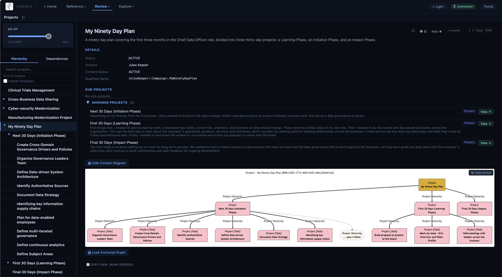
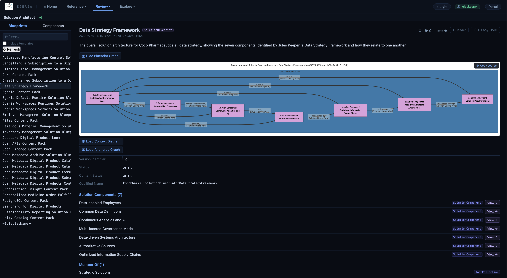

# Building the Governance Program

This directory contains seventeen Dr.Egeria Markdown files.  The first two were created by [Jules Keeper](https://egeria-project.org/practices/coco-pharmaceuticals/personas/jules-keeper/) to describe his plan for the first 90 days at Coco Pharmaceuticals and his data strategy framework.

* [jules-90-day-plan.md](jules-90-day-plan.md)
* [data-strategy-framework.md](data-strategy-framework.md)

The next file records the meeting where the governance leaders came together to agree the top-level definitions that everything else links to:

* [joint-governance-officer-definitions.md](joint-governance-officer-definitions.md)

It was [built by the Governance Leaders](https://egeria-project.org/practices/coco-pharmaceuticals/scenarios/building-the-governance-team/overview/) at Coco Pharmaceuticals as part of Jules' urging that they work together to build an integrated governance program.


The governance leaders then went back to their own teams to work through the priorities and concerns of their own domains.  Each of the files below is the output of one of those teams:

| File | Domain | Owner |
|---|---|---|
| [data-governance-program.md](data-governance-program.md) | `Data` | Jules Keeper, Chief Data Officer |
| [data-security-strategy.md](data-security-strategy.md) | `Security` | Ivor Padlock, Chief Information Security Officer |
| [privacy-governance-program.md](privacy-governance-program.md) | `Privacy` | Faith Broker, Chief Privacy Officer |
| [manufacturing-governance-program.md](manufacturing-governance-program.md) | `Manufacturing` | Stew Faster, Head of Manufacturing |
| [serialisation-governance-program.md](serialisation-governance-program.md) | `Manufacturing` | Stew Faster with Florence Paynter and George Pie |
| [drug-development-governance.md](drug-development-governance.md) | `Drug Development` | Tessa Tube, Drug Development Lead |
| [corporate-governance-program.md](corporate-governance-program.md) | `Corporate` | Reggie Mint, Chief Financial Officer |
| [human-resource-management.md](human-resource-management.md) | `Human Resource Management` | Faith Broker, Head of Human Resources |
| [diversity-equity-inclusion.md](diversity-equity-inclusion.md) | `Diversity, Equity and Inclusion` | Head of DEI *(appointment pending)* |
| [health-and-safety.md](health-and-safety.md) | `Health and Safety` | Faith Broker, Head of Human Resources |
| [biological-agents-and-gmo.md](biological-agents-and-gmo.md) | `Health and Safety` | Faith Broker, through the Biological Safety Officer |
| [dangerous-goods-transport.md](dangerous-goods-transport.md) | `Distribution` | Stew Faster with Florence Paynter and George Pie |

Two further files cut across the domains:

* [risk-register.md](risk-register.md) — the threats and risks affecting the company, contributed to and owned by all the governance leaders
* [employee-glossary.md](employee-glossary.md) — the output of a [glossary building session](https://egeria-project.org/practices/coco-pharmaceuticals/scenarios/defining-a-glossary/overview/) run by [Erin Overview](https://egeria-project.org/practices/coco-pharmaceuticals/personas/erin-overview/) and [Faith Broker](https://egeria-project.org/practices/coco-pharmaceuticals/personas/faith-broker/) on the employee subject area, showing the common data definitions principle being put into practice

----

## How the governance domains fit together

The domains are deliberately layered, and the layer determines which domain should own a definition.

| Layer | Domains | Owns drivers? | Role |
|---|---|---|---|
| Business outcome and regulatory | `Manufacturing`, `Privacy`, `Corporate`, `Drug Development`, `Human Resource Management`, `Diversity, Equity and Inclusion`, `Health and Safety`, `Distribution` | Yes | Carry responsibility for business results and regulatory compliance |
| Systemic | `Data`, `Security` | Sparingly | Address systemic issues across the business, in service of the outcome domains.  `Security` additionally owns board-level cyber drivers, because a cyber incident can halt the whole business |
| Serving | `IT Infrastructure`, `Software Development` | No | Provide the digital services the business runs on |

This is why the data governance program is short on drivers and long on links: most of what the `Data` domain does exists to let another domain meet an obligation that is theirs.

Domains are named by their display name throughout — `Manufacturing` rather than the underlying `21`.  Egeria resolves the name through the `domainIdentifier` valid value set, so the numeric value only appears where a domain is registered.

The set has three layers.  `All Domains`, `Data`, `Privacy`, `Security`, `IT Infrastructure`, `Software Development`, `Corporate`, `Asset Management`, `Data Sharing` and `Sustainability` are Egeria's built-in domains.  `Drug Development` and `Manufacturing` are Coco Pharmaceuticals extensions supplied by `CocoComboArchive.omarchive`.  `Human Resource Management`, `Diversity, Equity and Inclusion`, `Health and Safety` and `Distribution` are registered by the workbooks themselves, each opening with a `Setup Valid Metadata Value` command.  **A domain must be registered before any definition claims it**, which is why those four files register their own before defining anything.

----

## Load order

The files tell a story, and the load order follows it.  The root is `CocoComboArchive.omarchive` from `egeria.git`, which is already loaded when the metadata server starts and supplies the collections, subject areas and person profiles the workbooks reference but never create.

Load in this order:

| | File | The story |
|---|---|---|
| 1 | `jules-90-day-plan.md` | Jules Keeper joins Coco Pharmaceuticals and writes his plan for the first 90 days |
| 2 | `data-strategy-framework.md` | His analysis and interviews across the organisation become a [data strategy](https://egeria-project.org/practices/coco-pharmaceuticals/scenarios/defining-the-data-strategy/overview/) |
| 3 | `joint-governance-officer-definitions.md` | Jules convenes the governance officers, who meet for the first time and [agree the top-level definitions](https://egeria-project.org/practices/coco-pharmaceuticals/scenarios/defining-multi-faceted-governance/overview/) everything else links to |
| 4 | `risk-register.md` | The officers meet a second time to build the risk register |

The officers then go back to their own teams.  **The domains develop in parallel**, and the files below load in any order that respects the dependencies each team's work has on the others:

| | File | Team |
|---|---|---|
| 5 | `privacy-governance-program.md` | Faith Broker |
| 6 | `data-security-strategy.md` | Ivor Padlock and his associates, from the [data security strategy work](https://egeria-project.org/practices/coco-pharmaceuticals/scenarios/building-a-data-security-strategy/overview/) |
| 7 | `drug-development-governance.md` | Tessa Tube with Tanya Tidie |
| 8 | `corporate-governance-program.md` | Reggie Mint with Tom Tally and Sally Counter |
| 9 | `manufacturing-governance-program.md` | Stew Faster with Florence Paynter and George Pie |
| 10 | `serialisation-governance-program.md` | the same manufacturing team |
| 11 | `human-resource-management.md` | Faith Broker |
| 12 | `health-and-safety.md` | Faith Broker |
| 13 | `biological-agents-and-gmo.md` | Faith Broker, through the Biological Safety Officer |
| 14 | `dangerous-goods-transport.md` | the manufacturing team, establishing the Distribution domain |
| 15 | `diversity-equity-inclusion.md` | Faith Broker |

While that work is going on, Jules and his team are building the artifacts that support the whole program.  Their own domain file loads last, because it is written to dovetail into everything the other teams produced:

| | File | |
|---|---|---|
| 16 | `data-governance-program.md` | Jules Keeper, Erin Overview and Peter Profile |
| 17 | `employee-glossary.md` | Erin Overview and Faith Broker, from the [glossary session](https://egeria-project.org/practices/coco-pharmaceuticals/scenarios/defining-a-glossary/overview/) |

**There are no forward references.**  Every link resolves to a definition created in the same file or in an earlier one, so a single pass loads the whole directory.  This is worth preserving: the peer links between domains are symmetric, so when two domains reference each other the link belongs in whichever file loads later.  Several such links live in `data-governance-program.md` for exactly this reason, which is also where they belong thematically.

The story continues outside this directory:

* `6. data-privacy/data-processing-purposes.md` — the data processing purposes declared by every domain, gathered with their links so the lawful bases can be reviewed as a set
* `4. keeping-safe/it-governance-program.md` — Gary Geeke builds out the `IT Infrastructure` domain, after first creating the systems inventory that the security team needed urgently
* `3. sustainability/sustainability-governance-program.md` — Tom Tally, now leading the sustainability program, connects the sustainability definitions to the domain programs

All three load after this directory.  The Martyn's Law definitions in `4. keeping-safe/martyns-law/` load after those.

----


Each file is loaded as the governance leader responsible for it, so that the definitions are attributed to the person who owns them rather than to whoever happened to run the load.  The `--userid` therefore changes from file to file and the password is `secret` throughout:

| User id | Governance leader | Files |
|---|---|---|
| `juleskeeper` | Jules Keeper, Chief Data Officer | the 90 day plan, data strategy framework, joint officer definitions, risk register, and the data governance program |
| `faithbroker` | Faith Broker, Chief Privacy Officer and Head of Human Resources | privacy, human resource management, health and safety, biological agents, and diversity, equity and inclusion |
| `stewfaster` | Stew Faster, Head of Manufacturing | manufacturing, serialisation, and dangerous goods transport |
| `ivorpadlock` | Ivor Padlock, Chief Information Security Officer | the data security strategy |
| `tessatube` | Tessa Tube, Drug Development Lead | drug development governance |
| `reggiemint` | Reggie Mint, Chief Financial Officer | corporate governance |
| `erinoverview` | Erin Overview, Information Architect | the employee glossary |
| `garygeeke` | Gary Geeke, IT Infrastructure Director | the IT governance program in `4. keeping-safe` |

The sections below describe the files and how to load them into Egeria.  The files themselves are worth browsing.  They contain a narrative describing the definitions and the rationale behind them.  The instructions below describe how to load these definitions into Egeria.  Then you can browse the results in [Egeria Explorer](https://egeria-project.org/user-interfaces/egeria-explorer/overview/) in the Egeria Portal.

-----

## 1. The 90 Day Plan - First Version

The file [jules-90-day-plan.md](jules-90-day-plan.md) loads the project plan that Jules Keeper created to guide his work when he first started at Coco Pharmaceuticals into Egeria.  The data reflects his thinking [just after his 30 day review with the board](https://egeria-project.org/practices/coco-pharmaceuticals/scenarios/defining-the-data-strategy/overview/#the-first-data-strategy-review).  

You can load the definitions into Egeria in one of two ways:

1. From Obsidian - open the `jules-90-day-plan.md` file and click the suitcase icon labeled "Call Dr. Egeria (MCP)"
2. From the command line in JupyterLab. Make sure you are in this directory and issue the command:

    ```
    dr_egeria --directive process --userid juleskeeper --user_pass secret jules-90-day-plan.md
     
    ```

Once loaded, you can browse the results in [Egeria Explorer](https://egeria-project.org/user-interfaces/egeria-explorer/overview/) in the Egeria Portal.  Select the **Projects** card and then **My Ninety Day Plan**.



-----

## 2. The Data Strategy Framework

The file [data-strategy-framework.md](data-strategy-framework.md) defines a solution blueprint and a glossary defining the initial capabilities that Coco Pharmaceuticals needed to develop to enable them to safely share data between the business units.

You can load the definitions into Egeria in one of two ways:

1. From Obsidian - open the `data-strategy-framework.md` file and click the suitcase icon labeled "Call Dr. Egeria (MCP)"
2. From the command line in JupyterLab. Make sure you are in this directory and issue the command:

    ```
    dr_egeria --directive process --userid juleskeeper --user_pass secret data-strategy-framework.md
    ```

Once loaded, you can browse the results in [Egeria Explorer](https://egeria-project.org/user-interfaces/egeria-explorer/overview/) in the Egeria Portal.  Select the **Solution Architect** card and then **Data Strategy Framework**.



-----

## 3. Joint Governance Officer Definitions

The file [joint-governance-officer-definitions.md](joint-governance-officer-definitions.md) contains a series of Dr. Egeria commands that create the initial set of governance definitions created by [the governance leaders at Coco Pharmaceuticals](https://egeria-project.org/practices/coco-pharmaceuticals/scenarios/building-the-governance-team/overview/).

You can load the definitions into Egeria in one of two ways:

1. From Obsidian - open the `joint-governance-officer-definitions.md` file and click the suitcase icon labeled "Call Dr. Egeria (MCP)"
2. From the command line in JupyterLab. Make sure you are in this directory and issue the command:

    ```
    dr_egeria --directive process --userid juleskeeper --user_pass secret joint-governance-officer-definitions.md
     
    ```

----

## 4. Risk Register

The file [risk register.md](risk-register.md) contains the Dr.Egeria commands to load Coco Pharmaceuticals risk register into Egeria. This register considers each of the threats affecting the company and captures its likelihood, impact and hence importance.  The idea of a risk register comes from the [cybersecurity team](https://egeria-project.org/practices/coco-pharmaceuticals/scenarios/assuring-it-systems-security/overview/) but there is a lot of contribution and ownership taken by the other governance leaders.

You can load the definitions into Egeria in one of two ways:

1. From Obsidian - open the `risk-register.md` file and click the suitcase icon labeled "Call Dr. Egeria (MCP)"
2. From the command line in JupyterLab. Make sure you are in this directory and issue the command:

    ```
    dr_egeria --directive process --userid juleskeeper --user_pass secret risk-register.md
    ```

The risk register refers to some definitions in the Joint Governance Officer Definitions, so make sure it is loaded before the risk-register.

----

## 5. Privacy Governance Program

The file [privacy-governance-program.md](privacy-governance-program.md) contains the Dr.Egeria commands to load the governance definitions that define how Coco Pharmaceuticals complies with the EU and UK General Data Protection Regulations.  Because the company is a US-listed parent with subsidiaries in the UK and the EU, the program also covers controllership between group entities, international transfers to the US parent, and the supervisory authority relationships that follow from the group structure.

You can load the definitions into Egeria in one of two ways:

1. From Obsidian - open the `privacy-governance-program.md` file and click the suitcase icon labeled "Call Dr. Egeria (MCP)"
2. From the command line in JupyterLab. Make sure you are in this directory and issue the command:

    ```
    dr_egeria --directive process --userid faithbroker --user_pass secret privacy-governance-program.md
    ```

The Privacy Governance Program refers to some definitions in the Joint Governance Officer Definitions, so make sure they are loaded before the privacy-governance-program.


----

## 6. Data Security Strategy

The file [data-security-strategy.md](data-security-strategy.md) contains the Dr.Egeria commands to load Coco Pharmaceuticals governance definitions controlling Coco Pharmaceuticals certification for [ISO 27001](https://en.wikipedia.org/wiki/ISO/IEC_27001) into Egeria.

You can load the definitions into Egeria in one of two ways:

1. From Obsidian - open the `data-security-strategy.md` file and click the suitcase icon labeled "Call Dr. Egeria (MCP)"
2. From the command line in JupyterLab. Make sure you are in this directory and issue the command:

    ```
    dr_egeria --directive process --userid ivorpadlock --user_pass secret data-security-strategy.md
    ```

The Data Security Strategy refers to definitions in the Joint Governance Officer Definitions and the Risk Register, so make sure they are loaded first.  It is the output of Ivor Padlock's work with his team and associates on [building a data security strategy](https://egeria-project.org/practices/coco-pharmaceuticals/scenarios/building-a-data-security-strategy/overview/).


----

## 7. Drug Development Governance

The file [drug-development-governance.md](drug-development-governance.md) contains the governance definitions for clinical trial and research data, owned by [Tessa Tube](https://egeria-project.org/practices/coco-pharmaceuticals/personas/tessa-tube/) as Drug Development Lead.  It covers Good Clinical Practice, the EU Clinical Trials Regulation, source data attribution and verification, trial master file completeness, blinding integrity, adverse event reporting, and the twenty-five year retention obligation that outlives every system holding the records.

Its final section records how trials make the group's subsidiary structure concrete: sites sit in the UK and across the EU, the sponsor entity determines who the controller is, and data consolidates into a US-held clinical database — so a trial engages the controllership and international transfer obligations owned by the privacy domain.

You can load the definitions into Egeria in one of two ways:

1. From Obsidian - open the `drug-development-governance.md` file and click the suitcase icon labeled "Call Dr. Egeria (MCP)"
2. From the command line in JupyterLab. Make sure you are in this directory and issue the command:

    ```
    dr_egeria --directive process --userid tessatube --user_pass secret drug-development-governance.md
    ```

The definitions carry Domain Identifier `Drug Development`.  The file adds members to the Drug Development Lead folio created in the Joint Governance Officer Definitions, and its Part 4.5 links to obligations defined in `privacy-governance-program.md`, so load both of those first.

----

## 8. Corporate Governance Program

The file [corporate-governance-program.md](corporate-governance-program.md) contains the governance definitions owned by [Reggie Mint](https://egeria-project.org/practices/coco-pharmaceuticals/personas/reggie-mint/) as Chief Financial Officer, covering the obligations Coco Pharmaceuticals carries as a company rather than as a manufacturer or a trial sponsor: that its reported figures are true, that the third parties it pays are who they claim to be, and that its dealings with prescribing clinicians are transparent and defensible.

The supplier fraud that [Sally Counter](https://egeria-project.org/practices/coco-pharmaceuticals/personas/sally-counter/) detected runs through the file as its worked example.  The investigation showed how much of the company's defence rested on one person's familiarity with a ledger rather than on a control, and the definitions here are the response — making the checks systematic, making the supplier record authoritative, and making the evidence of both available without an investigation.

Because the company is US-listed with UK and EU subsidiaries, Sarbanes-Oxley, the Foreign Corrupt Practices Act, and the UK Bribery Act all apply simultaneously across the group.

You can load the definitions into Egeria in one of two ways:

1. From Obsidian - open the `corporate-governance-program.md` file and click the suitcase icon labeled "Call Dr. Egeria (MCP)"
2. From the command line in JupyterLab. Make sure you are in this directory and issue the command:

    ```
    dr_egeria --directive process --userid reggiemint --user_pass secret corporate-governance-program.md
    ```

The definitions carry Domain Identifier `Corporate` and add members to the Chief Financial Officer folio created in the Joint Governance Officer Definitions.  The file also links to the master data obligation in `data-governance-program.md` and the raw material obligation in `manufacturing-governance-program.md`.

----

## 9. Manufacturing Governance Program

The file [manufacturing-governance-program.md](manufacturing-governance-program.md) contains the Dr.Egeria commands to load the governance definitions that operationalise Good Manufacturing Practice at Coco Pharmaceuticals — batch record integrity, ALCOA+ data integrity, equipment qualification, deviations and CAPA, supplier qualification, cold chain monitoring, and the personalised manufacturing controls that arise when a batch is made for one identified patient.

You can load the definitions into Egeria in one of two ways:

1. From Obsidian - open the `manufacturing-governance-program.md` file and click the suitcase icon labeled "Call Dr. Egeria (MCP)"
2. From the command line in JupyterLab. Make sure you are in this directory and issue the command:

    ```
    dr_egeria --directive process --userid stewfaster --user_pass secret manufacturing-governance-program.md
    ```

The Manufacturing Governance Program refers to some definitions in the Joint Governance Officer Definitions, so make sure they are loaded before the manufacturing-governance-program.

----

## 10. Serialisation and Product Traceability

The file [serialisation-governance-program.md](serialisation-governance-program.md) covers the unique identifiers carried by every saleable pack of medicine, and the national systems that pharmacies check before dispensing.  It is separated from the manufacturing program because serialisation is a distinct data domain with its own regulations, its own external interfaces, and a data volume larger than the whole of the rest of manufacturing combined.

Three characteristics make it a governance problem rather than a systems integration problem: a serial number issued twice cannot be corrected once packs are distributed; the data is externally visible in real time, so the company learns about defects from a pharmacist rather than from its own monitoring; and decommissioning is irreversible within a short window, so an erroneous scan destroys saleable stock.

The regulatory position follows the group structure — EU packs fall under the Falsified Medicines Directive, Great Britain sits outside that system while Northern Ireland follows it, and US packs fall under the Drug Supply Chain Security Act.  A pack destined for Belfast and one destined for Dublin are governed differently despite leaving the same production line.

You can load the definitions into Egeria in one of two ways:

1. From Obsidian - open the `serialisation-governance-program.md` file and click the suitcase icon labeled "Call Dr. Egeria (MCP)"
2. From the command line in JupyterLab. Make sure you are in this directory and issue the command:

    ```
    dr_egeria --directive process --userid stewfaster --user_pass secret serialisation-governance-program.md
    ```

The definitions carry Domain Identifier `Manufacturing` and join the Manufacturing Governance Lead folio, so load `manufacturing-governance-program.md` first.

----

## 11. Human Resource Management

The file [human-resource-management.md](human-resource-management.md) establishes Human Resource Management as a governance domain and opens by registering its domain identifier as a valid metadata value.

The domain faces two ways.  Outward it answers to employment law that differs across the US parent and the UK and EU subsidiaries, and to pay transparency obligations that are among the most data-intensive reporting duties the company carries.  Inward it supplies data that other domains depend on absolutely: manufacturing cannot certify a batch without evidence that the operator was qualified, drug development cannot show GCP compliance without site training records, and security cannot revoke access to someone it has not been told has left.

The boundary with the privacy domain is drawn at the employment decision.  Privacy owns the lawful basis, the data subject rights and the retention framework for all personal data including employees'; this domain owns the employment purposes that data is processed for and the decisions taken on it.

You can load the definitions into Egeria in one of two ways:

1. From Obsidian - open the `human-resource-management.md` file and click the suitcase icon labeled "Call Dr. Egeria (MCP)"
2. From the command line in JupyterLab. Make sure you are in this directory and issue the command:

    ```
    dr_egeria --directive process --userid faithbroker --user_pass secret human-resource-management.md
    ```

The definitions carry Domain Identifier `Human Resource Management`, registered by the `Setup Valid Metadata Value` command at the top of the file.  The file creates its own folio and links to definitions in the joint file and in the data, security, privacy, manufacturing, corporate and drug development programs.

----

## 12. Health and Safety

The file [health-and-safety.md](health-and-safety.md) establishes Health and Safety as a governance domain.  What distinguishes it from the other manufacturing-adjacent domains is the direction of protection: every other control in the plant protects the product from the people, and these protect the people from the product.

That inversion produces the domain's hardest problem.  Coco Pharmaceuticals handles compounds that are pharmacologically active at very small doses, and the containment required to protect an operator can conflict directly with the conditions required to protect a sterile product.  Airflow that pulls contamination away from an operator pushes it toward the product; an isolator that contains a compound complicates the aseptic intervention it encloses.  These conflicts are resolved by engineering judgement, but they must first be recognised — and a change assessed only for its GMP consequences will pass while creating an exposure risk nobody evaluated.

The file also carries the longest retention obligation in the whole programme: health surveillance records must be kept for forty years from the last entry, and must remain interpretable across every system migration in that period.

Alongside occupational exposure, the file governs the hazardous materials used in the research laboratories and in manufacturing: the substance register and its safety data sheets, hazardous waste classified and tracked through to final disposal, and emergency arrangements derived from what is actually held at each location rather than from a template.  The substance register is treated as master data — it is the population the assessment obligation works against, and the source from which waste routing, emergency response and transport classification are all drawn.  Registration rhythm is deliberately differentiated: manufacturing holds few substances in large quantities and suits a periodic cycle, while a research laboratory holding a changing variety in small quantities needs registration to be immediate and lightweight or the register becomes fiction.

You can load the definitions into Egeria in one of two ways:

1. From Obsidian - open the `health-and-safety.md` file and click the suitcase icon labeled "Call Dr. Egeria (MCP)"
2. From the command line in JupyterLab. Make sure you are in this directory and issue the command:

    ```
    dr_egeria --directive process --userid faithbroker --user_pass secret health-and-safety.md
    ```

The definitions carry Domain Identifier `Health and Safety`, registered by the `Setup Valid Metadata Value` command at the top of the file.  It links to definitions in the manufacturing, human resources and privacy programs, so load those first.

----

## 13. Biological Agents and Contained Use of GMOs

The file [biological-agents-and-gmo.md](biological-agents-and-gmo.md) covers work with biological agents and the contained use of genetically modified organisms.  It carries Domain Identifier `Health and Safety` and joins the Head of Health and Safety folio, but is kept separate from `health-and-safety.md` because contained use is a distinct regulatory regime with its own classification scheme, its own regulator relationship, and a notification duty discharged before work begins.

Two activities bring the company into this regime, and only one is obvious.  The first is research: laboratories work with cell lines, viral vectors and cultures, some capable of causing human disease.  The second is the personalised medicine programme.  Autologous cell therapy takes a patient's own cells, modifies them — frequently using a viral vector — and returns them, which is contained use of genetically modified organisms in the legal sense.  The manufacturing program governs the patient identity attached to that material; nothing previously governed the fact that it is a genetically modified organism.

The regime attaches to *activities* rather than substances, and the notification is the permission rather than the record.  A COSHH assessment describes a substance and the tasks done with it; a contained use notification describes a class of activity at a set of premises, is submitted in advance, and constrains what may be done there until varied.  Missing a substance from the chemical register is a gap to close; conducting an unnotified class 2 activity is an offence committed on its first day.

You can load the definitions into Egeria in one of two ways:

1. From Obsidian - open the `biological-agents-and-gmo.md` file and click the suitcase icon labeled "Call Dr. Egeria (MCP)"
2. From the command line in JupyterLab. Make sure you are in this directory and issue the command:

    ```
    dr_egeria --directive process --userid faithbroker --user_pass secret biological-agents-and-gmo.md
    ```

The two regulations join the Health and Safety Regulations folder created in `health-and-safety.md`, so load that file first, together with `manufacturing-governance-program.md` whose personalised manufacturing content this file links to.

----

## 14. Dangerous Goods Transport

The file [dangerous-goods-transport.md](dangerous-goods-transport.md) establishes the **Distribution** domain, identifier `Distribution`, and registers it as a valid metadata value before any definition claims it.

The company moves a considerable amount of material that is dangerous goods in the transport sense, very little of which looks dangerous to the people handling it: solvents between research sites, cytotoxic product to hospital pharmacies, clinical samples classified as biological substances, patient-derived material for personalised manufacture travelling in both directions on a clock, and the lithium batteries in the temperature monitoring devices accompanying almost all of it.

Three things make this governance rather than logistics.  The shipper carries the liability and cannot delegate it — a courier accepting a misdeclared package has been misled, not made liable.  Certification expires, and an expired certificate makes every subsequent consignment non-compliant however correctly it was handled.  And time pressure falls exactly where the rules are least forgiving: a personalised therapy with a short viable life, shipped to a waiting patient, is where an expedited process is most tempting and a refusal at the airport most costly.

Dangerous goods is the first part of the Distribution domain rather than the whole of it.  Good distribution practice, cold chain in transit, and returns and recalls belong here too.  The file creates the Distribution folio and a `Transport Regulations` folder in the Corporate Regulation Library, since transport regulation binds the company as consignor rather than as employer and fits none of the existing folders.

You can load the definitions into Egeria in one of two ways:

1. From Obsidian - open the `dangerous-goods-transport.md` file and click the suitcase icon labeled "Call Dr. Egeria (MCP)"
2. From the command line in JupyterLab. Make sure you are in this directory and issue the command:

    ```
    dr_egeria --directive process --userid stewfaster --user_pass secret dangerous-goods-transport.md
    ```

Transport classification is drawn from the substance register in `health-and-safety.md` and the agent classification in `biological-agents-and-gmo.md`, and the file links to chain of identity and cold chain in `manufacturing-governance-program.md`, so load all three first.

----

## 15. Diversity, Equity and Inclusion

The file [diversity-equity-inclusion.md](diversity-equity-inclusion.md) establishes Diversity, Equity and Inclusion as a governance domain distinct from Human Resource Management, and the distinction is deliberate.  HR owns the employment relationship.  This domain owns something broader and, for a pharmaceutical company, more consequential — whether the medicines the company develops actually work for the populations that will take them.

A trial enrolling participants who differ systematically from the eventual patient population yields evidence that does not describe those patients, and the gap is discovered after approval by people for whom the dose or the safety profile turns out to be different.  The same failure recurs in a modern form as models are built to guide personalised treatment: a model trained on the population that happened to be enrolled performs worst for the groups least represented, and does so silently.

The domain therefore spans clinical evidence, patient-affecting models and information, and organisational representation — three areas sharing one logic, that unrepresentative data produces confident conclusions which are wrong for some people.

You can load the definitions into Egeria in one of two ways:

1. From Obsidian - open the `diversity-equity-inclusion.md` file and click the suitcase icon labeled "Call Dr. Egeria (MCP)"
2. From the command line in JupyterLab. Make sure you are in this directory and issue the command:

    ```
    dr_egeria --directive process --userid faithbroker --user_pass secret diversity-equity-inclusion.md
    ```

The definitions carry Domain Identifier `Diversity, Equity and Inclusion`, registered by the `Setup Valid Metadata Value` command at the top of the file.  It links to definitions in the human resources, drug development, privacy and data programs, so load those first.

----

## 16. Data Governance Program

The file [data-governance-program.md](data-governance-program.md) contains the governance definitions created by the data governance team at Coco Pharmaceuticals.

Its shape is unlike the other domain programs, and deliberately so.  The `Data` domain owns only three governance drivers — the small number of problems that originate in how the organisation manages data itself, that no single domain can fix from inside its own boundary, and that surface as damage in several domains at once.  Everything else in the program responds to drivers owned elsewhere, which is why the file's Part 1 is short and its Part 4 is long.  A `Data` policy that appears in neither section is governance without a customer.

Read the file's Part 4.2 to see the service relationship expressed as links: data policies answering manufacturing, privacy, drug development, security and corporate drivers.

You can load the definitions into Egeria in one of two ways:

1. From Obsidian - open the `data-governance-program.md` file and click the suitcase icon labeled "Call Dr. Egeria (MCP)"
2. From the command line in JupyterLab. Make sure you are in this directory and issue the command:

    ```
    dr_egeria --directive process --userid juleskeeper --user_pass secret data-governance-program.md
     
    ```

The data governance program refers to definitions in the Joint Governance Officer Definitions, the Risk Register, and the manufacturing and drug development programs, which is why it loads last.

----

## 17. Employee Glossary

The file [employee-glossary.md](employee-glossary.md) contains the Dr.Egeria commands to load the first draft of the glossary for the **Employee** subject area.  It was produced by [Erin Overview](https://egeria-project.org/practices/coco-pharmaceuticals/personas/erin-overview/) and [Faith Broker](https://egeria-project.org/practices/coco-pharmaceuticals/personas/faith-broker/), the director for human resources, in the working session described in [Defining a glossary](https://egeria-project.org/practices/coco-pharmaceuticals/scenarios/defining-a-glossary/overview/).


The file follows the shape of their session: the initial list of key concepts, then the drill-down into Work Location, the promotion of *Address* to a common **Postal Address** core type, and the recognition of Manager as a specialization of Employee.  It then continues past the session itself, filling out the glossary the way Erin and Faith concluded it should be done - by bringing in the payroll, facilities and learning teams and expanding each area with the people who know it best.

Everything is loaded with a content status of `DRAFT`, and the open questions from the session - *"Includes contractors?"*, *"What about team leaders?"*, *"Legal name vs known name?"* - are carried on each term as a journal entry.  Several of the later terms exist precisely to answer them: **Worker** is the broader concept covering employees and contractors, **Team Leader** is proposed as a type of employee but not a type of manager, and **Employment Contract** is what makes the Employee Id question answerable.

In total the file creates:

| | |
|---|---|
| 1 glossary | `Glossary::EmployeeGlossary` |
| 7 categories | Employment, Personal Details, Compensation, Work Locations, Addresses, Working Time and Absence, Performance and Development |
| 86 glossary terms | organized across those categories |
| 84 term relationships | `ISARelationship` and `RelatedTerm` |

Two of the relationships deliberately record a disagreement rather than a fact - Payroll Number to Employee Id, and Manager to Team Leader - with the uncertainty written into the relationship's expression.  Recording what is not yet agreed is as much a part of glossary building as recording what is.

You can load the definitions into Egeria in one of two ways:

1. From Obsidian - open the `employee-glossary.md` file and click the suitcase icon labeled "Call Dr. Egeria (MCP)"
2. From the command line in JupyterLab. Make sure you are in this directory and issue the command:

    ```
    dr_egeria --directive process --userid erinoverview --user_pass secret employee-glossary.md
    ```

The glossary is added as a member of the `SubjectArea::Person:Employee` collection, so that collection must already exist in Egeria.  The subject area collections are loaded from `CocoComboArchive.omarchive` when the metadata server starts up.

Once loaded, you can browse the results in [Egeria Explorer](https://egeria-project.org/user-interfaces/egeria-explorer/overview/) in the Egeria Portal.  Select the **Glossaries** card and then **Employee Glossary**.

----

## Viewing the results

You can browse the results of loading the governance definitions in [Egeria Explorer](https://egeria-project.org/user-interfaces/egeria-explorer/overview/) in the Egeria Portal.  Select the **Collections** card and then **Governance Folios**.


Each folio contains a set of governance definitions that are the responsibility of a governance officer, or specific team.  The definitions are also linked together to show their dependencies on one another.  This is to help people understand how their role contributes to the overall success of the program.  It also is used in rolling measurements into results for the various metrics defined throughout the program.

----
License: [CC BY 4.0](https://creativecommons.org/licenses/by/4.0/),
Copyright Contributors to the ODPi Egeria project.
