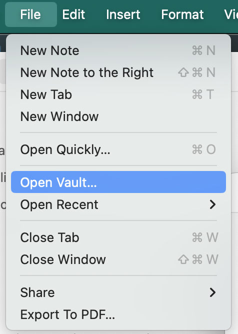
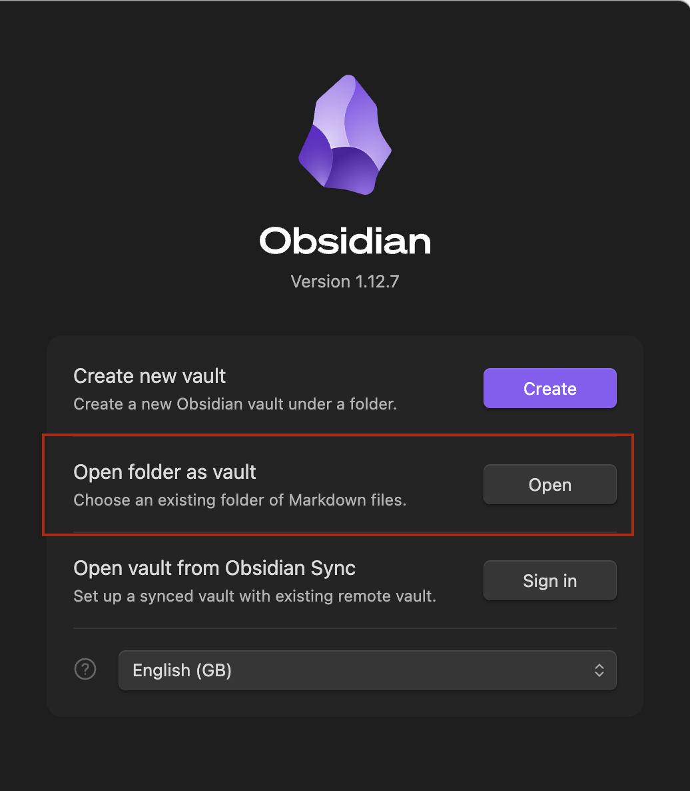
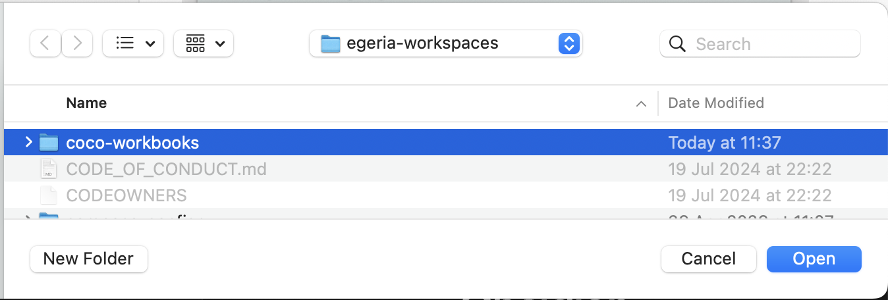
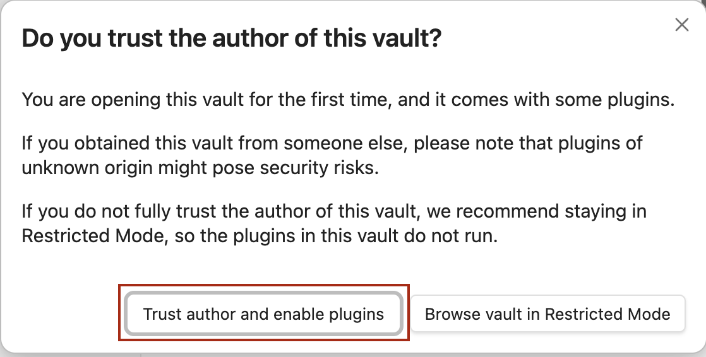
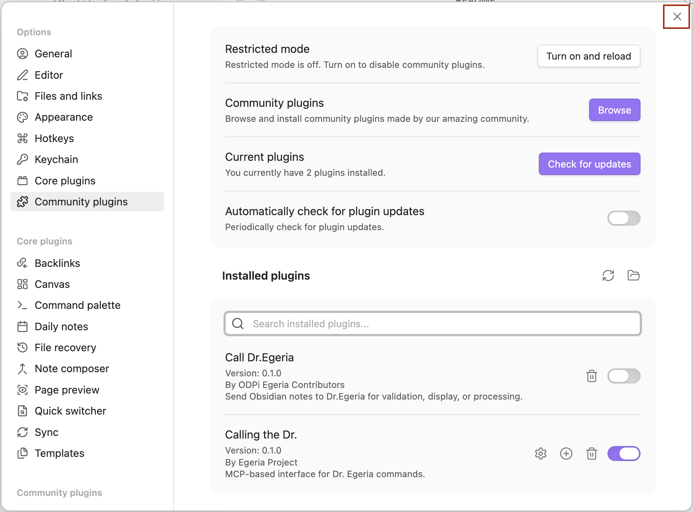

<!-- SPDX-License-Identifier: CC-BY-4.0 -->
<!-- Copyright Contributors to the Egeria project. -->

# Welcome to the Coco Workbooks

This repository contains a collection of workbooks and resources for the Egeria *quickstart* environment.
They implement various scenarios involving [Coco Pharmaceuticals](https://egeria-project.org/practices/coco-pharmaceuticals/).
The purpose of these workbooks is to help you understand how to use Egeria and explore its capabilities using real-world examples.

## Where to start

- **Getting Started**: Begin with the [Quickstart Guide]([quickstart.md](https://egeria-project.org/egeria-workspaces/quick-start/overview/)) to set up your environment and run the first workbook.
- **Exploring Workbooks**: Browse through the workbooks to find scenarios that interest you.
- **Contributing**: If you want to contribute, check out the [Egeria Community](https://egeria-project.org/community/)

## Setting up your Obsidian environment

This directory is set up with Egeria's Obsidian plugin that issues Dr.Egeria commands written in a markdown file.

Create a new vault for this directory:

**Select Open Vault from the File menu**

**Select the Open Folder as Vault option**

**Select the coco-workbooks directory**

**Trust the author of the vault**

**Check the Egeria plugin is installed and close (top right)**
