# Governance Zone Report - created at 2026-05-16 09:19  
    Governance Zone  found from the search string:  `All`  
<a id="430c45e5-c0c3-496d-8647-be9bdb08d928"></a>  
## Governance Zone Name: IT Machines Zone (part of Infrastructure Zone)  
  
### Mermaid Graph  
  
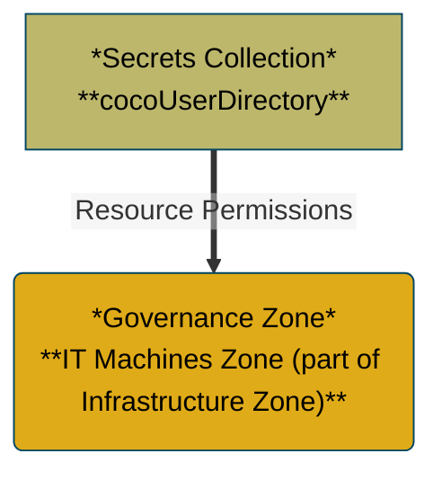
### Zone Profiles (Mermaid)  
  
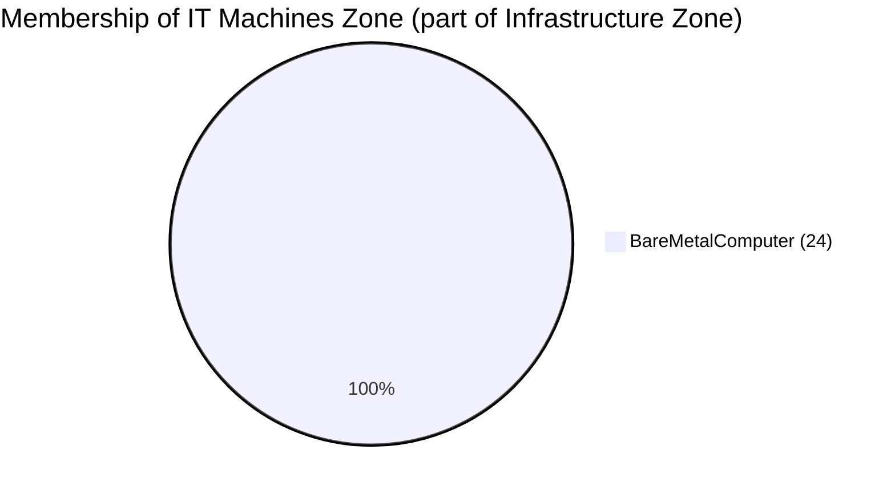
### Zone Profile Bar Chart  
  
```vega-lite  
{  
  "$schema": "https://vega.github.io/schema/vega-lite/v5.json",  "title": "Type Membership Bar Chart",  "description": "Type Membership Bar Chart",  "data": {    "values": [      {        "category": "BareMetalComputer",        "count": 24      }    ]  },  "mark": {    "type": "bar",    "tooltip": true  },  "encoding": {    "color": {      "field": "category",      "type": "nominal",      "legend": null    },    "tooltip": [      {        "field": "category",        "type": "nominal",        "title": "Category"      },      {        "field": "count",        "type": "quantitative",        "title": "Count"      }    ],    "y": {      "field": "category",      "type": "nominal",      "sort": "-x",      "title": "Category"    },    "x": {      "field": "count",      "type": "quantitative",      "title": "Count"    }  }}  
```  
  
### Zone Profile Pie Chart  
  
```vega-lite  
{  
  "$schema": "https://vega.github.io/schema/vega-lite/v5.json",  "title": "Type Membership Pie Chart",  "description": "Type Membership Pie Chart",  "data": {    "values": [      {        "category": "BareMetalComputer",        "count": 24      }    ]  },  "mark": {    "type": "arc",    "tooltip": true,    "innerRadius": 50  },  "encoding": {    "theta": {      "field": "count",      "type": "quantitative"    },    "color": {      "field": "category",      "type": "nominal"    },    "tooltip": [      {        "field": "category",        "type": "nominal",        "title": "Category"      },      {        "field": "count",        "type": "quantitative",        "title": "Count"      }    ]  }}  
```  
  
### Zone Profile Anchored (Mermaid)  
  
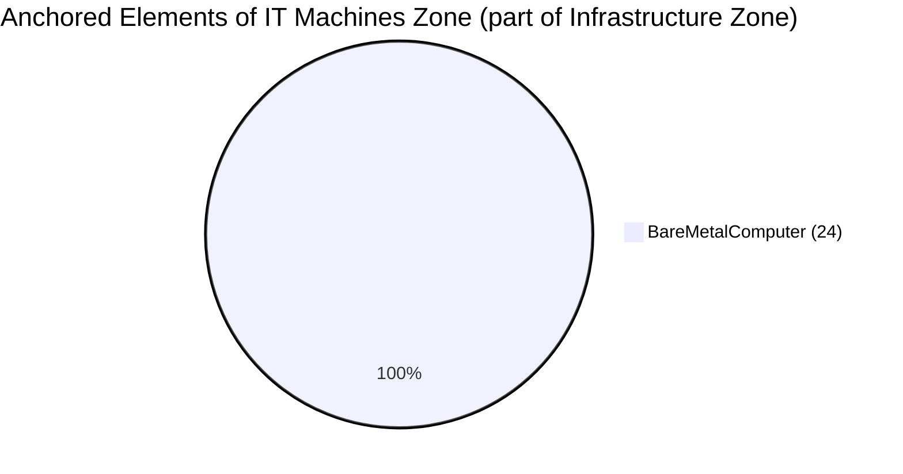
### Zone Profile Anchored Bar Chart  
  
```vega-lite  
{  
  "$schema": "https://vega.github.io/schema/vega-lite/v5.json",  "title": "Anchored Type Membership Bar Chart",  "description": "Anchored Type Membership Bar Chart",  "data": {    "values": [      {        "category": "BareMetalComputer",        "count": 24      }    ]  },  "mark": {    "type": "bar",    "tooltip": true  },  "encoding": {    "color": {      "field": "category",      "type": "nominal",      "legend": null    },    "tooltip": [      {        "field": "category",        "type": "nominal",        "title": "Category"      },      {        "field": "count",        "type": "quantitative",        "title": "Count"      }    ],    "y": {      "field": "category",      "type": "nominal",      "sort": "-x",      "title": "Category"    },    "x": {      "field": "count",      "type": "quantitative",      "title": "Count"    }  }}  
```  
  
### Zone Profile Anchored Pie Chart  
  
```vega-lite  
{  
  "$schema": "https://vega.github.io/schema/vega-lite/v5.json",  "title": "Anchored Type Membership Pie Chart",  "description": "Anchored Type Membership Pie Chart",  "data": {    "values": [      {        "category": "BareMetalComputer",        "count": 24      }    ]  },  "mark": {    "type": "arc",    "tooltip": true,    "innerRadius": 50  },  "encoding": {    "theta": {      "field": "count",      "type": "quantitative"    },    "color": {      "field": "category",      "type": "nominal"    },    "tooltip": [      {        "field": "category",        "type": "nominal",        "title": "Category"      },      {        "field": "count",        "type": "quantitative",        "title": "Count"      }    ]  }}  
```  
  
### Zone Profile All (Mermaid)  
  

### Zone Profile All Bar Chart  
  
```vega-lite  
{  
  "$schema": "https://vega.github.io/schema/vega-lite/v5.json",  "title": "All Type Membership Bar Chart",  "description": "All Type Membership Bar Chart",  "data": {    "values": [      {        "category": "BareMetalComputer",        "count": 48      }    ]  },  "mark": {    "type": "bar",    "tooltip": true  },  "encoding": {    "color": {      "field": "category",      "type": "nominal",      "legend": null    },    "tooltip": [      {        "field": "category",        "type": "nominal",        "title": "Category"      },      {        "field": "count",        "type": "quantitative",        "title": "Count"      }    ],    "y": {      "field": "category",      "type": "nominal",      "sort": "-x",      "title": "Category"    },    "x": {      "field": "count",      "type": "quantitative",      "title": "Count"    }  }}  
```  
  
### Zone Profile All Pie Chart  
  
```vega-lite  
{  
  "$schema": "https://vega.github.io/schema/vega-lite/v5.json",  "title": "All Type Membership Pie Chart",  "description": "All Type Membership Pie Chart",  "data": {    "values": [      {        "category": "BareMetalComputer",        "count": 48      }    ]  },  "mark": {    "type": "arc",    "tooltip": true,    "innerRadius": 50  },  "encoding": {    "theta": {      "field": "count",      "type": "quantitative"    },    "color": {      "field": "category",      "type": "nominal"    },    "tooltip": [      {        "field": "category",        "type": "nominal",        "title": "Category"      },      {        "field": "count",        "type": "quantitative",        "title": "Count"      }    ]  }}  
```  
  
  
---  
  
<a id="c79e3b4a-8cde-4de4-9050-1e500d386c4a"></a>  
## Governance Zone Name: Clinical Trials Zone  
  
### Mermaid Graph  
  
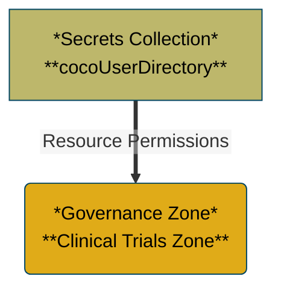
### Zone Profiles (Mermaid)  
---  
  
### Zone Profile Bar Chart  
---  
  
### Zone Profile Pie Chart  
---  
  
### Zone Profile Anchored (Mermaid)  
---  
  
### Zone Profile Anchored Bar Chart  
---  
  
### Zone Profile Anchored Pie Chart  
---  
  
### Zone Profile All (Mermaid)  
---  
  
### Zone Profile All Bar Chart  
---  
  
### Zone Profile All Pie Chart  
---  
  
  
---  
  
<a id="ea63a241-3645-4abc-83b4-6be4e8d9956c"></a>  
## Governance Zone Name: Supply, Manufacturing and Distribution Zone  
  
### Mermaid Graph  
  
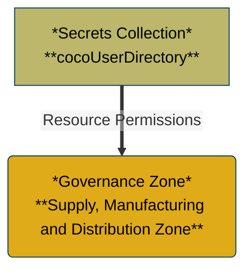
### Zone Profiles (Mermaid)  
---  
  
### Zone Profile Bar Chart  
---  
  
### Zone Profile Pie Chart  
---  
  
### Zone Profile Anchored (Mermaid)  
---  
  
### Zone Profile Anchored Bar Chart  
---  
  
### Zone Profile Anchored Pie Chart  
---  
  
### Zone Profile All (Mermaid)  
---  
  
### Zone Profile All Bar Chart  
---  
  
### Zone Profile All Pie Chart  
---  
  
  
---  
  
<a id="79babb8a-a580-4594-a986-55b5a975a9d3"></a>  
## Governance Zone Name: Research Zone  
  
### Mermaid Graph  
  
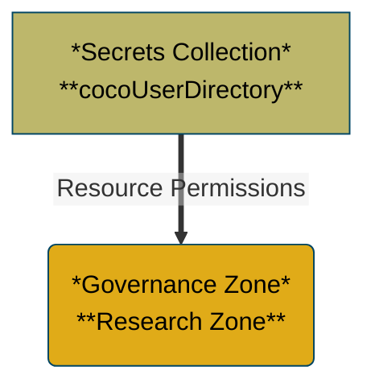
### Zone Profiles (Mermaid)  
---  
  
### Zone Profile Bar Chart  
---  
  
### Zone Profile Pie Chart  
---  
  
### Zone Profile Anchored (Mermaid)  
---  
  
### Zone Profile Anchored Bar Chart  
---  
  
### Zone Profile Anchored Pie Chart  
---  
  
### Zone Profile All (Mermaid)  
---  
  
### Zone Profile All Bar Chart  
---  
  
### Zone Profile All Pie Chart  
---  
  
  
---  
  
<a id="c1067633-d337-463e-851c-519137f5f8a8"></a>  
## Governance Zone Name: Digital Products Zone  
  
### Mermaid Graph  
  
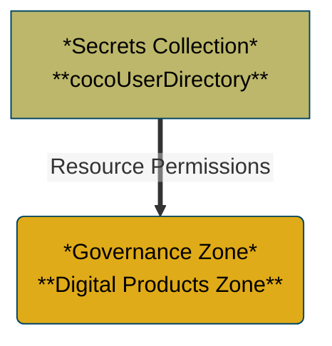
### Zone Profiles (Mermaid)  
  
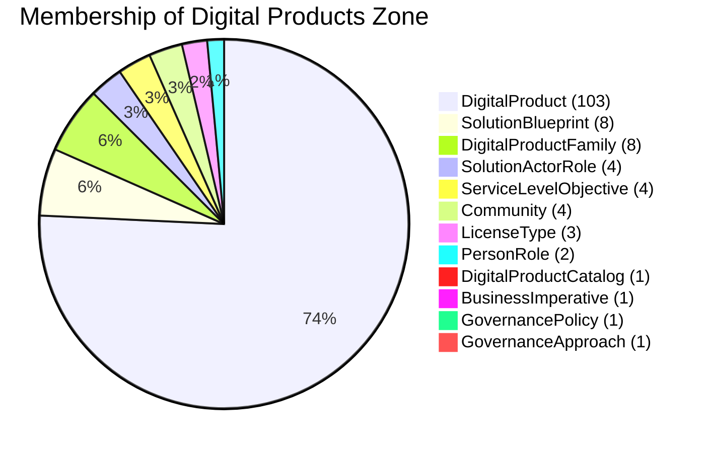
### Zone Profile Bar Chart  
  
```vega-lite  
{  
  "$schema": "https://vega.github.io/schema/vega-lite/v5.json",  "title": "Type Membership Bar Chart",  "description": "Type Membership Bar Chart",  "data": {    "values": [      {        "category": "SolutionActorRole",        "count": 4      },      {        "category": "DigitalProductCatalog",        "count": 1      },      {        "category": "BusinessImperative",        "count": 1      },      {        "category": "SolutionBlueprint",        "count": 8      },      {        "category": "ServiceLevelObjective",        "count": 4      },      {        "category": "DigitalProductFamily",        "count": 8      },      {        "category": "GovernancePolicy",        "count": 1      },      {        "category": "Community",        "count": 4      },      {        "category": "PersonRole",        "count": 2      },      {        "category": "LicenseType",        "count": 3      },      {        "category": "GovernanceApproach",        "count": 1      },      {        "category": "DigitalProduct",        "count": 103      }    ]  },  "mark": {    "type": "bar",    "tooltip": true  },  "encoding": {    "color": {      "field": "category",      "type": "nominal",      "legend": null    },    "tooltip": [      {        "field": "category",        "type": "nominal",        "title": "Category"      },      {        "field": "count",        "type": "quantitative",        "title": "Count"      }    ],    "y": {      "field": "category",      "type": "nominal",      "sort": "-x",      "title": "Category"    },    "x": {      "field": "count",      "type": "quantitative",      "title": "Count"    }  }}  
```  
  
### Zone Profile Pie Chart  
  
```vega-lite  
{  
  "$schema": "https://vega.github.io/schema/vega-lite/v5.json",  "title": "Type Membership Pie Chart",  "description": "Type Membership Pie Chart",  "data": {    "values": [      {        "category": "SolutionActorRole",        "count": 4      },      {        "category": "DigitalProductCatalog",        "count": 1      },      {        "category": "BusinessImperative",        "count": 1      },      {        "category": "SolutionBlueprint",        "count": 8      },      {        "category": "ServiceLevelObjective",        "count": 4      },      {        "category": "DigitalProductFamily",        "count": 8      },      {        "category": "GovernancePolicy",        "count": 1      },      {        "category": "Community",        "count": 4      },      {        "category": "PersonRole",        "count": 2      },      {        "category": "LicenseType",        "count": 3      },      {        "category": "GovernanceApproach",        "count": 1      },      {        "category": "DigitalProduct",        "count": 103      }    ]  },  "mark": {    "type": "arc",    "tooltip": true,    "innerRadius": 50  },  "encoding": {    "theta": {      "field": "count",      "type": "quantitative"    },    "color": {      "field": "category",      "type": "nominal"    },    "tooltip": [      {        "field": "category",        "type": "nominal",        "title": "Category"      },      {        "field": "count",        "type": "quantitative",        "title": "Count"      }    ]  }}  
```  
  
### Zone Profile Anchored (Mermaid)  
  
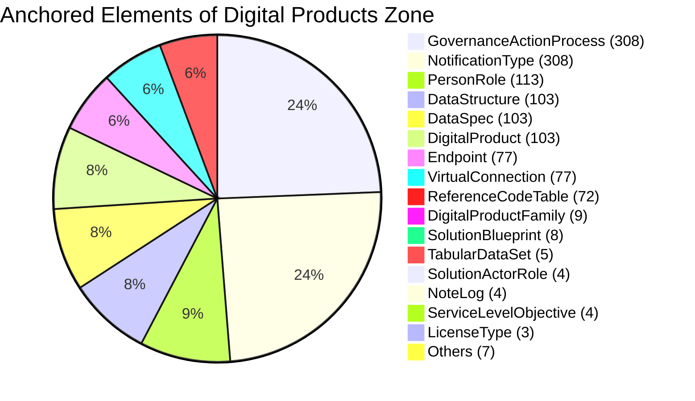
### Zone Profile Anchored Bar Chart  
  
```vega-lite  
{  
  "$schema": "https://vega.github.io/schema/vega-lite/v5.json",  "title": "Anchored Type Membership Bar Chart",  "description": "Anchored Type Membership Bar Chart",  "data": {    "values": [      {        "category": "SolutionActorRole",        "count": 4      },      {        "category": "GovernanceActionProcess",        "count": 308      },      {        "category": "DigitalProductCatalog",        "count": 1      },      {        "category": "BusinessImperative",        "count": 1      },      {        "category": "DigitalProductFamily",        "count": 9      },      {        "category": "GovernancePolicy",        "count": 1      },      {        "category": "DataStructure",        "count": 103      },      {        "category": "DataDictionary",        "count": 1      },      {        "category": "LicenseType",        "count": 3      },      {        "category": "PersonRole",        "count": 113      },      {        "category": "ReferenceCodeTable",        "count": 72      },      {        "category": "SolutionBlueprint",        "count": 8      },      {        "category": "NoteLog",        "count": 4      },      {        "category": "Endpoint",        "count": 77      },      {        "category": "ServiceLevelObjective",        "count": 4      },      {        "category": "VirtualConnection",        "count": 77      },      {        "category": "Glossary",        "count": 1      },      {        "category": "NotificationType",        "count": 308      },      {        "category": "DataSpec",        "count": 103      },      {        "category": "TabularDataSet",        "count": 5      },      {        "category": "Community",        "count": 4      },      {        "category": "GovernanceApproach",        "count": 1      },      {        "category": "DigitalProduct",        "count": 103      }    ]  },  "mark": {    "type": "bar",    "tooltip": true  },  "encoding": {    "color": {      "field": "category",      "type": "nominal",      "legend": null    },    "tooltip": [      {        "field": "category",        "type": "nominal",        "title": "Category"      },      {        "field": "count",        "type": "quantitative",        "title": "Count"      }    ],    "y": {      "field": "category",      "type": "nominal",      "sort": "-x",      "title": "Category"    },    "x": {      "field": "count",      "type": "quantitative",      "title": "Count"    }  }}  
```  
  
### Zone Profile Anchored Pie Chart  
  
```vega-lite  
{  
  "$schema": "https://vega.github.io/schema/vega-lite/v5.json",  "title": "Anchored Type Membership Pie Chart",  "description": "Anchored Type Membership Pie Chart",  "data": {    "values": [      {        "category": "SolutionActorRole",        "count": 4      },      {        "category": "GovernanceActionProcess",        "count": 308      },      {        "category": "DigitalProductCatalog",        "count": 1      },      {        "category": "BusinessImperative",        "count": 1      },      {        "category": "DigitalProductFamily",        "count": 9      },      {        "category": "GovernancePolicy",        "count": 1      },      {        "category": "DataStructure",        "count": 103      },      {        "category": "DataDictionary",        "count": 1      },      {        "category": "LicenseType",        "count": 3      },      {        "category": "PersonRole",        "count": 113      },      {        "category": "ReferenceCodeTable",        "count": 72      },      {        "category": "SolutionBlueprint",        "count": 8      },      {        "category": "NoteLog",        "count": 4      },      {        "category": "Endpoint",        "count": 77      },      {        "category": "ServiceLevelObjective",        "count": 4      },      {        "category": "VirtualConnection",        "count": 77      },      {        "category": "Glossary",        "count": 1      },      {        "category": "NotificationType",        "count": 308      },      {        "category": "DataSpec",        "count": 103      },      {        "category": "TabularDataSet",        "count": 5      },      {        "category": "Community",        "count": 4      },      {        "category": "GovernanceApproach",        "count": 1      },      {        "category": "DigitalProduct",        "count": 103      }    ]  },  "mark": {    "type": "arc",    "tooltip": true,    "innerRadius": 50  },  "encoding": {    "theta": {      "field": "count",      "type": "quantitative"    },    "color": {      "field": "category",      "type": "nominal"    },    "tooltip": [      {        "field": "category",        "type": "nominal",        "title": "Category"      },      {        "field": "count",        "type": "quantitative",        "title": "Count"      }    ]  }}  
```  
  
### Zone Profile All (Mermaid)  
  
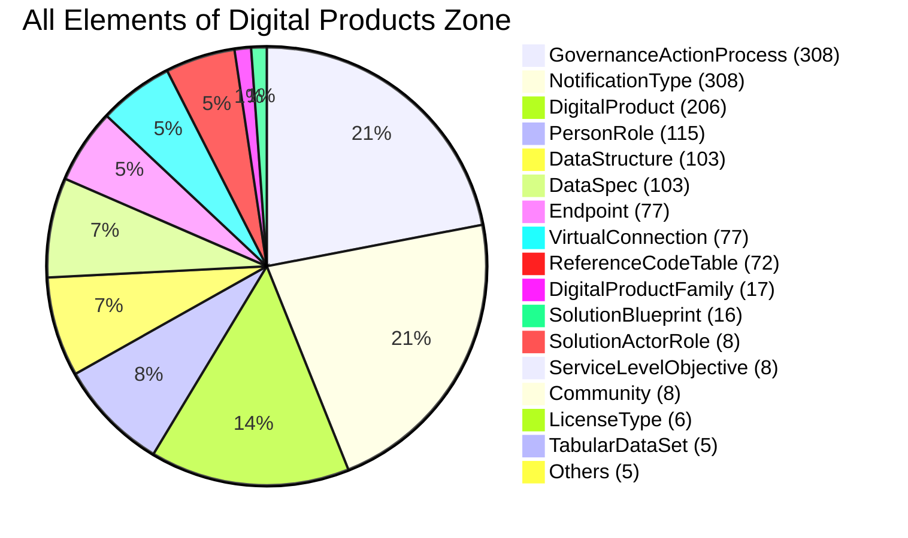
### Zone Profile All Bar Chart  
  
```vega-lite  
{  
  "$schema": "https://vega.github.io/schema/vega-lite/v5.json",  "title": "All Type Membership Bar Chart",  "description": "All Type Membership Bar Chart",  "data": {    "values": [      {        "category": "GovernanceActionProcess",        "count": 308      },      {        "category": "SolutionActorRole",        "count": 8      },      {        "category": "DigitalProductCatalog",        "count": 2      },      {        "category": "BusinessImperative",        "count": 2      },      {        "category": "DigitalProductFamily",        "count": 17      },      {        "category": "DataStructure",        "count": 103      },      {        "category": "GovernancePolicy",        "count": 2      },      {        "category": "DataDictionary",        "count": 1      },      {        "category": "PersonRole",        "count": 115      },      {        "category": "LicenseType",        "count": 6      },      {        "category": "ReferenceCodeTable",        "count": 72      },      {        "category": "NoteLog",        "count": 4      },      {        "category": "SolutionBlueprint",        "count": 16      },      {        "category": "Endpoint",        "count": 77      },      {        "category": "VirtualConnection",        "count": 77      },      {        "category": "ServiceLevelObjective",        "count": 8      },      {        "category": "Glossary",        "count": 1      },      {        "category": "NotificationType",        "count": 308      },      {        "category": "DataSpec",        "count": 103      },      {        "category": "TabularDataSet",        "count": 5      },      {        "category": "Community",        "count": 8      },      {        "category": "GovernanceApproach",        "count": 2      },      {        "category": "DigitalProduct",        "count": 206      }    ]  },  "mark": {    "type": "bar",    "tooltip": true  },  "encoding": {    "color": {      "field": "category",      "type": "nominal",      "legend": null    },    "tooltip": [      {        "field": "category",        "type": "nominal",        "title": "Category"      },      {        "field": "count",        "type": "quantitative",        "title": "Count"      }    ],    "y": {      "field": "category",      "type": "nominal",      "sort": "-x",      "title": "Category"    },    "x": {      "field": "count",      "type": "quantitative",      "title": "Count"    }  }}  
```  
  
### Zone Profile All Pie Chart  
  
```vega-lite  
{  
  "$schema": "https://vega.github.io/schema/vega-lite/v5.json",  "title": "All Type Membership Pie Chart",  "description": "All Type Membership Pie Chart",  "data": {    "values": [      {        "category": "GovernanceActionProcess",        "count": 308      },      {        "category": "SolutionActorRole",        "count": 8      },      {        "category": "DigitalProductCatalog",        "count": 2      },      {        "category": "BusinessImperative",        "count": 2      },      {        "category": "DigitalProductFamily",        "count": 17      },      {        "category": "DataStructure",        "count": 103      },      {        "category": "GovernancePolicy",        "count": 2      },      {        "category": "DataDictionary",        "count": 1      },      {        "category": "PersonRole",        "count": 115      },      {        "category": "LicenseType",        "count": 6      },      {        "category": "ReferenceCodeTable",        "count": 72      },      {        "category": "NoteLog",        "count": 4      },      {        "category": "SolutionBlueprint",        "count": 16      },      {        "category": "Endpoint",        "count": 77      },      {        "category": "VirtualConnection",        "count": 77      },      {        "category": "ServiceLevelObjective",        "count": 8      },      {        "category": "Glossary",        "count": 1      },      {        "category": "NotificationType",        "count": 308      },      {        "category": "DataSpec",        "count": 103      },      {        "category": "TabularDataSet",        "count": 5      },      {        "category": "Community",        "count": 8      },      {        "category": "GovernanceApproach",        "count": 2      },      {        "category": "DigitalProduct",        "count": 206      }    ]  },  "mark": {    "type": "arc",    "tooltip": true,    "innerRadius": 50  },  "encoding": {    "theta": {      "field": "count",      "type": "quantitative"    },    "color": {      "field": "category",      "type": "nominal"    },    "tooltip": [      {        "field": "category",        "type": "nominal",        "title": "Category"      },      {        "field": "count",        "type": "quantitative",        "title": "Count"      }    ]  }}  
```  
  
  
---  
  
<a id="8b1b97bd-d286-47c9-8b36-355310211a74"></a>  
## Governance Zone Name: Finance Zone  
  
### Mermaid Graph  
  
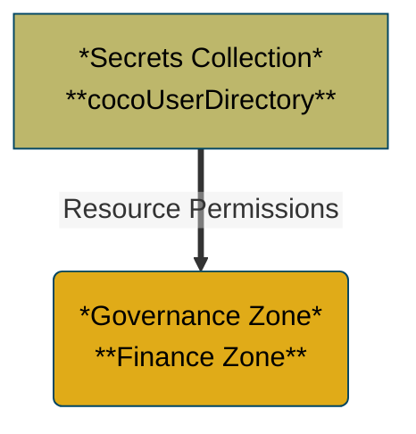
### Zone Profiles (Mermaid)  
---  
  
### Zone Profile Bar Chart  
---  
  
### Zone Profile Pie Chart  
---  
  
### Zone Profile Anchored (Mermaid)  
---  
  
### Zone Profile Anchored Bar Chart  
---  
  
### Zone Profile Anchored Pie Chart  
---  
  
### Zone Profile All (Mermaid)  
---  
  
### Zone Profile All Bar Chart  
---  
  
### Zone Profile All Pie Chart  
---  
  
  
---  
  
<a id="e6b0661a-9996-4d66-bfa8-a2b11a9c617a"></a>  
## Governance Zone Name: Security Zone  
  
### Mermaid Graph  
  
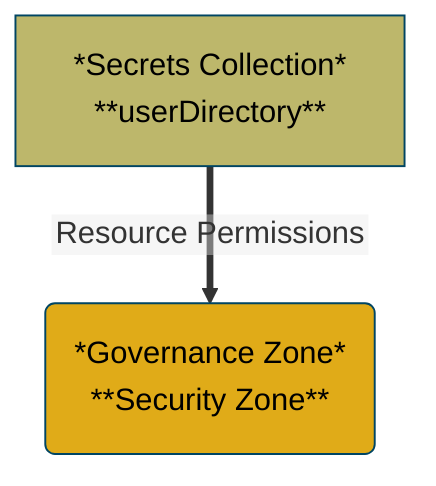
### Zone Profiles (Mermaid)  
  
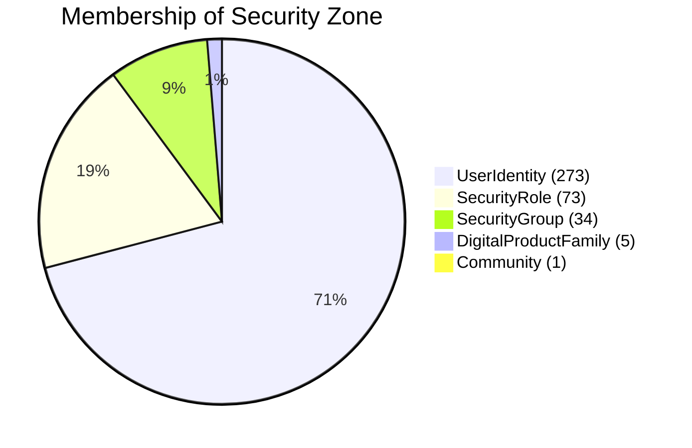
### Zone Profile Bar Chart  
  
```vega-lite  
{  
  "$schema": "https://vega.github.io/schema/vega-lite/v5.json",  "title": "Type Membership Bar Chart",  "description": "Type Membership Bar Chart",  "data": {    "values": [      {        "category": "SecurityRole",        "count": 73      },      {        "category": "DigitalProductFamily",        "count": 5      },      {        "category": "UserIdentity",        "count": 273      },      {        "category": "SecurityGroup",        "count": 34      },      {        "category": "Community",        "count": 1      }    ]  },  "mark": {    "type": "bar",    "tooltip": true  },  "encoding": {    "color": {      "field": "category",      "type": "nominal",      "legend": null    },    "tooltip": [      {        "field": "category",        "type": "nominal",        "title": "Category"      },      {        "field": "count",        "type": "quantitative",        "title": "Count"      }    ],    "y": {      "field": "category",      "type": "nominal",      "sort": "-x",      "title": "Category"    },    "x": {      "field": "count",      "type": "quantitative",      "title": "Count"    }  }}  
```  
  
### Zone Profile Pie Chart  
  
```vega-lite  
{  
  "$schema": "https://vega.github.io/schema/vega-lite/v5.json",  "title": "Type Membership Pie Chart",  "description": "Type Membership Pie Chart",  "data": {    "values": [      {        "category": "SecurityRole",        "count": 73      },      {        "category": "DigitalProductFamily",        "count": 5      },      {        "category": "UserIdentity",        "count": 273      },      {        "category": "SecurityGroup",        "count": 34      },      {        "category": "Community",        "count": 1      }    ]  },  "mark": {    "type": "arc",    "tooltip": true,    "innerRadius": 50  },  "encoding": {    "theta": {      "field": "count",      "type": "quantitative"    },    "color": {      "field": "category",      "type": "nominal"    },    "tooltip": [      {        "field": "category",        "type": "nominal",        "title": "Category"      },      {        "field": "count",        "type": "quantitative",        "title": "Count"      }    ]  }}  
```  
  
### Zone Profile Anchored (Mermaid)  
  
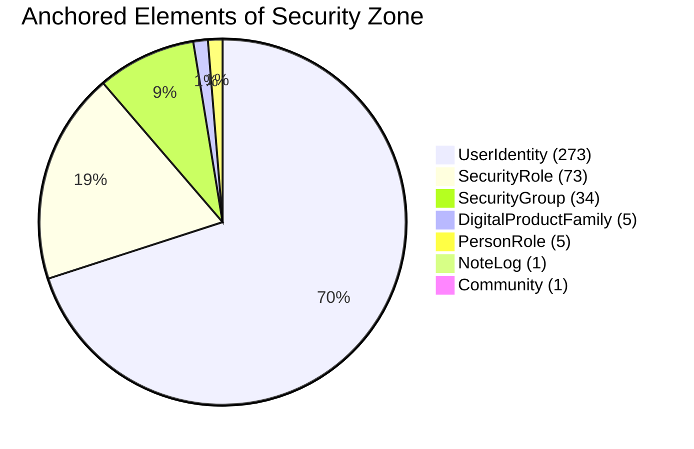
### Zone Profile Anchored Bar Chart  
  
```vega-lite  
{  
  "$schema": "https://vega.github.io/schema/vega-lite/v5.json",  "title": "Anchored Type Membership Bar Chart",  "description": "Anchored Type Membership Bar Chart",  "data": {    "values": [      {        "category": "SecurityRole",        "count": 73      },      {        "category": "NoteLog",        "count": 1      },      {        "category": "DigitalProductFamily",        "count": 5      },      {        "category": "UserIdentity",        "count": 273      },      {        "category": "SecurityGroup",        "count": 34      },      {        "category": "Community",        "count": 1      },      {        "category": "PersonRole",        "count": 5      }    ]  },  "mark": {    "type": "bar",    "tooltip": true  },  "encoding": {    "color": {      "field": "category",      "type": "nominal",      "legend": null    },    "tooltip": [      {        "field": "category",        "type": "nominal",        "title": "Category"      },      {        "field": "count",        "type": "quantitative",        "title": "Count"      }    ],    "y": {      "field": "category",      "type": "nominal",      "sort": "-x",      "title": "Category"    },    "x": {      "field": "count",      "type": "quantitative",      "title": "Count"    }  }}  
```  
  
### Zone Profile Anchored Pie Chart  
  
```vega-lite  
{  
  "$schema": "https://vega.github.io/schema/vega-lite/v5.json",  "title": "Anchored Type Membership Pie Chart",  "description": "Anchored Type Membership Pie Chart",  "data": {    "values": [      {        "category": "SecurityRole",        "count": 73      },      {        "category": "NoteLog",        "count": 1      },      {        "category": "DigitalProductFamily",        "count": 5      },      {        "category": "UserIdentity",        "count": 273      },      {        "category": "SecurityGroup",        "count": 34      },      {        "category": "Community",        "count": 1      },      {        "category": "PersonRole",        "count": 5      }    ]  },  "mark": {    "type": "arc",    "tooltip": true,    "innerRadius": 50  },  "encoding": {    "theta": {      "field": "count",      "type": "quantitative"    },    "color": {      "field": "category",      "type": "nominal"    },    "tooltip": [      {        "field": "category",        "type": "nominal",        "title": "Category"      },      {        "field": "count",        "type": "quantitative",        "title": "Count"      }    ]  }}  
```  
  
### Zone Profile All (Mermaid)  
  
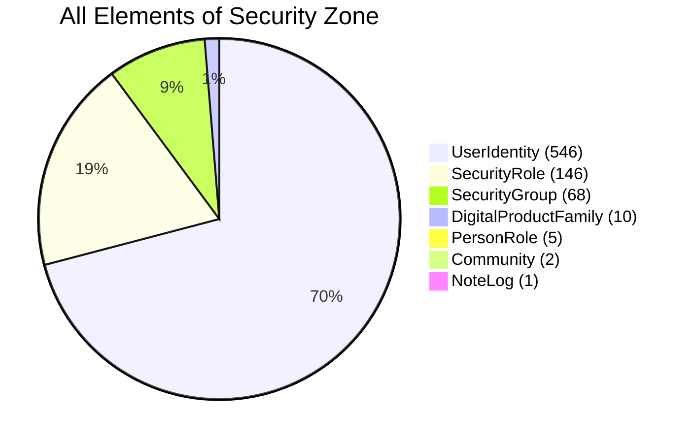
### Zone Profile All Bar Chart  
  
```vega-lite  
{  
  "$schema": "https://vega.github.io/schema/vega-lite/v5.json",  "title": "All Type Membership Bar Chart",  "description": "All Type Membership Bar Chart",  "data": {    "values": [      {        "category": "SecurityRole",        "count": 146      },      {        "category": "NoteLog",        "count": 1      },      {        "category": "DigitalProductFamily",        "count": 10      },      {        "category": "UserIdentity",        "count": 546      },      {        "category": "SecurityGroup",        "count": 68      },      {        "category": "Community",        "count": 2      },      {        "category": "PersonRole",        "count": 5      }    ]  },  "mark": {    "type": "bar",    "tooltip": true  },  "encoding": {    "color": {      "field": "category",      "type": "nominal",      "legend": null    },    "tooltip": [      {        "field": "category",        "type": "nominal",        "title": "Category"      },      {        "field": "count",        "type": "quantitative",        "title": "Count"      }    ],    "y": {      "field": "category",      "type": "nominal",      "sort": "-x",      "title": "Category"    },    "x": {      "field": "count",      "type": "quantitative",      "title": "Count"    }  }}  
```  
  
### Zone Profile All Pie Chart  
  
```vega-lite  
{  
  "$schema": "https://vega.github.io/schema/vega-lite/v5.json",  "title": "All Type Membership Pie Chart",  "description": "All Type Membership Pie Chart",  "data": {    "values": [      {        "category": "SecurityRole",        "count": 146      },      {        "category": "NoteLog",        "count": 1      },      {        "category": "DigitalProductFamily",        "count": 10      },      {        "category": "UserIdentity",        "count": 546      },      {        "category": "SecurityGroup",        "count": 68      },      {        "category": "Community",        "count": 2      },      {        "category": "PersonRole",        "count": 5      }    ]  },  "mark": {    "type": "arc",    "tooltip": true,    "innerRadius": 50  },  "encoding": {    "theta": {      "field": "count",      "type": "quantitative"    },    "color": {      "field": "category",      "type": "nominal"    },    "tooltip": [      {        "field": "category",        "type": "nominal",        "title": "Category"      },      {        "field": "count",        "type": "quantitative",        "title": "Count"      }    ]  }}  
```  
  
  
---  
  
<a id="46be2a77-186a-43bc-a4f5-327fdeb955e2"></a>  
## Governance Zone Name: Depot Systems Zone (part of Infrastructure Zone)  
  
### Mermaid Graph  
  
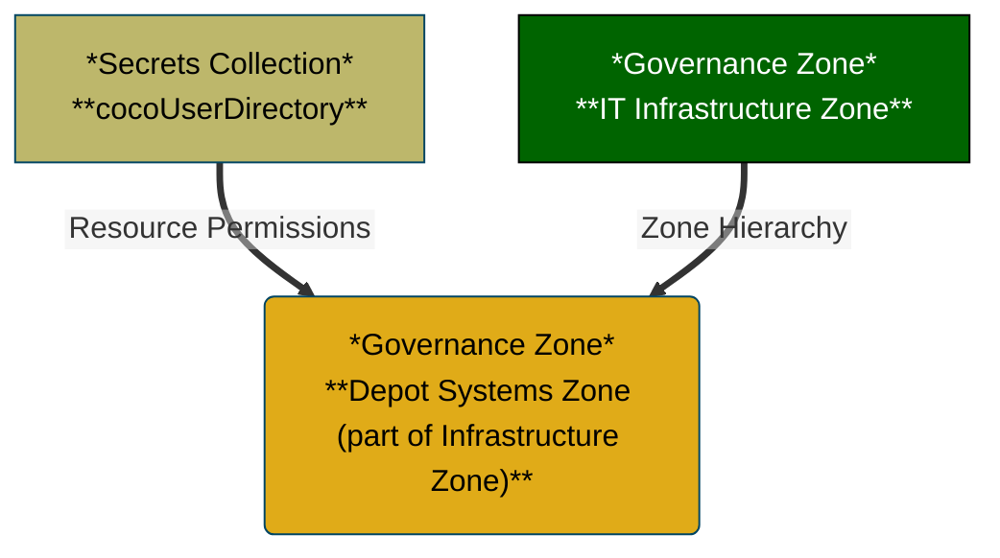
### Zone Profiles (Mermaid)  
  
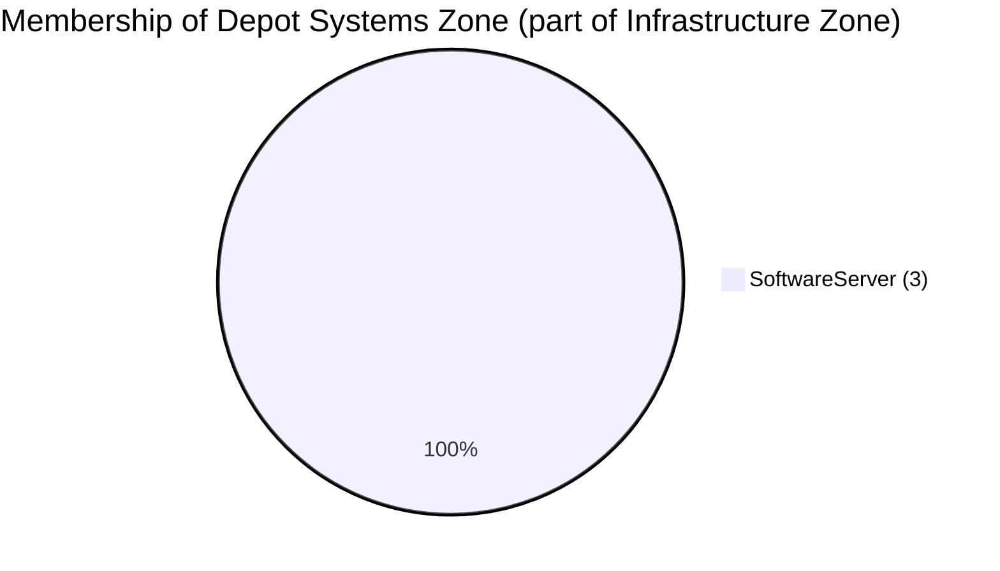
### Zone Profile Bar Chart  
  
```vega-lite  
{  
  "$schema": "https://vega.github.io/schema/vega-lite/v5.json",  "title": "Type Membership Bar Chart",  "description": "Type Membership Bar Chart",  "data": {    "values": [      {        "category": "SoftwareServer",        "count": 3      }    ]  },  "mark": {    "type": "bar",    "tooltip": true  },  "encoding": {    "color": {      "field": "category",      "type": "nominal",      "legend": null    },    "tooltip": [      {        "field": "category",        "type": "nominal",        "title": "Category"      },      {        "field": "count",        "type": "quantitative",        "title": "Count"      }    ],    "y": {      "field": "category",      "type": "nominal",      "sort": "-x",      "title": "Category"    },    "x": {      "field": "count",      "type": "quantitative",      "title": "Count"    }  }}  
```  
  
### Zone Profile Pie Chart  
  
```vega-lite  
{  
  "$schema": "https://vega.github.io/schema/vega-lite/v5.json",  "title": "Type Membership Pie Chart",  "description": "Type Membership Pie Chart",  "data": {    "values": [      {        "category": "SoftwareServer",        "count": 3      }    ]  },  "mark": {    "type": "arc",    "tooltip": true,    "innerRadius": 50  },  "encoding": {    "theta": {      "field": "count",      "type": "quantitative"    },    "color": {      "field": "category",      "type": "nominal"    },    "tooltip": [      {        "field": "category",        "type": "nominal",        "title": "Category"      },      {        "field": "count",        "type": "quantitative",        "title": "Count"      }    ]  }}  
```  
  
### Zone Profile Anchored (Mermaid)  
  
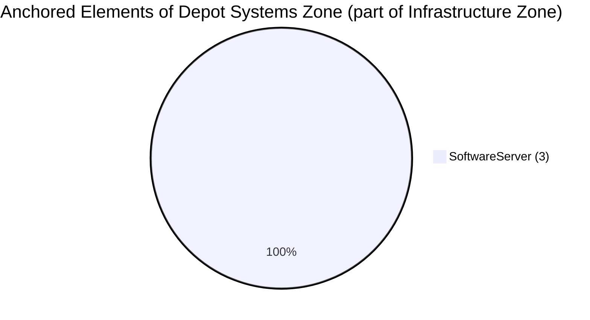
### Zone Profile Anchored Bar Chart  
  
```vega-lite  
{  
  "$schema": "https://vega.github.io/schema/vega-lite/v5.json",  "title": "Anchored Type Membership Bar Chart",  "description": "Anchored Type Membership Bar Chart",  "data": {    "values": [      {        "category": "SoftwareServer",        "count": 3      }    ]  },  "mark": {    "type": "bar",    "tooltip": true  },  "encoding": {    "color": {      "field": "category",      "type": "nominal",      "legend": null    },    "tooltip": [      {        "field": "category",        "type": "nominal",        "title": "Category"      },      {        "field": "count",        "type": "quantitative",        "title": "Count"      }    ],    "y": {      "field": "category",      "type": "nominal",      "sort": "-x",      "title": "Category"    },    "x": {      "field": "count",      "type": "quantitative",      "title": "Count"    }  }}  
```  
  
### Zone Profile Anchored Pie Chart  
  
```vega-lite  
{  
  "$schema": "https://vega.github.io/schema/vega-lite/v5.json",  "title": "Anchored Type Membership Pie Chart",  "description": "Anchored Type Membership Pie Chart",  "data": {    "values": [      {        "category": "SoftwareServer",        "count": 3      }    ]  },  "mark": {    "type": "arc",    "tooltip": true,    "innerRadius": 50  },  "encoding": {    "theta": {      "field": "count",      "type": "quantitative"    },    "color": {      "field": "category",      "type": "nominal"    },    "tooltip": [      {        "field": "category",        "type": "nominal",        "title": "Category"      },      {        "field": "count",        "type": "quantitative",        "title": "Count"      }    ]  }}  
```  
  
### Zone Profile All (Mermaid)  
  
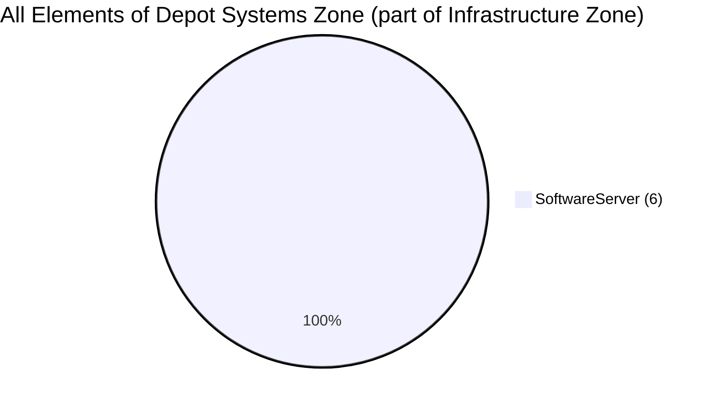
### Zone Profile All Bar Chart  
  
```vega-lite  
{  
  "$schema": "https://vega.github.io/schema/vega-lite/v5.json",  "title": "All Type Membership Bar Chart",  "description": "All Type Membership Bar Chart",  "data": {    "values": [      {        "category": "SoftwareServer",        "count": 6      }    ]  },  "mark": {    "type": "bar",    "tooltip": true  },  "encoding": {    "color": {      "field": "category",      "type": "nominal",      "legend": null    },    "tooltip": [      {        "field": "category",        "type": "nominal",        "title": "Category"      },      {        "field": "count",        "type": "quantitative",        "title": "Count"      }    ],    "y": {      "field": "category",      "type": "nominal",      "sort": "-x",      "title": "Category"    },    "x": {      "field": "count",      "type": "quantitative",      "title": "Count"    }  }}  
```  
  
### Zone Profile All Pie Chart  
  
```vega-lite  
{  
  "$schema": "https://vega.github.io/schema/vega-lite/v5.json",  "title": "All Type Membership Pie Chart",  "description": "All Type Membership Pie Chart",  "data": {    "values": [      {        "category": "SoftwareServer",        "count": 6      }    ]  },  "mark": {    "type": "arc",    "tooltip": true,    "innerRadius": 50  },  "encoding": {    "theta": {      "field": "count",      "type": "quantitative"    },    "color": {      "field": "category",      "type": "nominal"    },    "tooltip": [      {        "field": "category",        "type": "nominal",        "title": "Category"      },      {        "field": "count",        "type": "quantitative",        "title": "Count"      }    ]  }}  
```  
  
  
---  
  
<a id="c7256028-86cb-42bc-b6f6-23b05c2523e2"></a>  
## Governance Zone Name: Digital Products Zone  
  
### Mermaid Graph  
  
```mermaid  
flowchart TD  
%%{init: {"flowchart": {"htmlLabels": false}} }%%  
  
1("*Governance Zone*<br/>**Digital Products Zone**")  
2["*Secrets Collection*<br/>**userDirectory**"]  
2==>|"Resource Permissions"|1  
style 1 color:#000000, fill:#e0ab18, stroke:#004563  
style 2 color:#000000, fill:#BDB76B, stroke:#004563  
```  
### Zone Profiles (Mermaid)  
  
```mermaid  
pie  
title Membership of Digital Products Zone  
"DigitalProduct (103)" : 103  
"SolutionBlueprint (8)" : 8  
"DigitalProductFamily (8)" : 8  
"SolutionActorRole (4)" : 4  
"ServiceLevelObjective (4)" : 4  
"Community (4)" : 4  
"LicenseType (3)" : 3  
"PersonRole (2)" : 2  
"DigitalProductCatalog (1)" : 1  
"BusinessImperative (1)" : 1  
"GovernancePolicy (1)" : 1  
"GovernanceApproach (1)" : 1  
```  
### Zone Profile Bar Chart  
  
```vega-lite  
{  
  "$schema": "https://vega.github.io/schema/vega-lite/v5.json",  "title": "Type Membership Bar Chart",  "description": "Type Membership Bar Chart",  "data": {    "values": [      {        "category": "SolutionActorRole",        "count": 4      },      {        "category": "DigitalProductCatalog",        "count": 1      },      {        "category": "BusinessImperative",        "count": 1      },      {        "category": "SolutionBlueprint",        "count": 8      },      {        "category": "ServiceLevelObjective",        "count": 4      },      {        "category": "DigitalProductFamily",        "count": 8      },      {        "category": "GovernancePolicy",        "count": 1      },      {        "category": "Community",        "count": 4      },      {        "category": "PersonRole",        "count": 2      },      {        "category": "LicenseType",        "count": 3      },      {        "category": "GovernanceApproach",        "count": 1      },      {        "category": "DigitalProduct",        "count": 103      }    ]  },  "mark": {    "type": "bar",    "tooltip": true  },  "encoding": {    "color": {      "field": "category",      "type": "nominal",      "legend": null    },    "tooltip": [      {        "field": "category",        "type": "nominal",        "title": "Category"      },      {        "field": "count",        "type": "quantitative",        "title": "Count"      }    ],    "y": {      "field": "category",      "type": "nominal",      "sort": "-x",      "title": "Category"    },    "x": {      "field": "count",      "type": "quantitative",      "title": "Count"    }  }}  
```  
  
### Zone Profile Pie Chart  
  
```vega-lite  
{  
  "$schema": "https://vega.github.io/schema/vega-lite/v5.json",  "title": "Type Membership Pie Chart",  "description": "Type Membership Pie Chart",  "data": {    "values": [      {        "category": "SolutionActorRole",        "count": 4      },      {        "category": "DigitalProductCatalog",        "count": 1      },      {        "category": "BusinessImperative",        "count": 1      },      {        "category": "SolutionBlueprint",        "count": 8      },      {        "category": "ServiceLevelObjective",        "count": 4      },      {        "category": "DigitalProductFamily",        "count": 8      },      {        "category": "GovernancePolicy",        "count": 1      },      {        "category": "Community",        "count": 4      },      {        "category": "PersonRole",        "count": 2      },      {        "category": "LicenseType",        "count": 3      },      {        "category": "GovernanceApproach",        "count": 1      },      {        "category": "DigitalProduct",        "count": 103      }    ]  },  "mark": {    "type": "arc",    "tooltip": true,    "innerRadius": 50  },  "encoding": {    "theta": {      "field": "count",      "type": "quantitative"    },    "color": {      "field": "category",      "type": "nominal"    },    "tooltip": [      {        "field": "category",        "type": "nominal",        "title": "Category"      },      {        "field": "count",        "type": "quantitative",        "title": "Count"      }    ]  }}  
```  
  
### Zone Profile Anchored (Mermaid)  
  
```mermaid  
pie  
title Anchored Elements of Digital Products Zone  
"GovernanceActionProcess (308)" : 308  
"NotificationType (308)" : 308  
"PersonRole (113)" : 113  
"DataStructure (103)" : 103  
"DataSpec (103)" : 103  
"DigitalProduct (103)" : 103  
"Endpoint (77)" : 77  
"VirtualConnection (77)" : 77  
"ReferenceCodeTable (72)" : 72  
"DigitalProductFamily (9)" : 9  
"SolutionBlueprint (8)" : 8  
"TabularDataSet (5)" : 5  
"SolutionActorRole (4)" : 4  
"NoteLog (4)" : 4  
"ServiceLevelObjective (4)" : 4  
"LicenseType (3)" : 3  
"Others (7)" : 7  
```  
### Zone Profile Anchored Bar Chart  
  
```vega-lite  
{  
  "$schema": "https://vega.github.io/schema/vega-lite/v5.json",  "title": "Anchored Type Membership Bar Chart",  "description": "Anchored Type Membership Bar Chart",  "data": {    "values": [      {        "category": "SolutionActorRole",        "count": 4      },      {        "category": "GovernanceActionProcess",        "count": 308      },      {        "category": "DigitalProductCatalog",        "count": 1      },      {        "category": "BusinessImperative",        "count": 1      },      {        "category": "DigitalProductFamily",        "count": 9      },      {        "category": "GovernancePolicy",        "count": 1      },      {        "category": "DataStructure",        "count": 103      },      {        "category": "DataDictionary",        "count": 1      },      {        "category": "LicenseType",        "count": 3      },      {        "category": "PersonRole",        "count": 113      },      {        "category": "ReferenceCodeTable",        "count": 72      },      {        "category": "SolutionBlueprint",        "count": 8      },      {        "category": "NoteLog",        "count": 4      },      {        "category": "Endpoint",        "count": 77      },      {        "category": "ServiceLevelObjective",        "count": 4      },      {        "category": "VirtualConnection",        "count": 77      },      {        "category": "Glossary",        "count": 1      },      {        "category": "NotificationType",        "count": 308      },      {        "category": "DataSpec",        "count": 103      },      {        "category": "TabularDataSet",        "count": 5      },      {        "category": "Community",        "count": 4      },      {        "category": "GovernanceApproach",        "count": 1      },      {        "category": "DigitalProduct",        "count": 103      }    ]  },  "mark": {    "type": "bar",    "tooltip": true  },  "encoding": {    "color": {      "field": "category",      "type": "nominal",      "legend": null    },    "tooltip": [      {        "field": "category",        "type": "nominal",        "title": "Category"      },      {        "field": "count",        "type": "quantitative",        "title": "Count"      }    ],    "y": {      "field": "category",      "type": "nominal",      "sort": "-x",      "title": "Category"    },    "x": {      "field": "count",      "type": "quantitative",      "title": "Count"    }  }}  
```  
  
### Zone Profile Anchored Pie Chart  
  
```vega-lite  
{  
  "$schema": "https://vega.github.io/schema/vega-lite/v5.json",  "title": "Anchored Type Membership Pie Chart",  "description": "Anchored Type Membership Pie Chart",  "data": {    "values": [      {        "category": "SolutionActorRole",        "count": 4      },      {        "category": "GovernanceActionProcess",        "count": 308      },      {        "category": "DigitalProductCatalog",        "count": 1      },      {        "category": "BusinessImperative",        "count": 1      },      {        "category": "DigitalProductFamily",        "count": 9      },      {        "category": "GovernancePolicy",        "count": 1      },      {        "category": "DataStructure",        "count": 103      },      {        "category": "DataDictionary",        "count": 1      },      {        "category": "LicenseType",        "count": 3      },      {        "category": "PersonRole",        "count": 113      },      {        "category": "ReferenceCodeTable",        "count": 72      },      {        "category": "SolutionBlueprint",        "count": 8      },      {        "category": "NoteLog",        "count": 4      },      {        "category": "Endpoint",        "count": 77      },      {        "category": "ServiceLevelObjective",        "count": 4      },      {        "category": "VirtualConnection",        "count": 77      },      {        "category": "Glossary",        "count": 1      },      {        "category": "NotificationType",        "count": 308      },      {        "category": "DataSpec",        "count": 103      },      {        "category": "TabularDataSet",        "count": 5      },      {        "category": "Community",        "count": 4      },      {        "category": "GovernanceApproach",        "count": 1      },      {        "category": "DigitalProduct",        "count": 103      }    ]  },  "mark": {    "type": "arc",    "tooltip": true,    "innerRadius": 50  },  "encoding": {    "theta": {      "field": "count",      "type": "quantitative"    },    "color": {      "field": "category",      "type": "nominal"    },    "tooltip": [      {        "field": "category",        "type": "nominal",        "title": "Category"      },      {        "field": "count",        "type": "quantitative",        "title": "Count"      }    ]  }}  
```  
  
### Zone Profile All (Mermaid)  
  
```mermaid  
pie  
title All Elements of Digital Products Zone  
"GovernanceActionProcess (308)" : 308  
"NotificationType (308)" : 308  
"DigitalProduct (206)" : 206  
"PersonRole (115)" : 115  
"DataStructure (103)" : 103  
"DataSpec (103)" : 103  
"Endpoint (77)" : 77  
"VirtualConnection (77)" : 77  
"ReferenceCodeTable (72)" : 72  
"DigitalProductFamily (17)" : 17  
"SolutionBlueprint (16)" : 16  
"SolutionActorRole (8)" : 8  
"ServiceLevelObjective (8)" : 8  
"Community (8)" : 8  
"LicenseType (6)" : 6  
"TabularDataSet (5)" : 5  
"Others (5)" : 5  
```  
### Zone Profile All Bar Chart  
  
```vega-lite  
{  
  "$schema": "https://vega.github.io/schema/vega-lite/v5.json",  "title": "All Type Membership Bar Chart",  "description": "All Type Membership Bar Chart",  "data": {    "values": [      {        "category": "GovernanceActionProcess",        "count": 308      },      {        "category": "SolutionActorRole",        "count": 8      },      {        "category": "DigitalProductCatalog",        "count": 2      },      {        "category": "BusinessImperative",        "count": 2      },      {        "category": "DigitalProductFamily",        "count": 17      },      {        "category": "DataStructure",        "count": 103      },      {        "category": "GovernancePolicy",        "count": 2      },      {        "category": "DataDictionary",        "count": 1      },      {        "category": "PersonRole",        "count": 115      },      {        "category": "LicenseType",        "count": 6      },      {        "category": "ReferenceCodeTable",        "count": 72      },      {        "category": "NoteLog",        "count": 4      },      {        "category": "SolutionBlueprint",        "count": 16      },      {        "category": "Endpoint",        "count": 77      },      {        "category": "VirtualConnection",        "count": 77      },      {        "category": "ServiceLevelObjective",        "count": 8      },      {        "category": "Glossary",        "count": 1      },      {        "category": "NotificationType",        "count": 308      },      {        "category": "DataSpec",        "count": 103      },      {        "category": "TabularDataSet",        "count": 5      },      {        "category": "Community",        "count": 8      },      {        "category": "GovernanceApproach",        "count": 2      },      {        "category": "DigitalProduct",        "count": 206      }    ]  },  "mark": {    "type": "bar",    "tooltip": true  },  "encoding": {    "color": {      "field": "category",      "type": "nominal",      "legend": null    },    "tooltip": [      {        "field": "category",        "type": "nominal",        "title": "Category"      },      {        "field": "count",        "type": "quantitative",        "title": "Count"      }    ],    "y": {      "field": "category",      "type": "nominal",      "sort": "-x",      "title": "Category"    },    "x": {      "field": "count",      "type": "quantitative",      "title": "Count"    }  }}  
```  
  
### Zone Profile All Pie Chart  
  
```vega-lite  
{  
  "$schema": "https://vega.github.io/schema/vega-lite/v5.json",  "title": "All Type Membership Pie Chart",  "description": "All Type Membership Pie Chart",  "data": {    "values": [      {        "category": "GovernanceActionProcess",        "count": 308      },      {        "category": "SolutionActorRole",        "count": 8      },      {        "category": "DigitalProductCatalog",        "count": 2      },      {        "category": "BusinessImperative",        "count": 2      },      {        "category": "DigitalProductFamily",        "count": 17      },      {        "category": "DataStructure",        "count": 103      },      {        "category": "GovernancePolicy",        "count": 2      },      {        "category": "DataDictionary",        "count": 1      },      {        "category": "PersonRole",        "count": 115      },      {        "category": "LicenseType",        "count": 6      },      {        "category": "ReferenceCodeTable",        "count": 72      },      {        "category": "NoteLog",        "count": 4      },      {        "category": "SolutionBlueprint",        "count": 16      },      {        "category": "Endpoint",        "count": 77      },      {        "category": "VirtualConnection",        "count": 77      },      {        "category": "ServiceLevelObjective",        "count": 8      },      {        "category": "Glossary",        "count": 1      },      {        "category": "NotificationType",        "count": 308      },      {        "category": "DataSpec",        "count": 103      },      {        "category": "TabularDataSet",        "count": 5      },      {        "category": "Community",        "count": 8      },      {        "category": "GovernanceApproach",        "count": 2      },      {        "category": "DigitalProduct",        "count": 206      }    ]  },  "mark": {    "type": "arc",    "tooltip": true,    "innerRadius": 50  },  "encoding": {    "theta": {      "field": "count",      "type": "quantitative"    },    "color": {      "field": "category",      "type": "nominal"    },    "tooltip": [      {        "field": "category",        "type": "nominal",        "title": "Category"      },      {        "field": "count",        "type": "quantitative",        "title": "Count"      }    ]  }}  
```  
  
  
---  
  
<a id="3fdef9bf-6f54-409d-957d-4a031b279954"></a>  
## Governance Zone Name: Data Lake Zone  
  
### Mermaid Graph  
  
```mermaid  
flowchart TD  
%%{init: {"flowchart": {"htmlLabels": false}} }%%  
  
1("*Governance Zone*<br/>**Data Lake Zone**")  
2["*Secrets Collection*<br/>**cocoUserDirectory**"]  
2==>|"Resource Permissions"|1  
style 1 color:#000000, fill:#e0ab18, stroke:#004563  
style 2 color:#000000, fill:#BDB76B, stroke:#004563  
```  
### Zone Profiles (Mermaid)  
---  
  
### Zone Profile Bar Chart  
---  
  
### Zone Profile Pie Chart  
---  
  
### Zone Profile Anchored (Mermaid)  
---  
  
### Zone Profile Anchored Bar Chart  
---  
  
### Zone Profile Anchored Pie Chart  
---  
  
### Zone Profile All (Mermaid)  
---  
  
### Zone Profile All Bar Chart  
---  
  
### Zone Profile All Pie Chart  
---  
  
  
---  
  
<a id="3e8a7a06-4894-4767-879b-33c013550a4e"></a>  
## Governance Zone Name: Sustainability Zone  
  
### Mermaid Graph  
  
```mermaid  
flowchart TD  
%%{init: {"flowchart": {"htmlLabels": false}} }%%  
  
1("*Governance Zone*<br/>**Sustainability Zone**")  
2["*Secrets Collection*<br/>**cocoUserDirectory**"]  
2==>|"Resource Permissions"|1  
style 1 color:#000000, fill:#e0ab18, stroke:#004563  
style 2 color:#000000, fill:#BDB76B, stroke:#004563  
```  
### Zone Profiles (Mermaid)  
  
```mermaid  
pie  
title Membership of Sustainability Zone  
"SoftwareServer (9)" : 9  
```  
### Zone Profile Bar Chart  
  
```vega-lite  
{  
  "$schema": "https://vega.github.io/schema/vega-lite/v5.json",  "title": "Type Membership Bar Chart",  "description": "Type Membership Bar Chart",  "data": {    "values": [      {        "category": "SoftwareServer",        "count": 9      }    ]  },  "mark": {    "type": "bar",    "tooltip": true  },  "encoding": {    "color": {      "field": "category",      "type": "nominal",      "legend": null    },    "tooltip": [      {        "field": "category",        "type": "nominal",        "title": "Category"      },      {        "field": "count",        "type": "quantitative",        "title": "Count"      }    ],    "y": {      "field": "category",      "type": "nominal",      "sort": "-x",      "title": "Category"    },    "x": {      "field": "count",      "type": "quantitative",      "title": "Count"    }  }}  
```  
  
### Zone Profile Pie Chart  
  
```vega-lite  
{  
  "$schema": "https://vega.github.io/schema/vega-lite/v5.json",  "title": "Type Membership Pie Chart",  "description": "Type Membership Pie Chart",  "data": {    "values": [      {        "category": "SoftwareServer",        "count": 9      }    ]  },  "mark": {    "type": "arc",    "tooltip": true,    "innerRadius": 50  },  "encoding": {    "theta": {      "field": "count",      "type": "quantitative"    },    "color": {      "field": "category",      "type": "nominal"    },    "tooltip": [      {        "field": "category",        "type": "nominal",        "title": "Category"      },      {        "field": "count",        "type": "quantitative",        "title": "Count"      }    ]  }}  
```  
  
### Zone Profile Anchored (Mermaid)  
  
```mermaid  
pie  
title Anchored Elements of Sustainability Zone  
"SoftwareServer (9)" : 9  
```  
### Zone Profile Anchored Bar Chart  
  
```vega-lite  
{  
  "$schema": "https://vega.github.io/schema/vega-lite/v5.json",  "title": "Anchored Type Membership Bar Chart",  "description": "Anchored Type Membership Bar Chart",  "data": {    "values": [      {        "category": "SoftwareServer",        "count": 9      }    ]  },  "mark": {    "type": "bar",    "tooltip": true  },  "encoding": {    "color": {      "field": "category",      "type": "nominal",      "legend": null    },    "tooltip": [      {        "field": "category",        "type": "nominal",        "title": "Category"      },      {        "field": "count",        "type": "quantitative",        "title": "Count"      }    ],    "y": {      "field": "category",      "type": "nominal",      "sort": "-x",      "title": "Category"    },    "x": {      "field": "count",      "type": "quantitative",      "title": "Count"    }  }}  
```  
  
### Zone Profile Anchored Pie Chart  
  
```vega-lite  
{  
  "$schema": "https://vega.github.io/schema/vega-lite/v5.json",  "title": "Anchored Type Membership Pie Chart",  "description": "Anchored Type Membership Pie Chart",  "data": {    "values": [      {        "category": "SoftwareServer",        "count": 9      }    ]  },  "mark": {    "type": "arc",    "tooltip": true,    "innerRadius": 50  },  "encoding": {    "theta": {      "field": "count",      "type": "quantitative"    },    "color": {      "field": "category",      "type": "nominal"    },    "tooltip": [      {        "field": "category",        "type": "nominal",        "title": "Category"      },      {        "field": "count",        "type": "quantitative",        "title": "Count"      }    ]  }}  
```  
  
### Zone Profile All (Mermaid)  
  
```mermaid  
pie  
title All Elements of Sustainability Zone  
"SoftwareServer (18)" : 18  
```  
### Zone Profile All Bar Chart  
  
```vega-lite  
{  
  "$schema": "https://vega.github.io/schema/vega-lite/v5.json",  "title": "All Type Membership Bar Chart",  "description": "All Type Membership Bar Chart",  "data": {    "values": [      {        "category": "SoftwareServer",        "count": 18      }    ]  },  "mark": {    "type": "bar",    "tooltip": true  },  "encoding": {    "color": {      "field": "category",      "type": "nominal",      "legend": null    },    "tooltip": [      {        "field": "category",        "type": "nominal",        "title": "Category"      },      {        "field": "count",        "type": "quantitative",        "title": "Count"      }    ],    "y": {      "field": "category",      "type": "nominal",      "sort": "-x",      "title": "Category"    },    "x": {      "field": "count",      "type": "quantitative",      "title": "Count"    }  }}  
```  
  
### Zone Profile All Pie Chart  
  
```vega-lite  
{  
  "$schema": "https://vega.github.io/schema/vega-lite/v5.json",  "title": "All Type Membership Pie Chart",  "description": "All Type Membership Pie Chart",  "data": {    "values": [      {        "category": "SoftwareServer",        "count": 18      }    ]  },  "mark": {    "type": "arc",    "tooltip": true,    "innerRadius": 50  },  "encoding": {    "theta": {      "field": "count",      "type": "quantitative"    },    "color": {      "field": "category",      "type": "nominal"    },    "tooltip": [      {        "field": "category",        "type": "nominal",        "title": "Category"      },      {        "field": "count",        "type": "quantitative",        "title": "Count"      }    ]  }}  
```  
  
  
---  
  
<a id="7e4aea65-deb5-47b5-b298-e2a781c6337a"></a>  
## Governance Zone Name: IT Infrastructure Zone  
  
### Mermaid Graph  
  
```mermaid  
flowchart TD  
%%{init: {"flowchart": {"htmlLabels": false}} }%%  
  
1("*Governance Zone*<br/>**IT Infrastructure Zone**")  
2["*Secrets Collection*<br/>**cocoUserDirectory**"]  
2==>|"Resource Permissions"|1  
3["*Governance Zone*<br/>**Business Systems Zone (part of Infrastructure Zone)**"]  
1==>|"Zone Hierarchy"|3  
4["*Governance Zone*<br/>**Compliance Systems Zone (part of Infrastructure Zone)**"]  
1==>|"Zone Hierarchy"|4  
5["*Governance Zone*<br/>**Manufacturing Systems Zone (part of Infrastructure Zone)**"]  
1==>|"Zone Hierarchy"|5  
6["*Governance Zone*<br/>**Security Systems Zone (part of Infrastructure Zone)**"]  
1==>|"Zone Hierarchy"|6  
7["*Governance Zone*<br/>**Depot Systems Zone (part of Infrastructure Zone)**"]  
1==>|"Zone Hierarchy"|7  
style 1 color:#000000, fill:#e0ab18, stroke:#004563  
style 2 color:#000000, fill:#BDB76B, stroke:#004563  
style 3 color:#FFFFFF, fill:#006400, stroke:#000000  
style 4 color:#FFFFFF, fill:#006400, stroke:#000000  
style 5 color:#FFFFFF, fill:#006400, stroke:#000000  
style 6 color:#FFFFFF, fill:#006400, stroke:#000000  
style 7 color:#FFFFFF, fill:#006400, stroke:#000000  
```  
### Zone Profiles (Mermaid)  
---  
  
### Zone Profile Bar Chart  
  
```vega-lite  
{  
  "$schema": "https://vega.github.io/schema/vega-lite/v5.json",  "title": "Type Membership Bar Chart",  "description": "Type Membership Bar Chart",  "data": {    "values": [      {        "category": "SoftwareServer",        "count": 3      }    ]  },  "mark": {    "type": "bar",    "tooltip": true  },  "encoding": {    "color": {      "field": "category",      "type": "nominal",      "legend": null    },    "tooltip": [      {        "field": "category",        "type": "nominal",        "title": "Category"      },      {        "field": "count",        "type": "quantitative",        "title": "Count"      }    ],    "y": {      "field": "category",      "type": "nominal",      "sort": "-x",      "title": "Category"    },    "x": {      "field": "count",      "type": "quantitative",      "title": "Count"    }  }}  
```  
  
### Zone Profile Pie Chart  
  
```vega-lite  
{  
  "$schema": "https://vega.github.io/schema/vega-lite/v5.json",  "title": "Type Membership Pie Chart",  "description": "Type Membership Pie Chart",  "data": {    "values": [      {        "category": "SoftwareServer",        "count": 3      }    ]  },  "mark": {    "type": "arc",    "tooltip": true,    "innerRadius": 50  },  "encoding": {    "theta": {      "field": "count",      "type": "quantitative"    },    "color": {      "field": "category",      "type": "nominal"    },    "tooltip": [      {        "field": "category",        "type": "nominal",        "title": "Category"      },      {        "field": "count",        "type": "quantitative",        "title": "Count"      }    ]  }}  
```  
  
### Zone Profile Anchored (Mermaid)  
---  
  
### Zone Profile Anchored Bar Chart  
  
```vega-lite  
{  
  "$schema": "https://vega.github.io/schema/vega-lite/v5.json",  "title": "Anchored Type Membership Bar Chart",  "description": "Anchored Type Membership Bar Chart",  "data": {    "values": [      {        "category": "SoftwareServer",        "count": 3      }    ]  },  "mark": {    "type": "bar",    "tooltip": true  },  "encoding": {    "color": {      "field": "category",      "type": "nominal",      "legend": null    },    "tooltip": [      {        "field": "category",        "type": "nominal",        "title": "Category"      },      {        "field": "count",        "type": "quantitative",        "title": "Count"      }    ],    "y": {      "field": "category",      "type": "nominal",      "sort": "-x",      "title": "Category"    },    "x": {      "field": "count",      "type": "quantitative",      "title": "Count"    }  }}  
```  
  
### Zone Profile Anchored Pie Chart  
  
```vega-lite  
{  
  "$schema": "https://vega.github.io/schema/vega-lite/v5.json",  "title": "Anchored Type Membership Pie Chart",  "description": "Anchored Type Membership Pie Chart",  "data": {    "values": [      {        "category": "SoftwareServer",        "count": 3      }    ]  },  "mark": {    "type": "arc",    "tooltip": true,    "innerRadius": 50  },  "encoding": {    "theta": {      "field": "count",      "type": "quantitative"    },    "color": {      "field": "category",      "type": "nominal"    },    "tooltip": [      {        "field": "category",        "type": "nominal",        "title": "Category"      },      {        "field": "count",        "type": "quantitative",        "title": "Count"      }    ]  }}  
```  
  
### Zone Profile All (Mermaid)  
---  
  
### Zone Profile All Bar Chart  
  
```vega-lite  
{  
  "$schema": "https://vega.github.io/schema/vega-lite/v5.json",  "title": "All Type Membership Bar Chart",  "description": "All Type Membership Bar Chart",  "data": {    "values": [      {        "category": "SoftwareServer",        "count": 6      }    ]  },  "mark": {    "type": "bar",    "tooltip": true  },  "encoding": {    "color": {      "field": "category",      "type": "nominal",      "legend": null    },    "tooltip": [      {        "field": "category",        "type": "nominal",        "title": "Category"      },      {        "field": "count",        "type": "quantitative",        "title": "Count"      }    ],    "y": {      "field": "category",      "type": "nominal",      "sort": "-x",      "title": "Category"    },    "x": {      "field": "count",      "type": "quantitative",      "title": "Count"    }  }}  
```  
  
### Zone Profile All Pie Chart  
  
```vega-lite  
{  
  "$schema": "https://vega.github.io/schema/vega-lite/v5.json",  "title": "All Type Membership Pie Chart",  "description": "All Type Membership Pie Chart",  "data": {    "values": [      {        "category": "SoftwareServer",        "count": 6      }    ]  },  "mark": {    "type": "arc",    "tooltip": true,    "innerRadius": 50  },  "encoding": {    "theta": {      "field": "count",      "type": "quantitative"    },    "color": {      "field": "category",      "type": "nominal"    },    "tooltip": [      {        "field": "category",        "type": "nominal",        "title": "Category"      },      {        "field": "count",        "type": "quantitative",        "title": "Count"      }    ]  }}  
```  
  
  
---  
  
<a id="685355e4-409d-4fec-a0c9-2ff209f624b1"></a>  
## Governance Zone Name: Egeria''s Runtime Zone  
  
### Mermaid Graph  
  
```mermaid  
flowchart TD  
%%{init: {"flowchart": {"htmlLabels": false}} }%%  
  
1("*Governance Zone*<br/>**Egeria''s Runtime Zone**")  
2["*Secrets Collection*<br/>**userDirectory**"]  
2==>|"Resource Permissions"|1  
style 1 color:#000000, fill:#e0ab18, stroke:#004563  
style 2 color:#000000, fill:#BDB76B, stroke:#004563  
```  
### Zone Profiles (Mermaid)  
---  
  
### Zone Profile Bar Chart  
---  
  
### Zone Profile Pie Chart  
---  
  
### Zone Profile Anchored (Mermaid)  
---  
  
### Zone Profile Anchored Bar Chart  
---  
  
### Zone Profile Anchored Pie Chart  
---  
  
### Zone Profile All (Mermaid)  
---  
  
### Zone Profile All Bar Chart  
---  
  
### Zone Profile All Pie Chart  
---  
  
  
---  
  
<a id="c5feb148-3b95-416c-8c5c-ba0eb4678afe"></a>  
## Governance Zone Name: Security Systems Zone (part of Infrastructure Zone)  
  
### Mermaid Graph  
  
```mermaid  
flowchart TD  
%%{init: {"flowchart": {"htmlLabels": false}} }%%  
  
1("*Governance Zone*<br/>**Security Systems Zone (part of Infrastructure Zone)**")  
2["*Secrets Collection*<br/>**cocoUserDirectory**"]  
2==>|"Resource Permissions"|1  
3["*Governance Zone*<br/>**IT Infrastructure Zone**"]  
3==>|"Zone Hierarchy"|1  
style 1 color:#000000, fill:#e0ab18, stroke:#004563  
style 2 color:#000000, fill:#BDB76B, stroke:#004563  
style 3 color:#FFFFFF, fill:#006400, stroke:#000000  
```  
### Zone Profiles (Mermaid)  
---  
  
### Zone Profile Bar Chart  
---  
  
### Zone Profile Pie Chart  
---  
  
### Zone Profile Anchored (Mermaid)  
---  
  
### Zone Profile Anchored Bar Chart  
---  
  
### Zone Profile Anchored Pie Chart  
---  
  
### Zone Profile All (Mermaid)  
---  
  
### Zone Profile All Bar Chart  
---  
  
### Zone Profile All Pie Chart  
---  
  
  
---  
  
<a id="644c3764-9180-4a7c-81cd-1b2e3cb5c47d"></a>  
## Governance Zone Name: Security Zone  
  
### Mermaid Graph  
  
```mermaid  
flowchart TD  
%%{init: {"flowchart": {"htmlLabels": false}} }%%  
  
1("*Governance Zone*<br/>**Security Zone**")  
2["*Secrets Collection*<br/>**cocoUserDirectory**"]  
2==>|"Resource Permissions"|1  
style 1 color:#000000, fill:#e0ab18, stroke:#004563  
style 2 color:#000000, fill:#BDB76B, stroke:#004563  
```  
### Zone Profiles (Mermaid)  
  
```mermaid  
pie  
title Membership of Security Zone  
"UserIdentity (273)" : 273  
"SecurityRole (73)" : 73  
"SecurityGroup (34)" : 34  
"DigitalProductFamily (5)" : 5  
"Community (1)" : 1  
```  
### Zone Profile Bar Chart  
  
```vega-lite  
{  
  "$schema": "https://vega.github.io/schema/vega-lite/v5.json",  "title": "Type Membership Bar Chart",  "description": "Type Membership Bar Chart",  "data": {    "values": [      {        "category": "SecurityRole",        "count": 73      },      {        "category": "DigitalProductFamily",        "count": 5      },      {        "category": "UserIdentity",        "count": 273      },      {        "category": "SecurityGroup",        "count": 34      },      {        "category": "Community",        "count": 1      }    ]  },  "mark": {    "type": "bar",    "tooltip": true  },  "encoding": {    "color": {      "field": "category",      "type": "nominal",      "legend": null    },    "tooltip": [      {        "field": "category",        "type": "nominal",        "title": "Category"      },      {        "field": "count",        "type": "quantitative",        "title": "Count"      }    ],    "y": {      "field": "category",      "type": "nominal",      "sort": "-x",      "title": "Category"    },    "x": {      "field": "count",      "type": "quantitative",      "title": "Count"    }  }}  
```  
  
### Zone Profile Pie Chart  
  
```vega-lite  
{  
  "$schema": "https://vega.github.io/schema/vega-lite/v5.json",  "title": "Type Membership Pie Chart",  "description": "Type Membership Pie Chart",  "data": {    "values": [      {        "category": "SecurityRole",        "count": 73      },      {        "category": "DigitalProductFamily",        "count": 5      },      {        "category": "UserIdentity",        "count": 273      },      {        "category": "SecurityGroup",        "count": 34      },      {        "category": "Community",        "count": 1      }    ]  },  "mark": {    "type": "arc",    "tooltip": true,    "innerRadius": 50  },  "encoding": {    "theta": {      "field": "count",      "type": "quantitative"    },    "color": {      "field": "category",      "type": "nominal"    },    "tooltip": [      {        "field": "category",        "type": "nominal",        "title": "Category"      },      {        "field": "count",        "type": "quantitative",        "title": "Count"      }    ]  }}  
```  
  
### Zone Profile Anchored (Mermaid)  
  
```mermaid  
pie  
title Anchored Elements of Security Zone  
"UserIdentity (273)" : 273  
"SecurityRole (73)" : 73  
"SecurityGroup (34)" : 34  
"DigitalProductFamily (5)" : 5  
"PersonRole (5)" : 5  
"NoteLog (1)" : 1  
"Community (1)" : 1  
```  
### Zone Profile Anchored Bar Chart  
  
```vega-lite  
{  
  "$schema": "https://vega.github.io/schema/vega-lite/v5.json",  "title": "Anchored Type Membership Bar Chart",  "description": "Anchored Type Membership Bar Chart",  "data": {    "values": [      {        "category": "SecurityRole",        "count": 73      },      {        "category": "NoteLog",        "count": 1      },      {        "category": "DigitalProductFamily",        "count": 5      },      {        "category": "UserIdentity",        "count": 273      },      {        "category": "SecurityGroup",        "count": 34      },      {        "category": "Community",        "count": 1      },      {        "category": "PersonRole",        "count": 5      }    ]  },  "mark": {    "type": "bar",    "tooltip": true  },  "encoding": {    "color": {      "field": "category",      "type": "nominal",      "legend": null    },    "tooltip": [      {        "field": "category",        "type": "nominal",        "title": "Category"      },      {        "field": "count",        "type": "quantitative",        "title": "Count"      }    ],    "y": {      "field": "category",      "type": "nominal",      "sort": "-x",      "title": "Category"    },    "x": {      "field": "count",      "type": "quantitative",      "title": "Count"    }  }}  
```  
  
### Zone Profile Anchored Pie Chart  
  
```vega-lite  
{  
  "$schema": "https://vega.github.io/schema/vega-lite/v5.json",  "title": "Anchored Type Membership Pie Chart",  "description": "Anchored Type Membership Pie Chart",  "data": {    "values": [      {        "category": "SecurityRole",        "count": 73      },      {        "category": "NoteLog",        "count": 1      },      {        "category": "DigitalProductFamily",        "count": 5      },      {        "category": "UserIdentity",        "count": 273      },      {        "category": "SecurityGroup",        "count": 34      },      {        "category": "Community",        "count": 1      },      {        "category": "PersonRole",        "count": 5      }    ]  },  "mark": {    "type": "arc",    "tooltip": true,    "innerRadius": 50  },  "encoding": {    "theta": {      "field": "count",      "type": "quantitative"    },    "color": {      "field": "category",      "type": "nominal"    },    "tooltip": [      {        "field": "category",        "type": "nominal",        "title": "Category"      },      {        "field": "count",        "type": "quantitative",        "title": "Count"      }    ]  }}  
```  
  
### Zone Profile All (Mermaid)  
  
```mermaid  
pie  
title All Elements of Security Zone  
"UserIdentity (546)" : 546  
"SecurityRole (146)" : 146  
"SecurityGroup (68)" : 68  
"DigitalProductFamily (10)" : 10  
"PersonRole (5)" : 5  
"Community (2)" : 2  
"NoteLog (1)" : 1  
```  
### Zone Profile All Bar Chart  
  
```vega-lite  
{  
  "$schema": "https://vega.github.io/schema/vega-lite/v5.json",  "title": "All Type Membership Bar Chart",  "description": "All Type Membership Bar Chart",  "data": {    "values": [      {        "category": "SecurityRole",        "count": 146      },      {        "category": "NoteLog",        "count": 1      },      {        "category": "UserIdentity",        "count": 546      },      {        "category": "DigitalProductFamily",        "count": 10      },      {        "category": "SecurityGroup",        "count": 68      },      {        "category": "Community",        "count": 2      },      {        "category": "PersonRole",        "count": 5      }    ]  },  "mark": {    "type": "bar",    "tooltip": true  },  "encoding": {    "color": {      "field": "category",      "type": "nominal",      "legend": null    },    "tooltip": [      {        "field": "category",        "type": "nominal",        "title": "Category"      },      {        "field": "count",        "type": "quantitative",        "title": "Count"      }    ],    "y": {      "field": "category",      "type": "nominal",      "sort": "-x",      "title": "Category"    },    "x": {      "field": "count",      "type": "quantitative",      "title": "Count"    }  }}  
```  
  
### Zone Profile All Pie Chart  
  
```vega-lite  
{  
  "$schema": "https://vega.github.io/schema/vega-lite/v5.json",  "title": "All Type Membership Pie Chart",  "description": "All Type Membership Pie Chart",  "data": {    "values": [      {        "category": "SecurityRole",        "count": 146      },      {        "category": "NoteLog",        "count": 1      },      {        "category": "UserIdentity",        "count": 546      },      {        "category": "DigitalProductFamily",        "count": 10      },      {        "category": "SecurityGroup",        "count": 68      },      {        "category": "Community",        "count": 2      },      {        "category": "PersonRole",        "count": 5      }    ]  },  "mark": {    "type": "arc",    "tooltip": true,    "innerRadius": 50  },  "encoding": {    "theta": {      "field": "count",      "type": "quantitative"    },    "color": {      "field": "category",      "type": "nominal"    },    "tooltip": [      {        "field": "category",        "type": "nominal",        "title": "Category"      },      {        "field": "count",        "type": "quantitative",        "title": "Count"      }    ]  }}  
```  
  
  
---  
  
<a id="56c6e017-27a6-4f42-9ff3-7513d259716b"></a>  
## Governance Zone Name: Sales Zone  
  
### Mermaid Graph  
  
```mermaid  
flowchart TD  
%%{init: {"flowchart": {"htmlLabels": false}} }%%  
  
1("*Governance Zone*<br/>**Sales Zone**")  
2["*Secrets Collection*<br/>**cocoUserDirectory**"]  
2==>|"Resource Permissions"|1  
style 1 color:#000000, fill:#e0ab18, stroke:#004563  
style 2 color:#000000, fill:#BDB76B, stroke:#004563  
```  
### Zone Profiles (Mermaid)  
---  
  
### Zone Profile Bar Chart  
---  
  
### Zone Profile Pie Chart  
---  
  
### Zone Profile Anchored (Mermaid)  
---  
  
### Zone Profile Anchored Bar Chart  
---  
  
### Zone Profile Anchored Pie Chart  
---  
  
### Zone Profile All (Mermaid)  
---  
  
### Zone Profile All Bar Chart  
---  
  
### Zone Profile All Pie Chart  
---  
  
  
---  
  
<a id="5c23ca91-f0a5-4265-b6e3-e04d1b00c095"></a>  
## Governance Zone Name: Compliance Systems Zone (part of Infrastructure Zone)  
  
### Mermaid Graph  
  
```mermaid  
flowchart TD  
%%{init: {"flowchart": {"htmlLabels": false}} }%%  
  
1("*Governance Zone*<br/>**Compliance Systems Zone (part of Infrastructure Zone)**")  
2["*Secrets Collection*<br/>**cocoUserDirectory**"]  
2==>|"Resource Permissions"|1  
3["*Governance Zone*<br/>**IT Infrastructure Zone**"]  
3==>|"Zone Hierarchy"|1  
style 1 color:#000000, fill:#e0ab18, stroke:#004563  
style 2 color:#000000, fill:#BDB76B, stroke:#004563  
style 3 color:#FFFFFF, fill:#006400, stroke:#000000  
```  
### Zone Profiles (Mermaid)  
  
```mermaid  
pie  
title Membership of Compliance Systems Zone (part of Infrastructure Zone)  
"SoftwareServer (5)" : 5  
```  
### Zone Profile Bar Chart  
  
```vega-lite  
{  
  "$schema": "https://vega.github.io/schema/vega-lite/v5.json",  "title": "Type Membership Bar Chart",  "description": "Type Membership Bar Chart",  "data": {    "values": [      {        "category": "SoftwareServer",        "count": 5      }    ]  },  "mark": {    "type": "bar",    "tooltip": true  },  "encoding": {    "color": {      "field": "category",      "type": "nominal",      "legend": null    },    "tooltip": [      {        "field": "category",        "type": "nominal",        "title": "Category"      },      {        "field": "count",        "type": "quantitative",        "title": "Count"      }    ],    "y": {      "field": "category",      "type": "nominal",      "sort": "-x",      "title": "Category"    },    "x": {      "field": "count",      "type": "quantitative",      "title": "Count"    }  }}  
```  
  
### Zone Profile Pie Chart  
  
```vega-lite  
{  
  "$schema": "https://vega.github.io/schema/vega-lite/v5.json",  "title": "Type Membership Pie Chart",  "description": "Type Membership Pie Chart",  "data": {    "values": [      {        "category": "SoftwareServer",        "count": 5      }    ]  },  "mark": {    "type": "arc",    "tooltip": true,    "innerRadius": 50  },  "encoding": {    "theta": {      "field": "count",      "type": "quantitative"    },    "color": {      "field": "category",      "type": "nominal"    },    "tooltip": [      {        "field": "category",        "type": "nominal",        "title": "Category"      },      {        "field": "count",        "type": "quantitative",        "title": "Count"      }    ]  }}  
```  
  
### Zone Profile Anchored (Mermaid)  
  
```mermaid  
pie  
title Anchored Elements of Compliance Systems Zone (part of Infrastructure Zone)  
"SoftwareServer (5)" : 5  
```  
### Zone Profile Anchored Bar Chart  
  
```vega-lite  
{  
  "$schema": "https://vega.github.io/schema/vega-lite/v5.json",  "title": "Anchored Type Membership Bar Chart",  "description": "Anchored Type Membership Bar Chart",  "data": {    "values": [      {        "category": "SoftwareServer",        "count": 5      }    ]  },  "mark": {    "type": "bar",    "tooltip": true  },  "encoding": {    "color": {      "field": "category",      "type": "nominal",      "legend": null    },    "tooltip": [      {        "field": "category",        "type": "nominal",        "title": "Category"      },      {        "field": "count",        "type": "quantitative",        "title": "Count"      }    ],    "y": {      "field": "category",      "type": "nominal",      "sort": "-x",      "title": "Category"    },    "x": {      "field": "count",      "type": "quantitative",      "title": "Count"    }  }}  
```  
  
### Zone Profile Anchored Pie Chart  
  
```vega-lite  
{  
  "$schema": "https://vega.github.io/schema/vega-lite/v5.json",  "title": "Anchored Type Membership Pie Chart",  "description": "Anchored Type Membership Pie Chart",  "data": {    "values": [      {        "category": "SoftwareServer",        "count": 5      }    ]  },  "mark": {    "type": "arc",    "tooltip": true,    "innerRadius": 50  },  "encoding": {    "theta": {      "field": "count",      "type": "quantitative"    },    "color": {      "field": "category",      "type": "nominal"    },    "tooltip": [      {        "field": "category",        "type": "nominal",        "title": "Category"      },      {        "field": "count",        "type": "quantitative",        "title": "Count"      }    ]  }}  
```  
  
### Zone Profile All (Mermaid)  
  
```mermaid  
pie  
title All Elements of Compliance Systems Zone (part of Infrastructure Zone)  
"SoftwareServer (10)" : 10  
```  
### Zone Profile All Bar Chart  
  
```vega-lite  
{  
  "$schema": "https://vega.github.io/schema/vega-lite/v5.json",  "title": "All Type Membership Bar Chart",  "description": "All Type Membership Bar Chart",  "data": {    "values": [      {        "category": "SoftwareServer",        "count": 10      }    ]  },  "mark": {    "type": "bar",    "tooltip": true  },  "encoding": {    "color": {      "field": "category",      "type": "nominal",      "legend": null    },    "tooltip": [      {        "field": "category",        "type": "nominal",        "title": "Category"      },      {        "field": "count",        "type": "quantitative",        "title": "Count"      }    ],    "y": {      "field": "category",      "type": "nominal",      "sort": "-x",      "title": "Category"    },    "x": {      "field": "count",      "type": "quantitative",      "title": "Count"    }  }}  
```  
  
### Zone Profile All Pie Chart  
  
```vega-lite  
{  
  "$schema": "https://vega.github.io/schema/vega-lite/v5.json",  "title": "All Type Membership Pie Chart",  "description": "All Type Membership Pie Chart",  "data": {    "values": [      {        "category": "SoftwareServer",        "count": 10      }    ]  },  "mark": {    "type": "arc",    "tooltip": true,    "innerRadius": 50  },  "encoding": {    "theta": {      "field": "count",      "type": "quantitative"    },    "color": {      "field": "category",      "type": "nominal"    },    "tooltip": [      {        "field": "category",        "type": "nominal",        "title": "Category"      },      {        "field": "count",        "type": "quantitative",        "title": "Count"      }    ]  }}  
```  
  
  
---  
  
<a id="c1e8268c-68c7-457a-ab5c-3fb30a34ba5c"></a>  
## Governance Zone Name: Human Resources Zone  
  
### Mermaid Graph  
  
```mermaid  
flowchart TD  
%%{init: {"flowchart": {"htmlLabels": false}} }%%  
  
1("*Governance Zone*<br/>**Human Resources Zone**")  
2["*Secrets Collection*<br/>**cocoUserDirectory**"]  
2==>|"Resource Permissions"|1  
style 1 color:#000000, fill:#e0ab18, stroke:#004563  
style 2 color:#000000, fill:#BDB76B, stroke:#004563  
```  
### Zone Profiles (Mermaid)  
---  
  
### Zone Profile Bar Chart  
---  
  
### Zone Profile Pie Chart  
---  
  
### Zone Profile Anchored (Mermaid)  
---  
  
### Zone Profile Anchored Bar Chart  
---  
  
### Zone Profile Anchored Pie Chart  
---  
  
### Zone Profile All (Mermaid)  
---  
  
### Zone Profile All Bar Chart  
---  
  
### Zone Profile All Pie Chart  
---  
  
  
---  
  
<a id="952c65f3-e92f-4d30-b073-1cb7ef1d0d1b"></a>  
## Governance Zone Name: Manufacturing Systems Zone (part of Infrastructure Zone)  
  
### Mermaid Graph  
  
```mermaid  
flowchart TD  
%%{init: {"flowchart": {"htmlLabels": false}} }%%  
  
1("*Governance Zone*<br/>**Manufacturing Systems Zone (part of Infrastructure Zone)**")  
2["*Secrets Collection*<br/>**cocoUserDirectory**"]  
2==>|"Resource Permissions"|1  
3["*Governance Zone*<br/>**IT Infrastructure Zone**"]  
3==>|"Zone Hierarchy"|1  
style 1 color:#000000, fill:#e0ab18, stroke:#004563  
style 2 color:#000000, fill:#BDB76B, stroke:#004563  
style 3 color:#FFFFFF, fill:#006400, stroke:#000000  
```  
### Zone Profiles (Mermaid)  
  
```mermaid  
pie  
title Membership of Manufacturing Systems Zone (part of Infrastructure Zone)  
"SoftwareServer (4)" : 4  
```  
### Zone Profile Bar Chart  
  
```vega-lite  
{  
  "$schema": "https://vega.github.io/schema/vega-lite/v5.json",  "title": "Type Membership Bar Chart",  "description": "Type Membership Bar Chart",  "data": {    "values": [      {        "category": "SoftwareServer",        "count": 4      }    ]  },  "mark": {    "type": "bar",    "tooltip": true  },  "encoding": {    "color": {      "field": "category",      "type": "nominal",      "legend": null    },    "tooltip": [      {        "field": "category",        "type": "nominal",        "title": "Category"      },      {        "field": "count",        "type": "quantitative",        "title": "Count"      }    ],    "y": {      "field": "category",      "type": "nominal",      "sort": "-x",      "title": "Category"    },    "x": {      "field": "count",      "type": "quantitative",      "title": "Count"    }  }}  
```  
  
### Zone Profile Pie Chart  
  
```vega-lite  
{  
  "$schema": "https://vega.github.io/schema/vega-lite/v5.json",  "title": "Type Membership Pie Chart",  "description": "Type Membership Pie Chart",  "data": {    "values": [      {        "category": "SoftwareServer",        "count": 4      }    ]  },  "mark": {    "type": "arc",    "tooltip": true,    "innerRadius": 50  },  "encoding": {    "theta": {      "field": "count",      "type": "quantitative"    },    "color": {      "field": "category",      "type": "nominal"    },    "tooltip": [      {        "field": "category",        "type": "nominal",        "title": "Category"      },      {        "field": "count",        "type": "quantitative",        "title": "Count"      }    ]  }}  
```  
  
### Zone Profile Anchored (Mermaid)  
  
```mermaid  
pie  
title Anchored Elements of Manufacturing Systems Zone (part of Infrastructure Zone)  
"SoftwareServer (4)" : 4  
```  
### Zone Profile Anchored Bar Chart  
  
```vega-lite  
{  
  "$schema": "https://vega.github.io/schema/vega-lite/v5.json",  "title": "Anchored Type Membership Bar Chart",  "description": "Anchored Type Membership Bar Chart",  "data": {    "values": [      {        "category": "SoftwareServer",        "count": 4      }    ]  },  "mark": {    "type": "bar",    "tooltip": true  },  "encoding": {    "color": {      "field": "category",      "type": "nominal",      "legend": null    },    "tooltip": [      {        "field": "category",        "type": "nominal",        "title": "Category"      },      {        "field": "count",        "type": "quantitative",        "title": "Count"      }    ],    "y": {      "field": "category",      "type": "nominal",      "sort": "-x",      "title": "Category"    },    "x": {      "field": "count",      "type": "quantitative",      "title": "Count"    }  }}  
```  
  
### Zone Profile Anchored Pie Chart  
  
```vega-lite  
{  
  "$schema": "https://vega.github.io/schema/vega-lite/v5.json",  "title": "Anchored Type Membership Pie Chart",  "description": "Anchored Type Membership Pie Chart",  "data": {    "values": [      {        "category": "SoftwareServer",        "count": 4      }    ]  },  "mark": {    "type": "arc",    "tooltip": true,    "innerRadius": 50  },  "encoding": {    "theta": {      "field": "count",      "type": "quantitative"    },    "color": {      "field": "category",      "type": "nominal"    },    "tooltip": [      {        "field": "category",        "type": "nominal",        "title": "Category"      },      {        "field": "count",        "type": "quantitative",        "title": "Count"      }    ]  }}  
```  
  
### Zone Profile All (Mermaid)  
  
```mermaid  
pie  
title All Elements of Manufacturing Systems Zone (part of Infrastructure Zone)  
"SoftwareServer (8)" : 8  
```  
### Zone Profile All Bar Chart  
  
```vega-lite  
{  
  "$schema": "https://vega.github.io/schema/vega-lite/v5.json",  "title": "All Type Membership Bar Chart",  "description": "All Type Membership Bar Chart",  "data": {    "values": [      {        "category": "SoftwareServer",        "count": 8      }    ]  },  "mark": {    "type": "bar",    "tooltip": true  },  "encoding": {    "color": {      "field": "category",      "type": "nominal",      "legend": null    },    "tooltip": [      {        "field": "category",        "type": "nominal",        "title": "Category"      },      {        "field": "count",        "type": "quantitative",        "title": "Count"      }    ],    "y": {      "field": "category",      "type": "nominal",      "sort": "-x",      "title": "Category"    },    "x": {      "field": "count",      "type": "quantitative",      "title": "Count"    }  }}  
```  
  
### Zone Profile All Pie Chart  
  
```vega-lite  
{  
  "$schema": "https://vega.github.io/schema/vega-lite/v5.json",  "title": "All Type Membership Pie Chart",  "description": "All Type Membership Pie Chart",  "data": {    "values": [      {        "category": "SoftwareServer",        "count": 8      }    ]  },  "mark": {    "type": "arc",    "tooltip": true,    "innerRadius": 50  },  "encoding": {    "theta": {      "field": "count",      "type": "quantitative"    },    "color": {      "field": "category",      "type": "nominal"    },    "tooltip": [      {        "field": "category",        "type": "nominal",        "title": "Category"      },      {        "field": "count",        "type": "quantitative",        "title": "Count"      }    ]  }}  
```  
  
  
---  
  
<a id="3fd90c94-a365-4957-a8aa-b1894e24689b"></a>  
## Governance Zone Name: Egeria''s Runtime Zone  
  
### Mermaid Graph  
  
```mermaid  
flowchart TD  
%%{init: {"flowchart": {"htmlLabels": false}} }%%  
  
1("*Governance Zone*<br/>**Egeria''s Runtime Zone**")  
2["*Secrets Collection*<br/>**cocoUserDirectory**"]  
2==>|"Resource Permissions"|1  
style 1 color:#000000, fill:#e0ab18, stroke:#004563  
style 2 color:#000000, fill:#BDB76B, stroke:#004563  
```  
### Zone Profiles (Mermaid)  
---  
  
### Zone Profile Bar Chart  
---  
  
### Zone Profile Pie Chart  
---  
  
### Zone Profile Anchored (Mermaid)  
---  
  
### Zone Profile Anchored Bar Chart  
---  
  
### Zone Profile Anchored Pie Chart  
---  
  
### Zone Profile All (Mermaid)  
---  
  
### Zone Profile All Bar Chart  
---  
  
### Zone Profile All Pie Chart  
---  
  
  
---  
  
<a id="105eef25-fb88-4e66-b61c-88f89e8efaf8"></a>  
## Governance Zone Name: Marketing Zone  
  
### Mermaid Graph  
  
```mermaid  
flowchart TD  
%%{init: {"flowchart": {"htmlLabels": false}} }%%  
  
1("*Governance Zone*<br/>**Marketing Zone**")  
2["*Secrets Collection*<br/>**cocoUserDirectory**"]  
2==>|"Resource Permissions"|1  
style 1 color:#000000, fill:#e0ab18, stroke:#004563  
style 2 color:#000000, fill:#BDB76B, stroke:#004563  
```  
### Zone Profiles (Mermaid)  
---  
  
### Zone Profile Bar Chart  
---  
  
### Zone Profile Pie Chart  
---  
  
### Zone Profile Anchored (Mermaid)  
---  
  
### Zone Profile Anchored Bar Chart  
---  
  
### Zone Profile Anchored Pie Chart  
---  
  
### Zone Profile All (Mermaid)  
---  
  
### Zone Profile All Bar Chart  
---  
  
### Zone Profile All Pie Chart  
---  
  
  
---  
  
<a id="6a34bd53-4c34-4fe9-902a-59d1a8552b22"></a>  
## Governance Zone Name: Business Systems Zone (part of Infrastructure Zone)  
  
### Mermaid Graph  
  
```mermaid  
flowchart TD  
%%{init: {"flowchart": {"htmlLabels": false}} }%%  
  
1("*Governance Zone*<br/>**Business Systems Zone (part of Infrastructure Zone)**")  
2["*Secrets Collection*<br/>**cocoUserDirectory**"]  
2==>|"Resource Permissions"|1  
3["*Governance Zone*<br/>**IT Infrastructure Zone**"]  
3==>|"Zone Hierarchy"|1  
style 1 color:#000000, fill:#e0ab18, stroke:#004563  
style 2 color:#000000, fill:#BDB76B, stroke:#004563  
style 3 color:#FFFFFF, fill:#006400, stroke:#000000  
```  
### Zone Profiles (Mermaid)  
  
```mermaid  
pie  
title Membership of Business Systems Zone (part of Infrastructure Zone)  
"SoftwareServer (17)" : 17  
```  
### Zone Profile Bar Chart  
  
```vega-lite  
{  
  "$schema": "https://vega.github.io/schema/vega-lite/v5.json",  "title": "Type Membership Bar Chart",  "description": "Type Membership Bar Chart",  "data": {    "values": [      {        "category": "SoftwareServer",        "count": 17      }    ]  },  "mark": {    "type": "bar",    "tooltip": true  },  "encoding": {    "color": {      "field": "category",      "type": "nominal",      "legend": null    },    "tooltip": [      {        "field": "category",        "type": "nominal",        "title": "Category"      },      {        "field": "count",        "type": "quantitative",        "title": "Count"      }    ],    "y": {      "field": "category",      "type": "nominal",      "sort": "-x",      "title": "Category"    },    "x": {      "field": "count",      "type": "quantitative",      "title": "Count"    }  }}  
```  
  
### Zone Profile Pie Chart  
  
```vega-lite  
{  
  "$schema": "https://vega.github.io/schema/vega-lite/v5.json",  "title": "Type Membership Pie Chart",  "description": "Type Membership Pie Chart",  "data": {    "values": [      {        "category": "SoftwareServer",        "count": 17      }    ]  },  "mark": {    "type": "arc",    "tooltip": true,    "innerRadius": 50  },  "encoding": {    "theta": {      "field": "count",      "type": "quantitative"    },    "color": {      "field": "category",      "type": "nominal"    },    "tooltip": [      {        "field": "category",        "type": "nominal",        "title": "Category"      },      {        "field": "count",        "type": "quantitative",        "title": "Count"      }    ]  }}  
```  
  
### Zone Profile Anchored (Mermaid)  
  
```mermaid  
pie  
title Anchored Elements of Business Systems Zone (part of Infrastructure Zone)  
"SoftwareServer (17)" : 17  
```  
### Zone Profile Anchored Bar Chart  
  
```vega-lite  
{  
  "$schema": "https://vega.github.io/schema/vega-lite/v5.json",  "title": "Anchored Type Membership Bar Chart",  "description": "Anchored Type Membership Bar Chart",  "data": {    "values": [      {        "category": "SoftwareServer",        "count": 17      }    ]  },  "mark": {    "type": "bar",    "tooltip": true  },  "encoding": {    "color": {      "field": "category",      "type": "nominal",      "legend": null    },    "tooltip": [      {        "field": "category",        "type": "nominal",        "title": "Category"      },      {        "field": "count",        "type": "quantitative",        "title": "Count"      }    ],    "y": {      "field": "category",      "type": "nominal",      "sort": "-x",      "title": "Category"    },    "x": {      "field": "count",      "type": "quantitative",      "title": "Count"    }  }}  
```  
  
### Zone Profile Anchored Pie Chart  
  
```vega-lite  
{  
  "$schema": "https://vega.github.io/schema/vega-lite/v5.json",  "title": "Anchored Type Membership Pie Chart",  "description": "Anchored Type Membership Pie Chart",  "data": {    "values": [      {        "category": "SoftwareServer",        "count": 17      }    ]  },  "mark": {    "type": "arc",    "tooltip": true,    "innerRadius": 50  },  "encoding": {    "theta": {      "field": "count",      "type": "quantitative"    },    "color": {      "field": "category",      "type": "nominal"    },    "tooltip": [      {        "field": "category",        "type": "nominal",        "title": "Category"      },      {        "field": "count",        "type": "quantitative",        "title": "Count"      }    ]  }}  
```  
  
### Zone Profile All (Mermaid)  
  
```mermaid  
pie  
title All Elements of Business Systems Zone (part of Infrastructure Zone)  
"SoftwareServer (34)" : 34  
```  
### Zone Profile All Bar Chart  
  
```vega-lite  
{  
  "$schema": "https://vega.github.io/schema/vega-lite/v5.json",  "title": "All Type Membership Bar Chart",  "description": "All Type Membership Bar Chart",  "data": {    "values": [      {        "category": "SoftwareServer",        "count": 34      }    ]  },  "mark": {    "type": "bar",    "tooltip": true  },  "encoding": {    "color": {      "field": "category",      "type": "nominal",      "legend": null    },    "tooltip": [      {        "field": "category",        "type": "nominal",        "title": "Category"      },      {        "field": "count",        "type": "quantitative",        "title": "Count"      }    ],    "y": {      "field": "category",      "type": "nominal",      "sort": "-x",      "title": "Category"    },    "x": {      "field": "count",      "type": "quantitative",      "title": "Count"    }  }}  
```  
  
### Zone Profile All Pie Chart  
  
```vega-lite  
{  
  "$schema": "https://vega.github.io/schema/vega-lite/v5.json",  "title": "All Type Membership Pie Chart",  "description": "All Type Membership Pie Chart",  "data": {    "values": [      {        "category": "SoftwareServer",        "count": 34      }    ]  },  "mark": {    "type": "arc",    "tooltip": true,    "innerRadius": 50  },  "encoding": {    "theta": {      "field": "count",      "type": "quantitative"    },    "color": {      "field": "category",      "type": "nominal"    },    "tooltip": [      {        "field": "category",        "type": "nominal",        "title": "Category"      },      {        "field": "count",        "type": "quantitative",        "title": "Count"      }    ]  }}  
```  
  
  
---  
  
<a id="0516b383-9f84-43f9-a914-422d0a29d6e5"></a>  
## Governance Zone Name: Quarantine Zone  
  
### Mermaid Graph  
  
```mermaid  
flowchart TD  
%%{init: {"flowchart": {"htmlLabels": false}} }%%  
  
1("*Governance Zone*<br/>**Quarantine Zone**")  
2["*Secrets Collection*<br/>**cocoUserDirectory**"]  
2==>|"Resource Permissions"|1  
style 1 color:#000000, fill:#e0ab18, stroke:#004563  
style 2 color:#000000, fill:#BDB76B, stroke:#004563  
```  
### Zone Profiles (Mermaid)  
  
```mermaid  
pie  
title Membership of Quarantine Zone  
"CSVFile (2)" : 2  
```  
### Zone Profile Bar Chart  
  
```vega-lite  
{  
  "$schema": "https://vega.github.io/schema/vega-lite/v5.json",  "title": "Type Membership Bar Chart",  "description": "Type Membership Bar Chart",  "data": {    "values": [      {        "category": "CSVFile",        "count": 2      }    ]  },  "mark": {    "type": "bar",    "tooltip": true  },  "encoding": {    "color": {      "field": "category",      "type": "nominal",      "legend": null    },    "tooltip": [      {        "field": "category",        "type": "nominal",        "title": "Category"      },      {        "field": "count",        "type": "quantitative",        "title": "Count"      }    ],    "y": {      "field": "category",      "type": "nominal",      "sort": "-x",      "title": "Category"    },    "x": {      "field": "count",      "type": "quantitative",      "title": "Count"    }  }}  
```  
  
### Zone Profile Pie Chart  
  
```vega-lite  
{  
  "$schema": "https://vega.github.io/schema/vega-lite/v5.json",  "title": "Type Membership Pie Chart",  "description": "Type Membership Pie Chart",  "data": {    "values": [      {        "category": "CSVFile",        "count": 2      }    ]  },  "mark": {    "type": "arc",    "tooltip": true,    "innerRadius": 50  },  "encoding": {    "theta": {      "field": "count",      "type": "quantitative"    },    "color": {      "field": "category",      "type": "nominal"    },    "tooltip": [      {        "field": "category",        "type": "nominal",        "title": "Category"      },      {        "field": "count",        "type": "quantitative",        "title": "Count"      }    ]  }}  
```  
  
### Zone Profile Anchored (Mermaid)  
  
```mermaid  
pie  
title Anchored Elements of Quarantine Zone  
"CSVFile (2)" : 2  
```  
### Zone Profile Anchored Bar Chart  
  
```vega-lite  
{  
  "$schema": "https://vega.github.io/schema/vega-lite/v5.json",  "title": "Anchored Type Membership Bar Chart",  "description": "Anchored Type Membership Bar Chart",  "data": {    "values": [      {        "category": "CSVFile",        "count": 2      }    ]  },  "mark": {    "type": "bar",    "tooltip": true  },  "encoding": {    "color": {      "field": "category",      "type": "nominal",      "legend": null    },    "tooltip": [      {        "field": "category",        "type": "nominal",        "title": "Category"      },      {        "field": "count",        "type": "quantitative",        "title": "Count"      }    ],    "y": {      "field": "category",      "type": "nominal",      "sort": "-x",      "title": "Category"    },    "x": {      "field": "count",      "type": "quantitative",      "title": "Count"    }  }}  
```  
  
### Zone Profile Anchored Pie Chart  
  
```vega-lite  
{  
  "$schema": "https://vega.github.io/schema/vega-lite/v5.json",  "title": "Anchored Type Membership Pie Chart",  "description": "Anchored Type Membership Pie Chart",  "data": {    "values": [      {        "category": "CSVFile",        "count": 2      }    ]  },  "mark": {    "type": "arc",    "tooltip": true,    "innerRadius": 50  },  "encoding": {    "theta": {      "field": "count",      "type": "quantitative"    },    "color": {      "field": "category",      "type": "nominal"    },    "tooltip": [      {        "field": "category",        "type": "nominal",        "title": "Category"      },      {        "field": "count",        "type": "quantitative",        "title": "Count"      }    ]  }}  
```  
  
### Zone Profile All (Mermaid)  
  
```mermaid  
pie  
title All Elements of Quarantine Zone  
"CSVFile (4)" : 4  
```  
### Zone Profile All Bar Chart  
  
```vega-lite  
{  
  "$schema": "https://vega.github.io/schema/vega-lite/v5.json",  "title": "All Type Membership Bar Chart",  "description": "All Type Membership Bar Chart",  "data": {    "values": [      {        "category": "CSVFile",        "count": 4      }    ]  },  "mark": {    "type": "bar",    "tooltip": true  },  "encoding": {    "color": {      "field": "category",      "type": "nominal",      "legend": null    },    "tooltip": [      {        "field": "category",        "type": "nominal",        "title": "Category"      },      {        "field": "count",        "type": "quantitative",        "title": "Count"      }    ],    "y": {      "field": "category",      "type": "nominal",      "sort": "-x",      "title": "Category"    },    "x": {      "field": "count",      "type": "quantitative",      "title": "Count"    }  }}  
```  
  
### Zone Profile All Pie Chart  
  
```vega-lite  
{  
  "$schema": "https://vega.github.io/schema/vega-lite/v5.json",  "title": "All Type Membership Pie Chart",  "description": "All Type Membership Pie Chart",  "data": {    "values": [      {        "category": "CSVFile",        "count": 4      }    ]  },  "mark": {    "type": "arc",    "tooltip": true,    "innerRadius": 50  },  "encoding": {    "theta": {      "field": "count",      "type": "quantitative"    },    "color": {      "field": "category",      "type": "nominal"    },    "tooltip": [      {        "field": "category",        "type": "nominal",        "title": "Category"      },      {        "field": "count",        "type": "quantitative",        "title": "Count"      }    ]  }}  
```  
  
  
---  
  
<a id="1b59c021-d5cd-4eb8-97bf-0cc5398b590e"></a>  
## Governance Zone Name: Landing Area Zone  
  
### Mermaid Graph  
  
```mermaid  
flowchart TD  
%%{init: {"flowchart": {"htmlLabels": false}} }%%  
  
1("*Governance Zone*<br/>**Landing Area Zone**")  
2["*Secrets Collection*<br/>**cocoUserDirectory**"]  
2==>|"Resource Permissions"|1  
style 1 color:#000000, fill:#e0ab18, stroke:#004563  
style 2 color:#000000, fill:#BDB76B, stroke:#004563  
```  
### Zone Profiles (Mermaid)  
  
```mermaid  
pie  
title Membership of Landing Area Zone  
"CSVFile (1)" : 1  
```  
### Zone Profile Bar Chart  
  
```vega-lite  
{  
  "$schema": "https://vega.github.io/schema/vega-lite/v5.json",  "title": "Type Membership Bar Chart",  "description": "Type Membership Bar Chart",  "data": {    "values": [      {        "category": "CSVFile",        "count": 1      }    ]  },  "mark": {    "type": "bar",    "tooltip": true  },  "encoding": {    "color": {      "field": "category",      "type": "nominal",      "legend": null    },    "tooltip": [      {        "field": "category",        "type": "nominal",        "title": "Category"      },      {        "field": "count",        "type": "quantitative",        "title": "Count"      }    ],    "y": {      "field": "category",      "type": "nominal",      "sort": "-x",      "title": "Category"    },    "x": {      "field": "count",      "type": "quantitative",      "title": "Count"    }  }}  
```  
  
### Zone Profile Pie Chart  
  
```vega-lite  
{  
  "$schema": "https://vega.github.io/schema/vega-lite/v5.json",  "title": "Type Membership Pie Chart",  "description": "Type Membership Pie Chart",  "data": {    "values": [      {        "category": "CSVFile",        "count": 1      }    ]  },  "mark": {    "type": "arc",    "tooltip": true,    "innerRadius": 50  },  "encoding": {    "theta": {      "field": "count",      "type": "quantitative"    },    "color": {      "field": "category",      "type": "nominal"    },    "tooltip": [      {        "field": "category",        "type": "nominal",        "title": "Category"      },      {        "field": "count",        "type": "quantitative",        "title": "Count"      }    ]  }}  
```  
  
### Zone Profile Anchored (Mermaid)  
  
```mermaid  
pie  
title Anchored Elements of Landing Area Zone  
"CSVFile (1)" : 1  
```  
### Zone Profile Anchored Bar Chart  
  
```vega-lite  
{  
  "$schema": "https://vega.github.io/schema/vega-lite/v5.json",  "title": "Anchored Type Membership Bar Chart",  "description": "Anchored Type Membership Bar Chart",  "data": {    "values": [      {        "category": "CSVFile",        "count": 1      }    ]  },  "mark": {    "type": "bar",    "tooltip": true  },  "encoding": {    "color": {      "field": "category",      "type": "nominal",      "legend": null    },    "tooltip": [      {        "field": "category",        "type": "nominal",        "title": "Category"      },      {        "field": "count",        "type": "quantitative",        "title": "Count"      }    ],    "y": {      "field": "category",      "type": "nominal",      "sort": "-x",      "title": "Category"    },    "x": {      "field": "count",      "type": "quantitative",      "title": "Count"    }  }}  
```  
  
### Zone Profile Anchored Pie Chart  
  
```vega-lite  
{  
  "$schema": "https://vega.github.io/schema/vega-lite/v5.json",  "title": "Anchored Type Membership Pie Chart",  "description": "Anchored Type Membership Pie Chart",  "data": {    "values": [      {        "category": "CSVFile",        "count": 1      }    ]  },  "mark": {    "type": "arc",    "tooltip": true,    "innerRadius": 50  },  "encoding": {    "theta": {      "field": "count",      "type": "quantitative"    },    "color": {      "field": "category",      "type": "nominal"    },    "tooltip": [      {        "field": "category",        "type": "nominal",        "title": "Category"      },      {        "field": "count",        "type": "quantitative",        "title": "Count"      }    ]  }}  
```  
  
### Zone Profile All (Mermaid)  
  
```mermaid  
pie  
title All Elements of Landing Area Zone  
"CSVFile (2)" : 2  
```  
### Zone Profile All Bar Chart  
  
```vega-lite  
{  
  "$schema": "https://vega.github.io/schema/vega-lite/v5.json",  "title": "All Type Membership Bar Chart",  "description": "All Type Membership Bar Chart",  "data": {    "values": [      {        "category": "CSVFile",        "count": 2      }    ]  },  "mark": {    "type": "bar",    "tooltip": true  },  "encoding": {    "color": {      "field": "category",      "type": "nominal",      "legend": null    },    "tooltip": [      {        "field": "category",        "type": "nominal",        "title": "Category"      },      {        "field": "count",        "type": "quantitative",        "title": "Count"      }    ],    "y": {      "field": "category",      "type": "nominal",      "sort": "-x",      "title": "Category"    },    "x": {      "field": "count",      "type": "quantitative",      "title": "Count"    }  }}  
```  
  
### Zone Profile All Pie Chart  
  
```vega-lite  
{  
  "$schema": "https://vega.github.io/schema/vega-lite/v5.json",  "title": "All Type Membership Pie Chart",  "description": "All Type Membership Pie Chart",  "data": {    "values": [      {        "category": "CSVFile",        "count": 2      }    ]  },  "mark": {    "type": "arc",    "tooltip": true,    "innerRadius": 50  },  "encoding": {    "theta": {      "field": "count",      "type": "quantitative"    },    "color": {      "field": "category",      "type": "nominal"    },    "tooltip": [      {        "field": "category",        "type": "nominal",        "title": "Category"      },      {        "field": "count",        "type": "quantitative",        "title": "Count"      }    ]  }}  
```  
  
  
---  
  
<a id="1051fa52-b379-40fd-92f3-4487c081ff79"></a>  
## Governance Zone Name: IT Development and DevOps Zone  
  
### Mermaid Graph  
  
```mermaid  
flowchart TD  
%%{init: {"flowchart": {"htmlLabels": false}} }%%  
  
1("*Governance Zone*<br/>**IT Development and DevOps Zone**")  
2["*Secrets Collection*<br/>**cocoUserDirectory**"]  
2==>|"Resource Permissions"|1  
style 1 color:#000000, fill:#e0ab18, stroke:#004563  
style 2 color:#000000, fill:#BDB76B, stroke:#004563  
```  
### Zone Profiles (Mermaid)  
---  
  
### Zone Profile Bar Chart  
---  
  
### Zone Profile Pie Chart  
---  
  
### Zone Profile Anchored (Mermaid)  
---  
  
### Zone Profile Anchored Bar Chart  
---  
  
### Zone Profile Anchored Pie Chart  
---  
  
### Zone Profile All (Mermaid)  
---  
  
### Zone Profile All Bar Chart  
---  
  
### Zone Profile All Pie Chart  
---  
  
  
---  
  
<a id="9be89634-8dcf-4e18-b343-a70bb91d20ed"></a>  
## Governance Zone Name: Governance Zone  
  
### Mermaid Graph  
  
```mermaid  
flowchart TD  
%%{init: {"flowchart": {"htmlLabels": false}} }%%  
  
1("*Governance Zone*<br/>**Governance Zone**")  
2["*Secrets Collection*<br/>**cocoUserDirectory**"]  
2==>|"Resource Permissions"|1  
style 1 color:#000000, fill:#e0ab18, stroke:#004563  
style 2 color:#000000, fill:#BDB76B, stroke:#004563  
```  
### Zone Profiles (Mermaid)  
---  
  
### Zone Profile Bar Chart  
---  
  
### Zone Profile Pie Chart  
---  
  
### Zone Profile Anchored (Mermaid)  
---  
  
### Zone Profile Anchored Bar Chart  
---  
  
### Zone Profile Anchored Pie Chart  
---  
  
### Zone Profile All (Mermaid)  
---  
  
### Zone Profile All Bar Chart  
---  
  
### Zone Profile All Pie Chart  
---