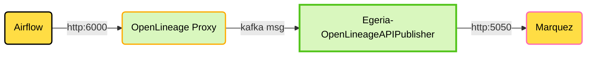

<!-- SPDX-License-Identifier: CC-BY-4.0 -->
<!-- Copyright Contributors to the ODPi Egeria project. -->

# Overview
This directory contains a sample Docker Compose setup to support the deployment of Apache Airflow and Marquez 
to simplify experimentation with Airflow, OpenLineage and Egeria. This is a somewhat more advanced setup that requires
a few manual steps.

A local volume is mounted in the egeria-workspaces directory to hold
**dags** (flows) to be executed in Airflow. There are a few sample dags provided. Workflows in Airflow are a natural extension
to Egeria's governance capabilities. 

The pyegeria and openlineage python packages are installed into the Airflow Docker image for your use. Airflow is pre-configured to produce openlineage http messages that are picked up
by the OpenLineage Proxy (part of egeria-quickstart) and forwarded to Egeria as Kafka messages as shown below. 

## Usage

This docker compose script is designed to run along-side the **egeria-quickstart** compose script. The **egeria-quickstart**
compose containers must already be running before you try to start the **airflow-marquez** docker compose script. This is because
both Airflow and Marquez are configured to share the same PostgreSQL database server as Egeria. Here are the steps to get
going:

This will:
a. download the docker images for Apache Airflow and Marquez
b. create and start the containers for these technologies. This can take several minutes the first time the containers are created. Subsequent startups will be much faster.

4. Using either the **docker desktop** application or the docker command line you can see the two new containers running. To do this with the docker command line, you can issue:

`docker ps`

5. The environment is ready to be used.

6. You can control the containers with docker compose commands - see [docker compose](https://docs.docker.com/reference/cli/docker/compose/). These commands can be used to administer and use the docker containers.
7. To access Marquez, open a browser tab to `http://localhost:3000/events`. 
8. To access Apache Airflow's console, open a browser tab to `http://localhost:8070/home`.  To sign in use a userId of `airflow` and a password of `????`.

License: CC BY 4.0, Copyright Contributors to the ODPi Egeria project.