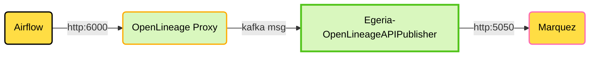

<!-- SPDX-License-Identifier: CC-BY-4.0 -->
<!-- Copyright Contributors to the ODPi Egeria project. -->

# Overview
This directory contains a sample Docker Compose setup to support the deployment of [Apache Airflow](https://airflow.apache.org/) and [Marquez ](https://github.com/MarquezProject/marquez)
to simplify experimentation with Airflow, OpenLineage and Egeria. This is a somewhat more advanced setup that requires
a few manual steps.

A local volume is mounted from the egeria-workspaces directory to externalize Airflow files that are useful to access. 
One of the subdirectories is a **dags** folder containing flows to be executed in Airflow. 
There are a few sample dags provided and more will be added over time. Workflows in Airflow are a natural extension
to Egeria's governance capabilities. 

The pyegeria and OpenLineage python packages are installed into the Airflow Docker image for your use. 
Airflow is pre-configured to produce OpenLineage http messages that are picked up
by the OpenLineage Proxy (part of egeria-quickstart).  Using the workbooks, it is possible to configure Egeria to listen for these open lineage events via kafka. Egeria will mine useful metadata from these events.  It can also be configured to publish open lineage events to Marquez as shown in the diagram below

## Usage

This docker compose script is designed to run along-side the **egeria-quickstart** compose script. The **egeria-quickstart**
compose containers must already be running before you try to start the **airflow-marquez** docker compose script. This is because
both Airflow and Marquez are configured to share the same PostgreSQL database server as Egeria. Here are the steps to get
going:

1. Build the Airflow image with useful python packages and initialize Airflow:
`docker compose -f airflow-marquez.yaml up airflow-init --build`
2. Start up all the containers:
`docker compose -f airflow-marquez.yaml up`
3. Check the status of the containers using either your IDE, docker-desktop, or `docker ps`
4. You can experiment with the Egeria Workspaces OpenLineage demo notebook at http://localhost:8888/lab/tree/workbooks/cataloguing-and-surveys/marquez/publish-to-marquez.ipynb 
5. You can also run some airflow dags and see the OpenLineage results in Marquez.
6. You can directly run airflow commands from a command line - from the `airflow-marquez`
directory, type `./airflow.sh <command>`, where **command** might be an airflow command such as *info*, e.g: `./airflow.sh info`

### Airflow 
* WebUI is port 8072 (API server), user: *airflow*, password: *airflow*
* Configured with `LocalExecutor` for simplicity in Airflow 3.x
* Publishes OpenLineage events to port 6000
* Postgres database for 

### Marquez
* Marquez UI is port 3000
* Listens to OpenLineage events on port 5050

----
License: CC BY 4.0, Copyright Contributors to the ODPi Egeria project.