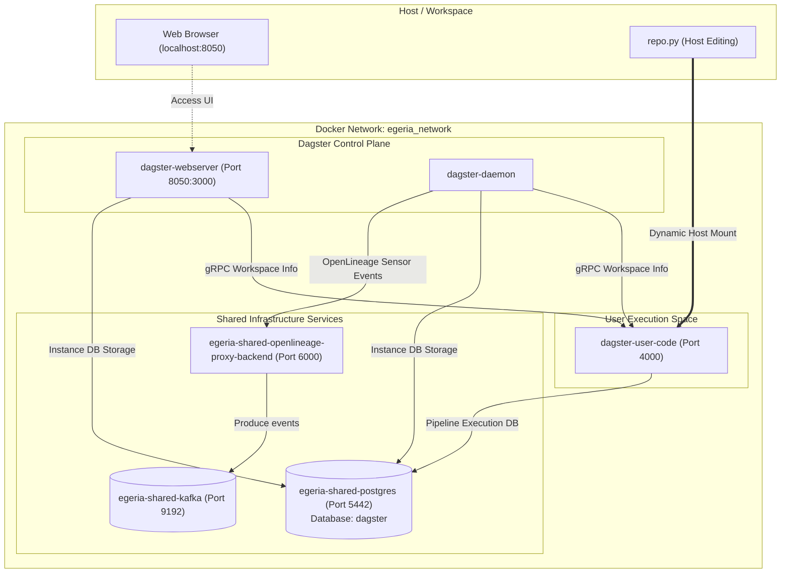

# Dagster & Egeria Integration Guide

This document describes the implementation architecture and usage patterns for the Dagster integration within the Egeria workspace shared infrastructure.

---

## 1. Architecture Overview

Dagster is deployed as part of the shared infrastructure to act as a Python-native data orchestrator. It executes surveying, profiling, and metadata harvesting pipelines on external resources, then automatically publishes execution lineage to Egeria via OpenLineage or updates the metadata catalog via Pyegeria.

Below is the service interaction diagram:



---

## 2. Implementation Details

We integrated Dagster directly into the Egeria shared infrastructure using the following changes:

### A. Database Provisioning
* **For new setups:** Modifies [init_egeria.sql](file:///Users/dwolfson/localGit/antigravity-egeria-workspaces/egeria-workspaces/compose-configs/shared-infra/docker-entrypoint-initdb.d/init_egeria.sql) to auto-provision the `dagster` database, create a dedicated `dagster_user`, and grant permissions.
* **For existing setups:** Created the schema using direct PostgreSQL admin execution:
  ```sql
  CREATE USER dagster_user WITH SUPERUSER LOGIN PASSWORD 'user4dagster';
  CREATE DATABASE dagster;
  GRANT ALL PRIVILEGES ON DATABASE dagster TO dagster_user;
  ```

### B. Compose Services ([shared-infra.yaml](file:///Users/dwolfson/localGit/antigravity-egeria-workspaces/egeria-workspaces/compose-configs/shared-infra/shared-infra.yaml))
* **`dagster-user-code`:** Builds a custom Python 3.11 container installing Dagster, Pyegeria, and OpenLineage libraries. It mounts the host pipeline directory for hot-reloading and exposes port `4000`.
* **`dagster-webserver`:** The UI dashboard. It runs using the same custom user-code image (avoiding external registry pulls) and is exposed on host port **`8050`** to prevent conflicts with Obsidian (`3000`/`3001`).
* **`dagster-daemon`:** The background scheduler and sensor processor. It runs on the custom user-code image and is explicitly configured to read the workspace layout file (`-w /opt/dagster/workspace.yaml`).

### C. Image Optimization
Instead of pulling multiple heavy images from Docker Hub, all Dagster containers reuse the locally built custom user-code image. This guarantees that python version changes or extra libraries (like `pyegeria`) are immediately available across the entire Dagster environment without registry synchronization.

---

## 3. Usage & Operations Guide

### A. Managing the Services
Dagster is fully integrated into the shared startup process.

* **Start the entire stack (including Dagster):**
  ```bash
  ./ensure-shared-infra.sh
  ```
* **Stop the services:**
  ```bash
  docker compose -p egeria-shared-infra -f shared-infra.yaml down
  ```
* **Restart Dagster services only:**
  ```bash
  docker compose -p egeria-shared-infra -f shared-infra.yaml restart dagster-user-code dagster-webserver dagster-daemon
  ```

---

## 4. Development & Pipeline Customization

### A. Writing Pipelines
All Python pipeline code is located in the host directory [runtime-volumes/dagster/user_code/](file:///Users/dwolfson/localGit/antigravity-egeria-workspaces/egeria-workspaces/runtime-volumes/dagster/user_code/). The entry point is [repo.py](file:///Users/dwolfson/localGit/antigravity-egeria-workspaces/egeria-workspaces/runtime-volumes/dagster/user_code/repo.py).

### B. Hot-Reloading Code
Because the host directory is volume-mounted:
1. Edit your code in [repo.py](file:///Users/dwolfson/localGit/antigravity-egeria-workspaces/egeria-workspaces/runtime-volumes/dagster/user_code/repo.py) locally.
2. Open the Dagster UI at [http://localhost:8050](http://localhost:8050).
3. Click the **Reload** button in the top-right workspace panel. The daemon and webserver will immediately load your changes without restarting the Docker containers.

### C. Integrating with Egeria & OpenLineage

#### 1. Automated Lineage (OpenLineage Sensor)
The `dagster-daemon` container has the `OPENLINEAGE_URL` environment variable pointing to the Egeria OpenLineage proxy container. 

To automatically emit execution metadata to Egeria, register the `openlineage_sensor` in your `repo.py` Definitions object:

```python
from dagster import Definitions
from dagster_openlineage import openlineage_sensor

defs = Definitions(
    assets=[...],
    jobs=[...],
    sensors=[
        openlineage_sensor(include_asset_events=True)
    ]
)
```

Whenever an asset is materialized or a job is executed, the sensor polls the database event log and forwards the standard OpenLineage event payloads (schemas, steps, dependencies) to Egeria's proxy, which translates and publishes them onto the Kafka queue (`openlineage.events`).

#### 2. Manual Cataloging and Metadata Control (Pyegeria)
You can call the **Pyegeria** library directly within your assets or operations to feed custom governance parameters or trigger actions in the Egeria OMAG servers:

```python
from dagster import asset, get_dagster_logger
from pyegeria import EgeriaRuntime

logger = get_dagster_logger()

@asset
def profile_customer_database():
    """
    Profiles a database and registers details inside Egeria.
    """
    # 1. Perform database checks / profiling
    columns_found = ["id", "email_address", "phone_number"]
    
    # 2. Call Pyegeria to update the Egeria Metadata Store
    try:
        # Connect to the local Egeria OMAG server platform
        egeria = EgeriaRuntime("https://localhost:9443")
        logger.info("Connected to Egeria catalog. Registering assets...")
        
        # Example: Register a dataset or write classification logic
        # egeria.create_asset(...)
    except Exception as e:
        logger.error(f"Failed to communicate with Egeria catalog: {e}")
        
    return columns_found
```
