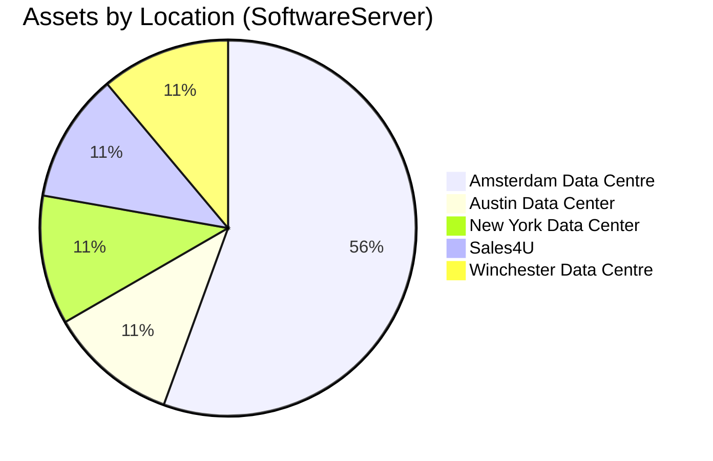

<!-- SPDX-License-Identifier: CC-BY-4.0 -->
<!-- Copyright Contributors to the ODPi Egeria project. -->

# Local Dashboards — Worked Example: Assets by Type & Location

> Loadable **Dr.Egeria** document, standalone (doesn't extend the "Next
> Steps" dashboard family — see `LOCAL_DASHBOARDS_ROADMAP.dr-egeria.md` for
> that one). Builds a complete demo dashboard from scratch: how many assets
> are cataloged, of which type, and where they're located — a mix of live
> analytic-function reports (two chart styles + two KPI numbers) and one
> narrative snapshot panel, chosen deliberately to show several different
> Local Dashboards techniques side by side in one runnable file. See
> `LOCAL_DASHBOARDS_TUTORIAL.md` for the concepts each step below assumes.
>
> **Why this file exists, beyond being a demo**: it's the worked answer to
> "how do I show a breakdown by X" when X (here, Location) has no live
> analytic function to compute it yet — see the `Add Text on Dashboard
> Sheet` step's own commentary below for exactly where that gap is and what
> a real fix would look like (BACKLOG.md — a "Saved Query" for this is
> under discussion; see the Detail Spec note there too).
>
> **Run with VALIDATE first, then PROCESS.** The four `Link Report to
> Dashboard Sheet` steps reference Reports created earlier in this same
> file — VALIDATE will show them as "not found" (expected, mid-file
> forward-reference); clears up on PROCESS since each step runs in order.
>
> **`Dashboard Sheet Heading` is required**, even though `Create Dashboard
> Sheet`'s processor code has an `or name` fallback for it — that fallback
> is for programmatic callers that bypass command validation, not for
> Dr.Egeria commands themselves. Skip it and VALIDATE rejects the command
> with "Missing required attribute: 'Dashboard Sheet Heading'" (found live
> writing this file's own regression test,
> `egeria-python/tests/dr-egeria-command-tests/dr_test_dashboard_sheet.md`).

___

## Create Dashboard Sheet
> Create the Dashboard Sheet itself — an empty, named placement list. Reports get linked onto it in later steps.

### Display Name
Assets by Type and Location Demo

### Dashboard Sheet Heading
Assets by Type & Location

### Dashboard Sheet Description
Demo dashboard: how many assets, of which type, are cataloged, and where they're located — a mix of live charts, KPI numbers, and a location snapshot.

### Dashboard Sheet Family
dashboard

___

## Create Report
> A GENERIC analytic function (count_elements — same one the Analytics Demo file retargets at Project/GlossaryTerm) retargeted at the broad Asset supertype, for a single "how many things are cataloged, total" KPI number.

### Display Name
Total Cataloged Assets

### Report Spec
Analytic Demo - Element Count by Type

### Output Format
DICT

### Analytic Parameters:
  type_name: Asset

___

## Create Report
> Same GENERIC function again, retargeted at Location instead of Asset — the point of a generic function is exactly this: one Python routine, any type, no code change, just a different Analytic Parameters value.

### Display Name
Total Locations Tracked

### Report Spec
Analytic Demo - Element Count by Type

### Output Format
DICT

### Analytic Parameters:
  type_name: Location

___

## Create Report
> counts_by_type as a PIE chart — Output Format PIE (or BAR below) renders the same {label, type, count} rows as a real Vega-Lite chart instead of a raw table, no extra placement config needed. type_map here is the same 6-type breakdown egeria-overview.html's own "Cataloged Assets" tile uses (BACKLOG.md NEXT-18's sum_type_counts), so the numbers line up with what Egeria Overview shows.

### Display Name
Assets by Type (Pie Chart)

### Report Spec
Analytic Demo - Assets by Type Breakdown

### Output Format
PIE

### Analytic Parameters:
  type_map: [["Data Stores", "DataStore"], ["Data Sets", "DataSet"], ["Software Components", "DeployedSoftwareComponent"], ["Infrastructure", "ITInfrastructure"], ["APIs", "DeployedAPI"], ["Processes", "Process"]]

___

## Create Report
> Same Report Spec and same Analytic Parameters as the Pie Chart above, just Output Format BAR instead of PIE -- two different renderings of one function's result, to show both chart styles side by side on the dashboard.

### Display Name
Assets by Type (Bar Chart)

### Report Spec
Analytic Demo - Assets by Type Breakdown

### Output Format
BAR

### Analytic Parameters:
  type_map: [["Data Stores", "DataStore"], ["Data Sets", "DataSet"], ["Software Components", "DeployedSoftwareComponent"], ["Infrastructure", "ITInfrastructure"], ["APIs", "DeployedAPI"], ["Processes", "Process"]]

___

## Link Report to Dashboard Sheet
> Placement Emphasis kpi renders as a compact number tile once the result resolves to a scalar (BACKLOG.md NEXT-20) -- decided from the actual result shape, not just this attribute, so a placement left at the "kpi" default never hides a genuinely large result.

### Dashboard Sheet Name
Assets by Type and Location Demo

### Report Name
Total Cataloged Assets

### Placement Span
1

### Placement Emphasis
kpi

___

## Link Report to Dashboard Sheet

### Dashboard Sheet Name
Assets by Type and Location Demo

### Report Name
Total Locations Tracked

### Placement Span
1

### Placement Emphasis
kpi

___

## Link Report to Dashboard Sheet
> Placement Span 2 + Emphasis panel for the charts -- wide enough for a real Vega-Lite chart to render legibly, unlike the compact KPI tiles above.

### Dashboard Sheet Name
Assets by Type and Location Demo

### Report Name
Assets by Type (Pie Chart)

### Placement Span
2

### Placement Emphasis
panel

___

## Link Report to Dashboard Sheet

### Dashboard Sheet Name
Assets by Type and Location Demo

### Report Name
Assets by Type (Bar Chart)

### Placement Span
2

### Placement Emphasis
panel

___

## Add Text on Dashboard Sheet
> Assets by Location has no live analytic function or Report Spec to back it yet -- Location isn't a filterable dimension any existing find-based report spec groups by, and no analytic function computes an assets-per-location breakdown (unlike Assets by Type above, which reuses the already-registered counts_by_type). Rather than leave the demo missing that half of "by type and location," this panel is a hand-built snapshot: real numbers, pulled live from /api/locations at authoring time, rendered as a Mermaid pie chart + table -- but a snapshot, not a Report placement, so it will NOT refresh itself on future dashboard visits the way the four tiles above do. A genuinely live version needs one of: (a) a new registered analytic function (same shape as sum_type_counts, BACKLOG.md NEXT-18, fetching AssetLocation-linked elements and grouping by Location instead of by type), or (b) a Saved Query (the "Create Saved Query"/"Link Saved Query to Results Set" commands already exist in this same Report family -- see egeria-python's dashboard_sheet.py -- worth evaluating for exactly this case). Either route, once built, could also become this Pie Chart placement's drill-down target via Placement Detail Spec (BACKLOG.md NEXT-21) -- click the chart, see the location table -- instead of sitting alongside it as its own panel. Whichever shape it ends up taking, update this comment and the placement below to match, so this file keeps being an accurate answer to "how do I show a breakdown Local Dashboards doesn't have a ready-made analytic for yet."
>
> A `#`/`##` markdown heading, or a leading `> ` blockquote line, inside MD
> Content collides with this file format's own structural/comment markers
> and truncates the attribute silently at PROCESS time (VALIDATE's preview
> path doesn't catch it) -- confirmed live writing this file's own
> regression test. Bold text without a leading `>`, as used below, is safe.

### Dashboard Sheet Name
Assets by Type and Location Demo

### Placement Name
Assets by Location Snapshot

### MD Content
**Assets by Location** — snapshot as of authoring time, built from real live
`/api/locations` data (no live "group assets by Location" analytic function
exists yet, so unlike the tiles above this panel doesn't re-query on every
view — see this step's own commentary above for what a live version would
need). 37 locations are tracked in Egeria; 5 currently have assets
registered against them, all `SoftwareServer` infrastructure, 9 assets
total.

| Location | Asset Count | Asset Type |
|---|---|---|
| Amsterdam Data Centre | 5 | SoftwareServer |
| Austin Data Center | 1 | SoftwareServer |
| New York Data Center | 1 | SoftwareServer |
| Sales4U | 1 | SoftwareServer |
| Winchester Data Centre | 1 | SoftwareServer |

The remaining 32 tracked locations have no assets registered against them
yet in this demo dataset.

### Placement Span
full

### Placement Emphasis
panel

___

> End of the Assets by Type & Location worked example. Open
> `/local-dashboards?sheet=Assets%20by%20Type%20and%20Location%20Demo` to
> view it once processed.
