<!-- SPDX-License-Identifier: CC-BY-4.0 -->
<!-- Copyright Contributors to the ODPi Egeria project. -->

# Local Dashboards — "Next Steps" Report Migration

> Loadable **Dr.Egeria** document that migrates the `local-dashboards-next-steps`
> Dashboard Sheet (see `LOCAL_DASHBOARDS_ROADMAP.dr-egeria.md`) off its
> original bare Report Spec placements onto real `Report` elements, following
> the hard cutover of `Link Report to Dashboard Sheet`'s target attribute
> from `Report Spec` to `Report Name` (a Report Spec alone can't carry fixed/
> scoped parameters — see egeria-workspaces-fs BACKLOG.md NEXT-14).
>
> Creates two `Report` assets and links both into the existing Dashboard
> Sheet:
> - **Next Steps Work Item List** — a `Work-Item-List-DrE-Basic` instance,
>   DICT format. No Search String needed; that spec only ever returns
>   WorkItemList collections, so it's inherently narrow.
> - **Next Steps Membership Diagram** — a `Collections` instance, MERMAID
>   format, **scoped with Search String** to the "Local Dashboards - Next
>   Steps" collection specifically. This is the concrete fix for the "output
>   format ignored" / "huge unscoped diagram" problems hit earlier in this
>   feature's development — without a Report carrying its own Search String,
>   this same placement returned a diagram of the *entire* dataset (observed
>   80–150KB) rather than just this one Work Item List and its Task members.
>
> **Requires the `Create Report` / updated `Link Report to Dashboard Sheet`
> commands** — only available via the egeria-python dev checkout's own
> `.venv` (`source .venv/bin/activate`) at the time this was written, not yet
> in a published pyegeria release. Run **inside that venv**, not via
> `docker exec` against `quickstart-pyegeria-web` (its installed `pyegeria`
> package predates these commands) — but the Dashboard Sheet store still has
> to end up in the *container's* `~/.pyegeria/dashboard_sheets.json`
> (`docker cp` it over afterward), not the host's copy. See
> `LOCAL_DASHBOARDS_TUTORIAL.md`'s "Where dr_egeria has to run" section.
>
> **Run with VALIDATE first, then PROCESS.** The two `Link Report to
> Dashboard Sheet` steps reference the Reports created earlier in this same
> file — VALIDATE will show them as "not found" (expected, mid-file
> forward-reference, same pattern as `LOCAL_DASHBOARDS_ROADMAP.dr-egeria.md`);
> clears up on PROCESS since each step runs in order.
>
> This file only re-links; it doesn't remove the two old direct-Report-Spec
> placements (`Work-Item-List-DrE-Basic`, `Collections`) — those were removed
> by hand-editing the JSON store after this ran, since there's no
> "Remove Placement" Dr.Egeria command yet.

___

## Create Report
> Defines a report with optional default parameters set, that can be placed on a Dashboard.

### Display Name
Next Steps Work Item List

### Description
The Local Dashboards - Next Steps Work Item List itself (header attributes) — a Report instance of Work-Item-List-DrE-Basic, no scoping needed since that spec only ever returns WorkItemList collections.

### Report Spec
Work-Item-List-DrE-Basic

### Output Format
DICT

___

## Create Report
> Defines a report with optional default parameters set, that can be placed on a Dashboard.

### Display Name
Next Steps Membership Diagram

### Description
Mermaid diagram of the Local Dashboards - Next Steps Work Item List and its Task members — a Report instance of Collections, scoped with Search String so it doesn't return the entire dataset.

### Report Spec
Collections

### Output Format
MERMAID

### Search String
Local Dashboards - Next Steps

___

## Create Report
> Defines a report with optional default parameters set, that can be placed on a Dashboard.

### Display Name
Tasks

### Description
Tasks for the project

### Report Spec
Collection Members

### Output Format
MERMAID

### Report Parameters
collection_guid : 0affb580-fa81-4d00-9438-b26faf11845d

### OUTPUT Format
TABLE

---
## Link Report to Dashboard Sheet
> Link a Report Spec (placement) into a Dashboard Sheet.

### Dashboard Sheet Name
local-dashboards-next-steps

### Report Name
Tasks

### Placement Span
2

### Placement Emphasis
kpi
---

## Link Report to Dashboard Sheet
> Link a Report Spec (placement) into a Dashboard Sheet.

### Dashboard Sheet Name
local-dashboards-next-steps

### Report Name
Next Steps Work Item List

### Placement Span
2

### Placement Emphasis
kpi

___

## Link Report to Dashboard Sheet
> Link a Report Spec (placement) into a Dashboard Sheet.

### Dashboard Sheet Name
local-dashboards-next-steps

### Report Name
Next Steps Membership Diagram

### Placement Span
full

### Placement Emphasis
panel

___
## Add Text on Dashboard Sheet
### Placement Name
My own mermaid
### Dashboard Sheet Name
local-dashboards-next-steps

### MD Content

```mermaid
flowchart TD
%%{init: {"flowchart": {"htmlLabels": false}} }%%

1("*Secrets Collection*<br/>**cocoUserDirectory**")
2("*User Authentication Manager*<br/>**User Token Manager**")
2==>|"Capability Asset Use"|1
3("*Authorization Manager*<br/>**User Access Manager**")
3==>|"Capability Asset Use"|1
4@{ shape: tag-doc, label: "*Key Store File*<br/>**coco-user-directory.omsecrets**"}
1==>|"Data Set Content"|4
5@{ shape: bow-rect, label: "*User Identity*<br/>**lemmiestage**"}
1==>|"User Account"|5
6@{ shape: bow-rect, label: "*User Identity*<br/>**filescatnpa**"}
1==>|"User Account"|6
7@{ shape: bow-rect, label: "*User Identity*<br/>**stewfaster**"}
1==>|"User Account"|7
8@{ shape: bow-rect, label: "*User Identity*<br/>**zachnow**"}
1==>|"User Account"|8
9@{ shape: bow-rect, label: "*User Identity*<br/>**jacquardnpa**"}
1==>|"User Account"|9
10@{ shape: bow-rect, label: "*User Identity*<br/>**bobnitter**"}
1==>|"User Account"|10
11("*User Account*<br/>**... plus 52 Items**")
1-.->11
12["*Governance Zone*<br/>**Research Zone**"]
1==>|"Resource Permissions"|12
13["*Security Role*<br/>**omagServer**"]
12==>|"Associated Security List"|13
14["*Security Role*<br/>**dataManagementProcess**"]
12==>|"Associated Security List"|14
15["*Security Role*<br/>**researchStaff**"]
12==>|"Associated Security List"|15
12==>|"Associated Security List"|15
16["*Governance Zone*<br/>**Business Systems Zone (part of Infrastructure Zone)**"]
1==>|"Resource Permissions"|16
17["*Security Role*<br/>**infrastructureStaff**"]
16==>|"Associated Security List"|17
16==>|"Associated Security List"|17
16==>|"Associated Security List"|14
16==>|"Associated Security List"|13
18["*Governance Zone*<br/>**Digital Products Zone**"]
1==>|"Resource Permissions"|18
19["*Service Access Control*<br/>**Platform Services**"]
1==>|"Resource Permissions"|19
20["*Security Role*<br/>**serverOperator**"]
19==>|"Associated Security List"|20
21["*Governance Zone*<br/>**Egeria''s Runtime Zone**"]
1==>|"Resource Permissions"|21
22["*Security Role*<br/>**runtimeManager**"]
21==>|"Associated Security List"|22
23["*Security Role*<br/>**openMetadataMember**"]
21==>|"Associated Security List"|23
24["*Service Access Control*<br/>**Access to qs-integration-daemon**"]
1==>|"Resource Permissions"|24
24==>|"Associated Security List"|20
25("*Resource Permissions*<br/>**... plus 31 Items**")
1-.->25
26["*Security Role*<br/>**devOpsStaff**"]
1==>|"Secrets Collection Security List"|26
27["*Security Group*<br/>**newMaintainer**"]
1==>|"Secrets Collection Security List"|27
28["*Security Group*<br/>**securityTeam**"]
1==>|"Secrets Collection Security List"|28
29["*Security Role*<br/>**serverInvestigator**"]
1==>|"Secrets Collection Security List"|29
30["*Security Role*<br/>**marketingStaff**"]
1==>|"Secrets Collection Security List"|30
31["*Security Group*<br/>**instanceOwner**"]
1==>|"Secrets Collection Security List"|31
32("*Secrets Collection Security List*<br/>**... plus 82 Items**")
1-.->32
style 22 color:#000000, fill:#f5fffa, stroke:#000000
style 23 color:#000000, fill:#f5fffa, stroke:#000000
style 24 color:#FFFFFF, fill:#006400, stroke:#000000
style 25 color:#000000, fill:#F9F7ED, stroke:#b7c0c7
style 26 color:#000000, fill:#f5fffa, stroke:#000000
style 27 color:#000000, fill:#f5fffa, stroke:#000000
style 28 color:#000000, fill:#f5fffa, stroke:#000000
style 29 color:#000000, fill:#f5fffa, stroke:#000000
style 30 color:#000000, fill:#f5fffa, stroke:#000000
style 31 color:#000000, fill:#f5fffa, stroke:#000000
style 10 color:#000000, fill:#FF8C00, stroke:#000000
style 32 color:#000000, fill:#F9F7ED, stroke:#b7c0c7
style 11 color:#000000, fill:#F9F7ED, stroke:#b7c0c7
style 12 color:#FFFFFF, fill:#006400, stroke:#000000
style 13 color:#000000, fill:#f5fffa, stroke:#000000
style 14 color:#000000, fill:#f5fffa, stroke:#000000
style 15 color:#000000, fill:#f5fffa, stroke:#000000
style 16 color:#FFFFFF, fill:#006400, stroke:#000000
style 17 color:#000000, fill:#f5fffa, stroke:#000000
style 18 color:#FFFFFF, fill:#006400, stroke:#000000
style 19 color:#FFFFFF, fill:#006400, stroke:#000000
style 1 color:#000000, fill:#e0ab18, stroke:#004563
style 2 color:#000000, fill:#39add1, stroke:#004563
style 3 color:#000000, fill:#39add1, stroke:#004563
style 4 color:#000000, fill:#BDB76B, stroke:#004563
style 5 color:#000000, fill:#FF8C00, stroke:#000000
style 6 color:#000000, fill:#FF8C00, stroke:#000000
style 7 color:#000000, fill:#FF8C00, stroke:#000000
style 8 color:#000000, fill:#FF8C00, stroke:#000000
style 9 color:#000000, fill:#FF8C00, stroke:#000000
style 20 color:#000000, fill:#f5fffa, stroke:#000000
style 21 color:#FFFFFF, fill:#006400, stroke:#000000
click 3 "https://egeria-project.org/concepts/platform-metadata-security-connector/" "Click for more documentation" _blank
```

### Placement Span
full

### Placement Emphasis
panel
