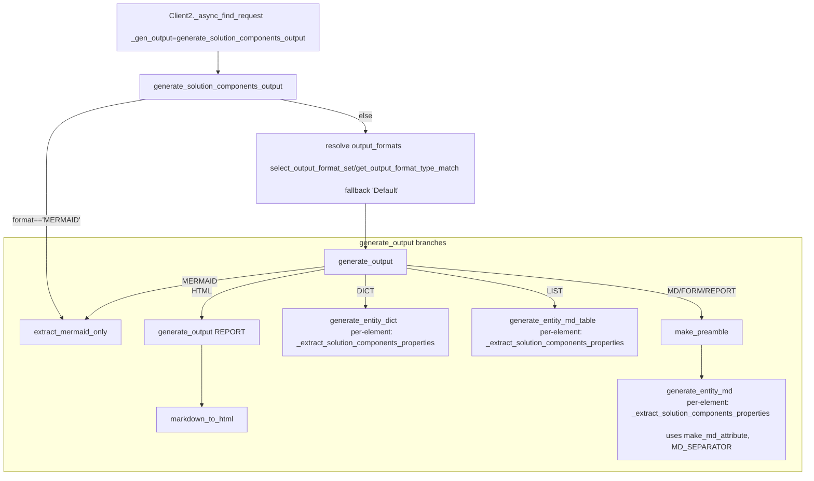

  ### What calls `generate_solution_components_output`  
- `SolutionArchitect.find_solution_components(...)`  
  → `SolutionArchitect._async_find_solution_components(...)`  
  → `Client2._async_find_request(url, _type="SolutionComponent", _gen_output=self.generate_solution_components_output, ...)`  
  → HTTP POST via `Client2._async_make_request` to `.../solution-components/by-search-string`  
  → Parse JSON response into `elements`  
  → Call `_gen_output(...)` i.e., `generate_solution_components_output(elements, search_string, element_type_name, output_format, output_format_set)`  
  
### Inside `generate_solution_components_output`  
Entry point: `SolutionArchitect.generate_solution_components_output(elements, search_string, element_type_name, output_format='MD', output_format_set=None)`  
  
1) Short-circuit for Mermaid  
- If `output_format == 'MERMAID'`: return `extract_mermaid_only(elements)` immediately.  
  
2) Resolve output format set (column/heading schema)  
- Determine `entity_type = 'Solution Component'`.  
- Choose `output_formats` (aka `columns_struct`):  
  - If `output_format_set` is a string: `select_output_format_set(output_format_set, output_format)`  
  - If `output_format_set` is a dict: `get_output_format_type_match(output_format_set, output_format)`  
  - Else: `select_output_format_set('Solution Components', output_format)`  
  - If still `None`: fallback `select_output_format_set('Default', output_format)`  
  
3) Delegate to shared output pipeline  
- Calls `generate_output(elements, search_string, entity_type, output_format, extract_properties_func=self._extract_solution_components_properties, get_additional_props_func=None, columns_struct=output_formats)`  
  
### The shared output pipeline (`output_formatter.generate_output`)  
Signature: `generate_output(elements, search_string, entity_type, output_format, extract_properties_func, get_additional_props_func=None, columns_struct=None)`  
  
Common setup  
- Ensure `columns = columns_struct['formats'].get('columns', None)`; if missing, fallback to `select_output_format_set('Default', output_format)`  
- `target_type = columns_struct.get('target_type', entity_type)`  
- Ensure `elements` is a list; normalize `search_string` (empty → `"All"`)  
- If `output_format == 'TABLE'`, coerce to `'DICT'`  
  
Branch by `output_format`  
- `'MERMAID'`  
  - `return extract_mermaid_only(elements)`  
  
- `'HTML'`  
  - First render `'REPORT'` by recursively calling `generate_output(..., output_format='REPORT', ...)`  
  - Convert to HTML using `markdown_to_html(report_output)`  
  
- `'DICT'`  
  - `return generate_entity_dict(elements, extract_properties_func, get_additional_props_func, exclude_keys=['properties'], columns_struct=columns_struct, output_format='DICT')`  
  
- `'LIST'`  
  - `return generate_entity_md_table(elements, search_string, entity_type, extract_properties_func, columns_struct, get_additional_props_func, output_format='LIST')`  
  
- Default: `'MD' | 'FORM' | 'REPORT'`  
  - `elements_md, elements_action = make_preamble(obj_type=target_type, search_string=search_string, output_format=output_format)`  
  - Append body from `generate_entity_md(elements, elements_action, output_format, entity_type=target_type, extract_properties_func, get_additional_props_func, columns_struct)`  
  - `return elements_md`  
  
### What the per-format generators do  
- `generate_entity_dict(...)`  
  - Iterates elements; for each element it calls `extract_properties_func(element, columns_struct)` when supported, else `extract_properties_func(element)`.  
  - Merges/filters keys according to `include_keys`/`exclude_keys` (here excludes raw `properties`).  
  - Includes any `get_additional_props_func` output if present.  
  - Returns a list of dicts ready for programmatic use (e.g., table widgets).  
  
- `generate_entity_md_table(...)` (for `'LIST'`)  
  - Uses `columns_struct['formats']['columns']` to build Markdown table headers.  
  - For each element:  
    - Preferred path: `returned_struct = extract_properties_func(element, columns_struct)` which should fill `column['value']` per column.  
    - Fallback: derive a `props` dict from `extract_properties_func(element)` and pick values by `column['key']`.  
    - If `column['format']` is set, formats via `format_for_markdown_table(value, guid)` (adds anchors/links, etc.).  
  - Returns a Markdown table.  
  
- `generate_entity_md(...)` (for `'MD' | 'FORM' | 'REPORT'`)  
  - For each element:  
    - Try `returned_struct = extract_properties_func(element, columns_struct)` (preferred). Otherwise fallback to `props = extract_properties_func(element)`.  
    - Compute a display name from either returned struct (`display_name` or `title` column) or legacy props; default to `"NO DISPLAY NAME"`.  
    - Write headings depending on `output_format`.  
    - Emit attributes:  
      - Preferred: iterate `returned_struct['formats']['columns']`, use `make_md_attribute(name, value, output_format)`, applying `format_for_markdown_table` when `column['format']` is truthy. Also append any `annotations.wikilinks` if present.  
      - Fallback: iterate `props` and any `additional_props` from `get_additional_props_func`.  
    - Separate elements with `MD_SEPARATOR`.  
  
### Typical implementation details of the extractor for Solution Components  
- The extractor passed in is `SolutionArchitect._extract_solution_components_properties`.  
- While the exact body isn’t shown here, across the module similar extractors populate the provided `columns_struct` by:  
  - Pulling core attributes from the element’s `elementHeader` and `properties`.  
  - Calling `populate_common_columns(element, columns_struct, include_header=True, include_relationships=True, include_subject_area=True, mermaid_source_key='mermaidGraph', mermaid_dest_key='mermaid')` to enrich common fields and relationships.  
  - Optionally calling `get_required_relationships(element, columns_struct)` to derive relationship-based column values (e.g., lists of related names) from top-level lists in the element.  
  - Returning the updated `columns_struct` where each column has a filled `value` for downstream formatting.  
  
### End-to-end view (from `generate_solution_components_output` downward)  
- `generate_solution_components_output`  
  - If `'MERMAID'`: `extract_mermaid_only`  
  - Else: resolve `output_formats` via `select_output_format_set`/`get_output_format_type_match` (fallback `'Default'`)  
  - Call `generate_output(..., extract_properties_func=_extract_solution_components_properties, columns_struct=output_formats)`  
    - For `'HTML'`: `generate_output(... 'REPORT' ...)` → `markdown_to_html`  
    - For `'DICT'`: `generate_entity_dict` → per-element `extract_properties_func`  
    - For `'LIST'`: `generate_entity_md_table` → per-element `extract_properties_func`  
    - For `'MD'|'FORM'|'REPORT'`: `make_preamble` → `generate_entity_md` → per-element `extract_properties_func` → `make_md_attribute` (+ optional `format_for_markdown_table`, `MD_SEPARATOR`)  
  
### Mermaid diagram of the call chain (focused on this function)  

  
### Summary  
- Upstream: `generate_solution_components_output` is invoked by the find pipeline after HTTP results are parsed.  
- Inside: it only resolves the appropriate column/format configuration and then hands off to the generic `generate_output` pipeline.  
- Downstream: `generate_output` fans out to specialized renderers (`DICT`, `LIST`, `MD/FORM/REPORT`, `HTML`, `MERMAID`), each of which relies on the `_extract_solution_components_properties` extractor to populate values, with helpers like `populate_common_columns`, `get_required_relationships`, `make_md_attribute`, and `format_for_markdown_table` handling consistent presentation.