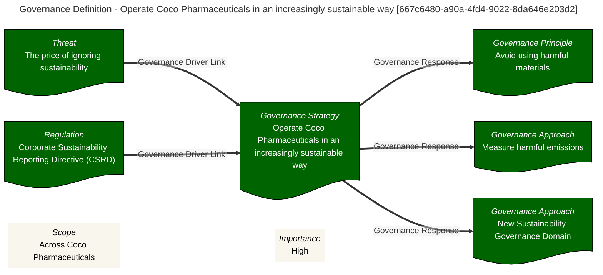
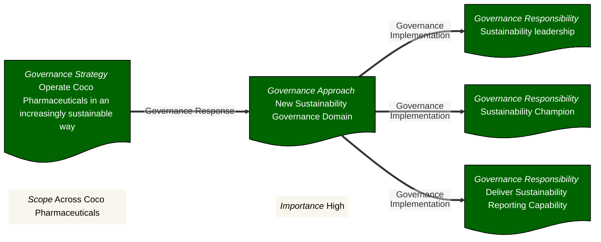

#Coco #Sustainability 
# Create Regulation Article
>	A RegulationArticle entity is an article in a regulation. Dividing a regulation  simplifies planning and execution.

## Display Name
>	Input Required: True

>	Description: Name of the  definition.

>	Alternative Labels: Name

## Summary
>	Input Required: False

>	Description: Summary of the definition.

## Description
>	Input Required: False

>	Description: Description of the contents of the definition.

## Domain Identifier
>	Input Required: False

>	Description: Integer representing the governance domain. All domains is 0.

>	Default Value: 0

## Document Identifier
>	Input Required: False

>	Description: A user supplied identifier for the governance document.

>	Alternative Labels: Doc Id

## Version Identifier
>	Input Required: False

>	Description: Published  version identifier.

## Scope
>	Input Required: False

>	Description: Scope of the definition.

## Importance
>	Input Required: False

>	Description: Importance of the definition.

## Implications
>	Input Required: False

>	Description: List of implications.

## Outcomes
>	Input Required: False

>	Description: List of desired outcomes.

## Results
>	Input Required: False

>	Description: A list of expected results.

## Status
>	Input Required: False

>	Description: The status of the agreement. There is a list of valid values that this conforms to.

>	Alternative Labels: Definition Status

>	Valid Values: DRAFT; PREPARED; PROPOSED; APPROVED; REJECTED; ACTIVE'; DEPRECATED; OTHER

>	Default Value: DRAFT

## User Defined Status
>	Input Required: False

>	Description: Only valid if Product Status is set to OTHER. User defined & managed status values.

## Qualified Name
>	Input Required: False

>	Description: A unique qualified name for the element. Generated using the qualified name pattern  if not user specified.

## GUID
>	Input Required: False

>	Description: A system generated unique identifier.

>	Alternative Labels: Guid; guid

___
