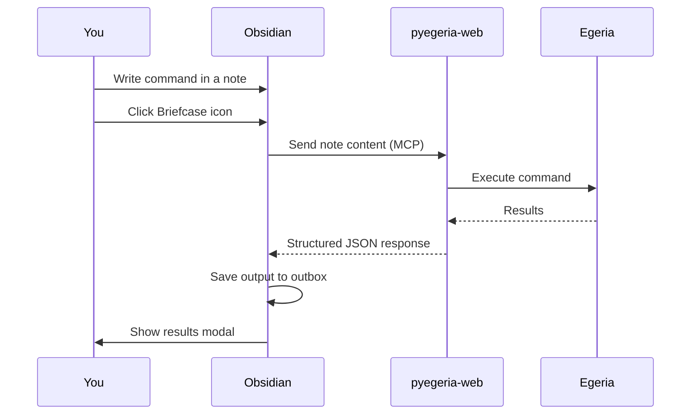

# Dr. Egeria

Dr. Egeria is a markdown-driven command interface for Egeria. You write commands as structured Markdown in Obsidian, send them via the **Call Dr. Egeria** plugin, and receive results directly back into your vault.

---

## How it works

### Via Obsidian (primary workflow)



The MCP tool `dr_egeria_run_block` returns a **structured JSON response** (not plain text) containing `success`, `partial`, per-step `validation_errors` and `execution_errors`, command counts, and the full output document. See [Using MCP in Egeria-Workspaces](../../Using MCP in Egeria-Workspaces.md) for the full response schema.

### Via Egeria Explorer (browser testing)

The **Egeria Explorer** has a built-in Execute panel for running individual commands directly in the browser — no Obsidian required. It shows the same structured result: success/partial/failure banner, validation and execution error lists, and the output document.

Use the Execute panel for testing individual commands. Use Obsidian for production workflows with multi-command sequences and narrative prose.

---

## Directives

Each note is processed with a **directive** that controls what Dr. Egeria does:

| Directive | Behaviour |
|---|---|
| `process` | Execute the command and save output to the outbox |
| `validate` | Check the command syntax without executing |
| `display` | Show current metadata without making changes |

The default directive is set in the plugin settings. You can also override it per-note using front matter:

```markdown
---
directive: validate
---
# View Glossaries
```

---

## Writing commands

Commands follow a consistent Markdown pattern:

```markdown
# Command Name
Property: Value
Another Property: Another Value
```

For example, to view all glossaries:

```markdown
# View Glossaries
```

To create a glossary term:

```markdown
# Create Glossary Term
Term: Customer
Glossary: Business Glossary
Summary: A person or organisation that purchases products or services.
```

See the [Basic Templates](templates-basic.md) and [Advanced Templates](templates-advanced.md) for ready-to-use examples.

---

## Output

Results are saved to the **outbox folder** (default: `dr-egeria-outbox`) with a timestamp:

```
dr-egeria-outbox/
  MyNote-processed-20260601-142300.md
```

The results modal shows the full output with status icons:
- ✅ Success
- ❌ Error — check the command syntax or Egeria connectivity
- ⚠️ Warning — command ran but something to note

---

## Refreshing command specs

If you update Dr. Egeria command definitions on the backend, click **Refresh Now** in the plugin settings to reload the dispatcher without restarting the container.

---

## Further reading

- [Basic Templates](templates-basic.md) — ready-to-use command templates
- [Advanced Templates](templates-advanced.md) — complex operations and batch commands
- [Obsidian setup](../obsidian.md) — configuring the plugin and vault
