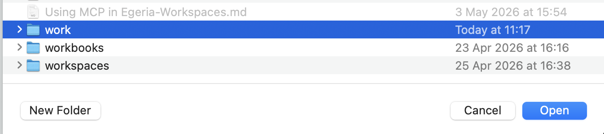

<!-- SPDX-License-Identifier: CC-BY-4.0 -->
<!-- Copyright Contributors to the Egeria project. -->

# Personal workbooks and markdown files

This directory is for your own work.  It is visible in the JupyterHub for the [freshstart envitonment](https://egeria-project.org/egeria-workspaces/fresh-start/overview/) of egeria-workspaces.

## If you are using Obsidian ...

This directory is set up with Egeria's Obsidian plugin that enables you to call Dr.Egeria to run the commands in a Markdown file you have open, or selected on a canvas.  Create a new vault for this directory to activate the plugin.

**Select Open Vault from the File menu**

**Select the Open Folder as Vault option**

**Select the work directory**

**Trust the author of the vault**

**Check the Egeria plugin is installed and close (top right)**

