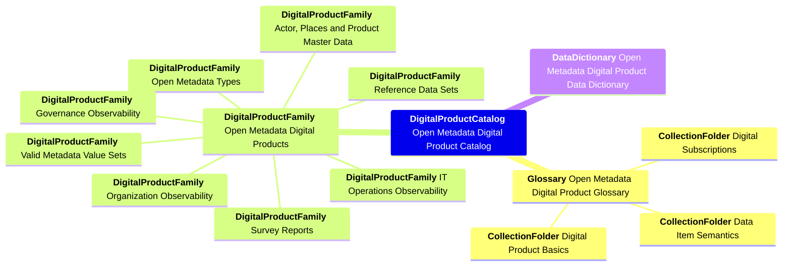

<!-- SPDX-License-Identifier: CC-BY-4.0 -->
<!-- Copyright Contributors to the Egeria project. -->

# Open Metadata Digital Product Catalog

Egeria has a digital product harvester that builds a digital product marketplace called the **Open Metadata Digital Product Catalog** from the elements in the open metadata ecosystem.

Each product is a table of interesting values.  The products are organized into product families.  The products in a family use consistent identifiers so they can be joined as part of a query.

> Mindmap showing the principle product families in the open metadata digital product catalog

The digital product marketplace includes a subscription manager.  The products each declare the types of subscription they support.  This includes different triggers and time intervals between delivery of data.
Users of the marketplace subscribe to a digital product, requesting a specific subscription type and nominating a destination for the data.

The products each have a product manager role.  Individuals may optionally be appointed to these roles to show they are responsible for curating the values.  The roles receive notifications about their 

The notebooks in this folder illustrate how to use the *Open Metadata Digital Product Catalog*:

* [Searching the Open Metadata Digital Product Catalog](searching-product-catalog.ipynb) shows how to search and retrieve details of the products in the catalog.
* [Reviewing my subscriptions](reviewing-my-subscriptions.ipynb) shows how to subscribe to a product, review the product subscriptions that you have and cancel a subscription.
* [Reviewing my products](reviewing-my-products.ipynb) provides the product manager's view of a product and how to maintin it.

----
License: [CC BY 4.0](https://creativecommons.org/licenses/by/4.0/),
Copyright Contributors to the Egeria project.