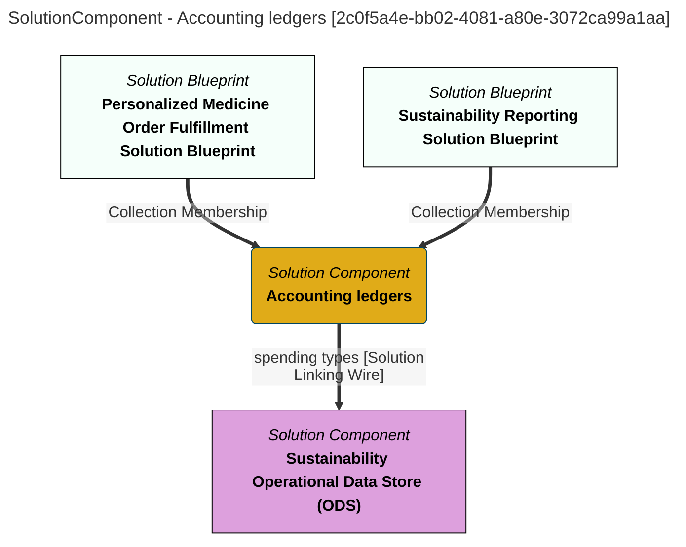

> Accounting ledgers: Application for recording and tracing the income and spending of Coco Pharmaceuticals.  This can help to identify how much the company is spending on particular materials and activities. (Extracted from V1.0)
