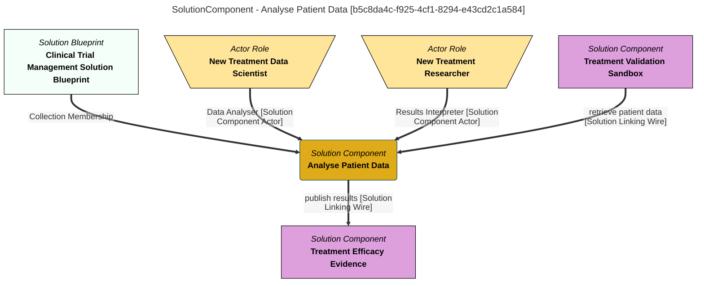

```mermaid
---
title: SolutionComponent - Analyse Patient Data [b5c8da4c-f925-4cf1-8294-e43cd2c1a584]
---
flowchart TD
%%{init: {"flowchart": {"htmlLabels": false}} }%%

1@{ shape: rounded, label: "*Solution Component*
**Analyse Patient Data**"}
2@{ shape: rect, label: "*Solution Blueprint*
**Clinical Trial Management Solution Blueprint**"}
2==>|"Collection Membership"|1
3@{ shape: trap-t, label: "*Actor Role*
**New Treatment Data Scientist**"}
3==>|"Data Analyser [Solution Component Actor]"|1
4@{ shape: trap-t, label: "*Actor Role*
**New Treatment Researcher**"}
4==>|"Results Interpreter [Solution Component Actor]"|1
5@{ shape: rect, label: "*Solution Component*
**Treatment Validation Sandbox**"}
5==>|"retrieve patient data [Solution Linking Wire]"|1
6@{ shape: rect, label: "*Solution Component*
**Treatment Efficacy Evidence**"}
1==>|"publish results [Solution Linking Wire]"|6
style 1 color:#000000, fill:#e0ab18, stroke:#004563
style 2 color:#000000, fill:#f5fffa, stroke:#000000
style 3 color:#000000, fill:#FFE599, stroke:#000000
style 4 color:#000000, fill:#FFE599, stroke:#000000
style 5 color:#000000, fill:#dda0dd, stroke:#000000
style 6 color:#000000, fill:#dda0dd, stroke:#000000
```
> Analyse Patient Data: ML Flow based analytics pipeline to run the variety of models over the patient data. (Extracted from V1.0)
