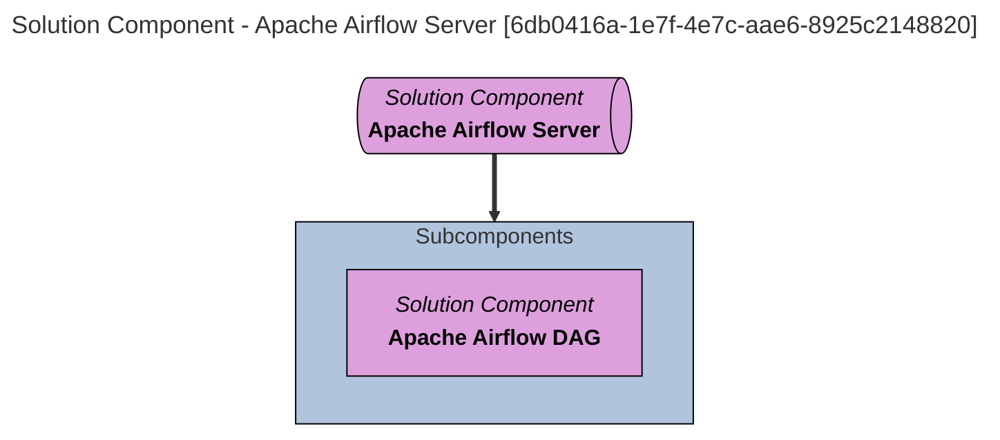

```mermaid
---
title: Solution Component - Apache Airflow Server [6db0416a-1e7f-4e7c-aae6-8925c2148820]
---
flowchart TD
%%{init: {"flowchart": {"htmlLabels": false}} }%%

1@{ shape: das, label: "*Solution Component*
**Apache Airflow Server**"}
subgraph 2 [Subcomponents]
3@{ shape: rect, label: "*Solution Component*
**Apache Airflow DAG**"}
end
1==>2
style 1 color:#000000, fill:#dda0dd, stroke:#000000
style 2 color:#000000, fill:#b0c4de, stroke:#000000
style 3 color:#000000, fill:#dda0dd, stroke:#000000
click 1 "https://airflow.apache.org/" "Click for more documentation" _blank
click 3 "https://egeria-project.org/types/2/0215-Software-Components/" "Click for more documentation" _blank
```
> Apache Airflow Server: Runs data movement and transformation pipelines. (Extracted from 6.0-SNAPSHOT)
