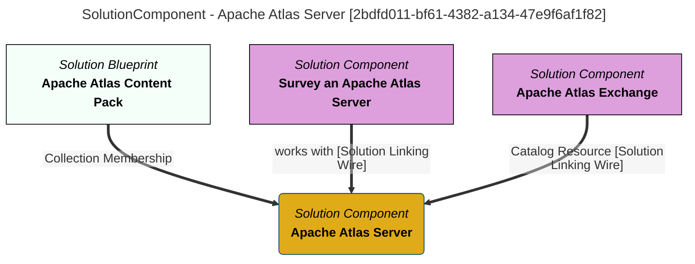

```mermaid
---
title: SolutionComponent - Apache Atlas Server [2bdfd011-bf61-4382-a134-47e9f6af1f82]
---
flowchart TD
%%{init: {"flowchart": {"htmlLabels": false}} }%%

1@{ shape: rounded, label: "*Solution Component*
**Apache Atlas Server**"}
2@{ shape: rect, label: "*Solution Blueprint*
**Apache Atlas Content Pack**"}
2==>|"Collection Membership"|1
3@{ shape: rect, label: "*Solution Component*
**Survey an Apache Atlas Server**"}
3==>|"works with [Solution Linking Wire]"|1
4@{ shape: rect, label: "*Solution Component*
**Apache Atlas Exchange**"}
4==>|"Catalog Resource [Solution Linking Wire]"|1
style 1 color:#000000, fill:#e0ab18, stroke:#004563
style 2 color:#000000, fill:#f5fffa, stroke:#000000
style 3 color:#000000, fill:#dda0dd, stroke:#000000
style 4 color:#000000, fill:#dda0dd, stroke:#000000
click 1 "https://atlas.apache.org/" "Click for more documentation" _blank
click 3 "https://egeria-project.org/concepts/governance-action-type/" "Click for more documentation" _blank
click 4 "https://egeria-project.org/concepts/integration-connector/" "Click for more documentation" _blank
```
> Apache Atlas Server: A data catalog for the Hadoop ecosystem. (Extracted from 6.0-SNAPSHOT)
