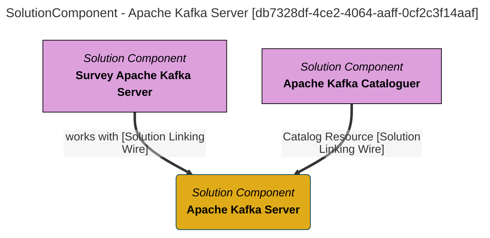

```mermaid
---
title: SolutionComponent - Apache Kafka Server [db7328df-4ce2-4064-aaff-0cf2c3f14aaf]
---
flowchart TD
%%{init: {"flowchart": {"htmlLabels": false}} }%%

1@{ shape: rounded, label: "*Solution Component*
**Apache Kafka Server**"}
2@{ shape: rect, label: "*Solution Component*
**Survey Apache Kafka Server**"}
2==>|"works with [Solution Linking Wire]"|1
3@{ shape: rect, label: "*Solution Component*
**Apache Kafka Cataloguer**"}
3==>|"Catalog Resource [Solution Linking Wire]"|1
style 1 color:#000000, fill:#e0ab18, stroke:#004563
style 2 color:#000000, fill:#dda0dd, stroke:#000000
style 3 color:#000000, fill:#dda0dd, stroke:#000000
click 1 "https://kafka.apache.org/" "Click for more documentation" _blank
click 2 "https://egeria-project.org/concepts/governance-action-type/" "Click for more documentation" _blank
click 3 "https://egeria-project.org/concepts/integration-connector/" "Click for more documentation" _blank
```
> Apache Kafka Server: A software server supporting an event broker that enables high-speed, reliable topic-based event exchange. (Extracted from 6.0-SNAPSHOT)
