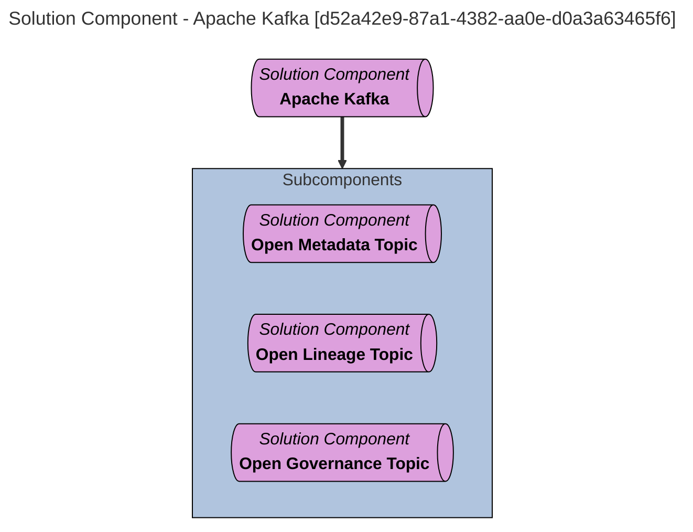

```mermaid
---
title: Solution Component - Apache Kafka [d52a42e9-87a1-4382-aa0e-d0a3a63465f6]
---
flowchart TD
%%{init: {"flowchart": {"htmlLabels": false}} }%%

1@{ shape: das, label: "*Solution Component*
**Apache Kafka**"}
subgraph 2 [Subcomponents]
3@{ shape: das, label: "*Solution Component*
**Open Metadata Topic**"}
4@{ shape: das, label: "*Solution Component*
**Open Lineage Topic**"}
5@{ shape: das, label: "*Solution Component*
**Open Governance Topic**"}
end
1==>2
style 1 color:#000000, fill:#dda0dd, stroke:#000000
style 2 color:#000000, fill:#b0c4de, stroke:#000000
style 3 color:#000000, fill:#dda0dd, stroke:#000000
style 4 color:#000000, fill:#dda0dd, stroke:#000000
style 5 color:#000000, fill:#dda0dd, stroke:#000000
click 1 "https://kafka.apache.org/" "Click for more documentation" _blank
click 3 "https://egeria-project.org/concepts/open-metadata-topic-connector/" "Click for more documentation" _blank
click 4 "https://egeria-project.org/features/lineage-management/overview/#egerias-open-lineage-support" "Click for more documentation" _blank
click 5 "https://egeria-project.org/concepts/open-metadata-topic-connector/" "Click for more documentation" _blank
```
> Apache Kafka: Manages a reliable topic based service. (Extracted from 6.0-SNAPSHOT)
