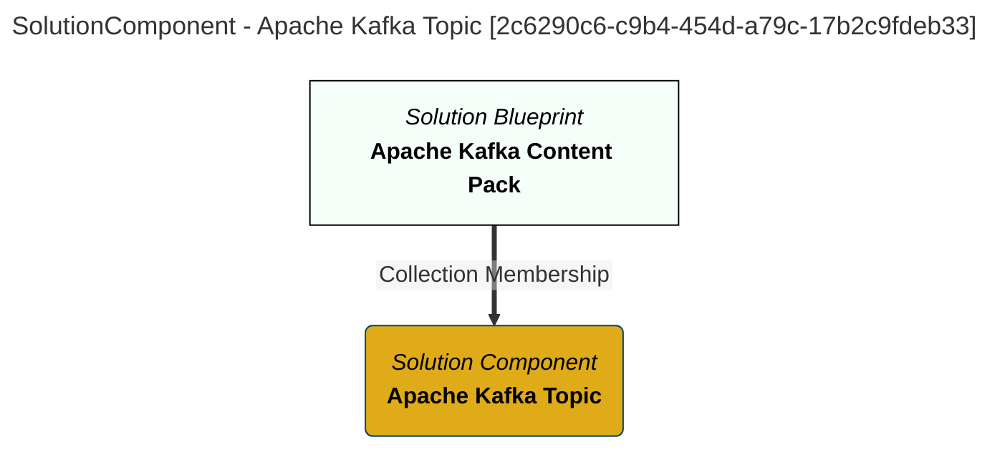

```mermaid
---
title: SolutionComponent - Apache Kafka Topic [2c6290c6-c9b4-454d-a79c-17b2c9fdeb33]
---
flowchart TD
%%{init: {"flowchart": {"htmlLabels": false}} }%%

1@{ shape: rounded, label: "*Solution Component*
**Apache Kafka Topic**"}
2@{ shape: rect, label: "*Solution Blueprint*
**Apache Kafka Content Pack**"}
2==>|"Collection Membership"|1
style 1 color:#000000, fill:#e0ab18, stroke:#004563
style 2 color:#000000, fill:#f5fffa, stroke:#000000
click 1 "https://kafka.apache.org/" "Click for more documentation" _blank
```
> Apache Kafka Topic: An event topic supporting high-speed, reliable event exchange. (Extracted from 6.0-SNAPSHOT)
