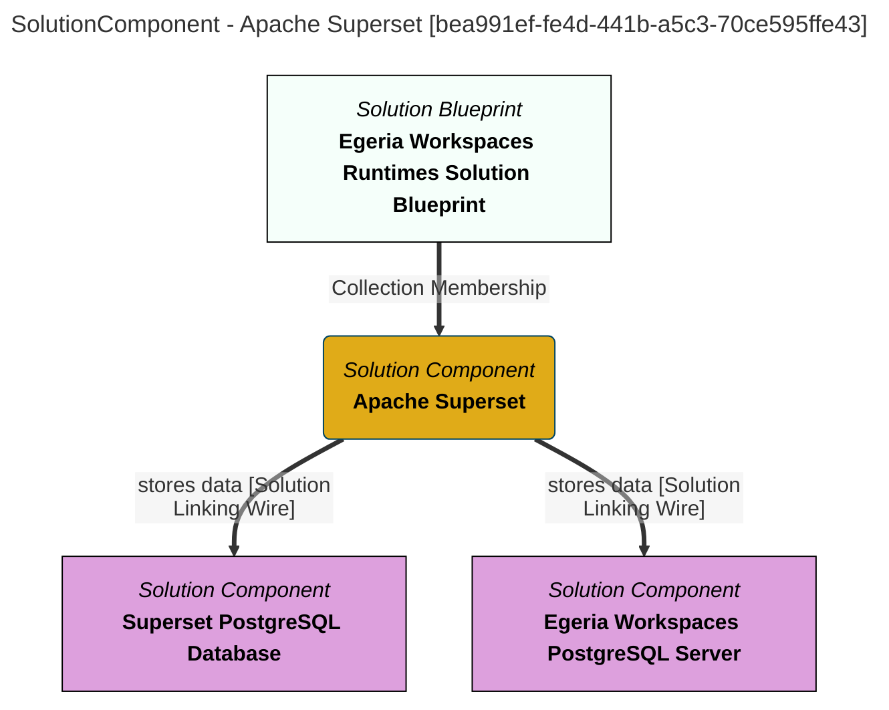

```mermaid
---
title: SolutionComponent - Apache Superset [bea991ef-fe4d-441b-a5c3-70ce595ffe43]
---
flowchart TD
%%{init: {"flowchart": {"htmlLabels": false}} }%%

1@{ shape: rounded, label: "*Solution Component*
**Apache Superset**"}
2@{ shape: rect, label: "*Solution Blueprint*
**Egeria Workspaces Runtimes Solution Blueprint**"}
2==>|"Collection Membership"|1
3@{ shape: rect, label: "*Solution Component*
**Superset PostgreSQL Database**"}
1==>|"stores data [Solution Linking Wire]"|3
4@{ shape: rect, label: "*Solution Component*
**Egeria Workspaces PostgreSQL Server**"}
1==>|"stores data [Solution Linking Wire]"|4
style 1 color:#000000, fill:#e0ab18, stroke:#004563
style 2 color:#000000, fill:#f5fffa, stroke:#000000
style 3 color:#000000, fill:#dda0dd, stroke:#000000
style 4 color:#000000, fill:#dda0dd, stroke:#000000
click 1 "https://superset.apache.org/" "Click for more documentation" _blank
click 3 "https://www.postgresql.org/" "Click for more documentation" _blank
click 4 "https://www.postgresql.org/" "Click for more documentation" _blank
```
> Apache Superset: Manages the definition and display of reports. (Extracted from 6.0-SNAPSHOT)
