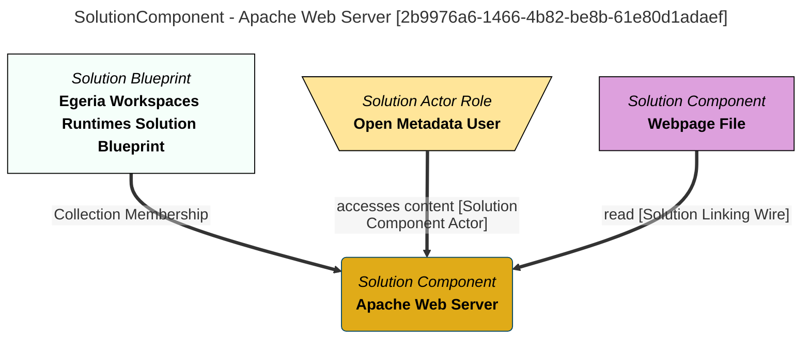

```mermaid
---
title: SolutionComponent - Apache Web Server [2b9976a6-1466-4b82-be8b-61e80d1adaef]
---
flowchart TD
%%{init: {"flowchart": {"htmlLabels": false}} }%%

1@{ shape: rounded, label: "*Solution Component*
**Apache Web Server**"}
2@{ shape: rect, label: "*Solution Blueprint*
**Egeria Workspaces Runtimes Solution Blueprint**"}
2==>|"Collection Membership"|1
3@{ shape: trap-t, label: "*Solution Actor Role*
**Open Metadata User**"}
3==>|"accesses content [Solution Component Actor]"|1
4@{ shape: rect, label: "*Solution Component*
**Webpage File**"}
4==>|"read [Solution Linking Wire]"|1
style 1 color:#000000, fill:#e0ab18, stroke:#004563
style 2 color:#000000, fill:#f5fffa, stroke:#000000
style 3 color:#000000, fill:#FFE599, stroke:#000000
style 4 color:#000000, fill:#dda0dd, stroke:#000000
click 1 "https://httpd.apache.org/" "Click for more documentation" _blank
click 4 "https://en.wikipedia.org/wiki/HTML" "Click for more documentation" _blank
```
> Apache Web Server: Services HTML documents written to the file system. (Extracted from 6.0-SNAPSHOT)
