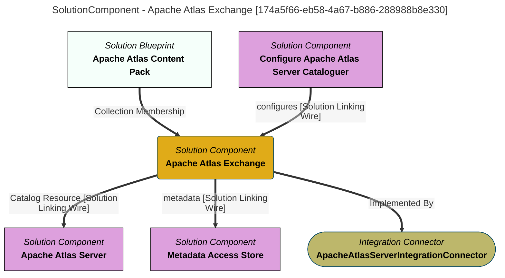

```mermaid
---
title: SolutionComponent - Apache Atlas Exchange [174a5f66-eb58-4a67-b886-288988b8e330]
---
flowchart TD
%%{init: {"flowchart": {"htmlLabels": false}} }%%

1@{ shape: rounded, label: "*Solution Component*
**Apache Atlas Exchange**"}
2@{ shape: rect, label: "*Solution Blueprint*
**Apache Atlas Content Pack**"}
2==>|"Collection Membership"|1
3@{ shape: rect, label: "*Solution Component*
**Configure Apache Atlas Server Cataloguer**"}
3==>|"configures [Solution Linking Wire]"|1
4@{ shape: rect, label: "*Solution Component*
**Apache Atlas Server**"}
1==>|"Catalog Resource [Solution Linking Wire]"|4
5@{ shape: rect, label: "*Solution Component*
**Metadata Access Store**"}
1==>|"metadata [Solution Linking Wire]"|5
6@{ shape: stadium, label: "*Integration Connector*
**ApacheAtlasServerIntegrationConnector**"}
1==>|"Implemented By"|6
style 1 color:#000000, fill:#e0ab18, stroke:#004563
style 2 color:#000000, fill:#f5fffa, stroke:#000000
style 3 color:#000000, fill:#dda0dd, stroke:#000000
style 4 color:#000000, fill:#dda0dd, stroke:#000000
style 5 color:#000000, fill:#dda0dd, stroke:#000000
style 6 color:#000000, fill:#bdb76b, stroke:#004563
click 1 "https://egeria-project.org/concepts/integration-connector/" "Click for more documentation" _blank
click 3 "https://egeria-project.org/concepts/governance-action-type/" "Click for more documentation" _blank
click 4 "https://atlas.apache.org/" "Click for more documentation" _blank
click 5 "https://egeria-project.org/concepts/metadata-access-store/" "Click for more documentation" _blank
```
> Apache Atlas Exchange: Proves a two-way synchronization of metadata between the open metadata ecosystem and Apache Atlas servers. (Extracted from 6.0-SNAPSHOT)
