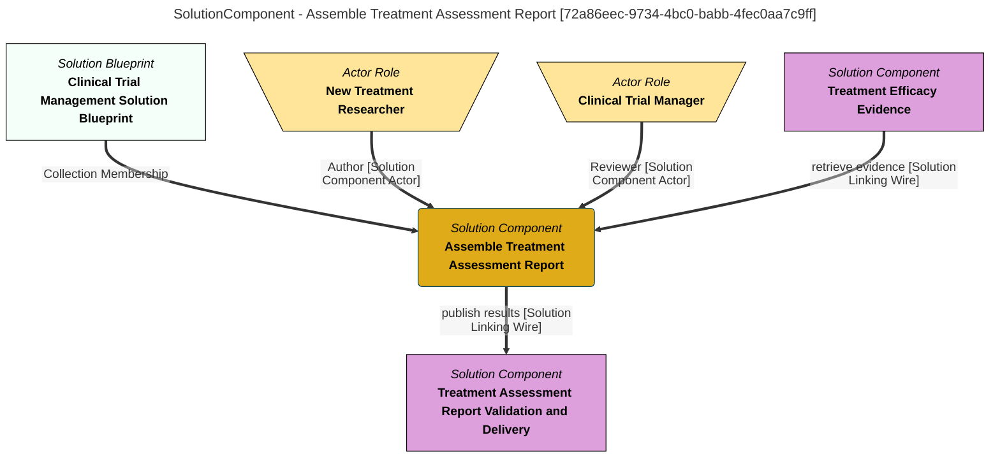

```mermaid
---
title: SolutionComponent - Assemble Treatment Assessment Report [72a86eec-9734-4bc0-babb-4fec0aa7c9ff]
---
flowchart TD
%%{init: {"flowchart": {"htmlLabels": false}} }%%

1@{ shape: rounded, label: "*Solution Component*
**Assemble Treatment Assessment Report**"}
2@{ shape: rect, label: "*Solution Blueprint*
**Clinical Trial Management Solution Blueprint**"}
2==>|"Collection Membership"|1
3@{ shape: trap-t, label: "*Actor Role*
**New Treatment Researcher**"}
3==>|"Author [Solution Component Actor]"|1
4@{ shape: trap-t, label: "*Actor Role*
**Clinical Trial Manager**"}
4==>|"Reviewer [Solution Component Actor]"|1
5@{ shape: rect, label: "*Solution Component*
**Treatment Efficacy Evidence**"}
5==>|"retrieve evidence [Solution Linking Wire]"|1
6@{ shape: rect, label: "*Solution Component*
**Treatment Assessment Report Validation and Delivery**"}
1==>|"publish results [Solution Linking Wire]"|6
style 1 color:#000000, fill:#e0ab18, stroke:#004563
style 2 color:#000000, fill:#f5fffa, stroke:#000000
style 3 color:#000000, fill:#FFE599, stroke:#000000
style 4 color:#000000, fill:#FFE599, stroke:#000000
style 5 color:#000000, fill:#dda0dd, stroke:#000000
style 6 color:#000000, fill:#dda0dd, stroke:#000000
```
> Assemble Treatment Assessment Report: A process of creating a filing report for the regulators detailing the findings from the clinical trial. (Extracted from V1.0)
