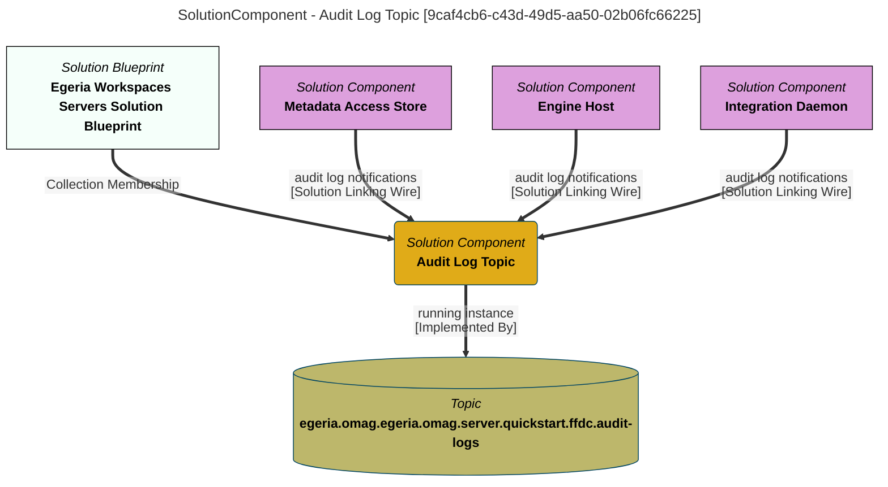

> Audit Log Topic: Provides notifications when audit log events of severity Error, Exception, Activity, Action, Decision, Security or Cohort are written to the audit log by registered OMAG Servers. (Extracted from 6.0-SNAPSHOT)
