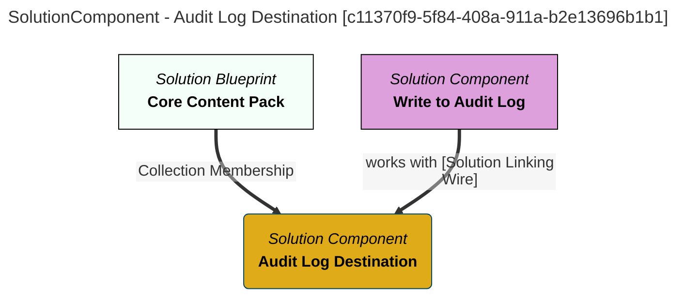

```mermaid
---
title: SolutionComponent - Audit Log Destination [c11370f9-5f84-408a-911a-b2e13696b1b1]
---
flowchart TD
%%{init: {"flowchart": {"htmlLabels": false}} }%%

1@{ shape: rounded, label: "*Solution Component*
**Audit Log Destination**"}
2@{ shape: rect, label: "*Solution Blueprint*
**Core Content Pack**"}
2==>|"Collection Membership"|1
3@{ shape: rect, label: "*Solution Component*
**Write to Audit Log**"}
3==>|"works with [Solution Linking Wire]"|1
style 1 color:#000000, fill:#e0ab18, stroke:#004563
style 2 color:#000000, fill:#f5fffa, stroke:#000000
style 3 color:#000000, fill:#dda0dd, stroke:#000000
click 1 "https://egeria-project.org/concepts/audit-log/" "Click for more documentation" _blank
click 3 "https://egeria-project.org/concepts/governance-action-type/" "Click for more documentation" _blank
```
> Audit Log Destination: Reads and writes records to the Open Metadata Repository Services (OMRS) audit log. (Extracted from 6.0-SNAPSHOT)
