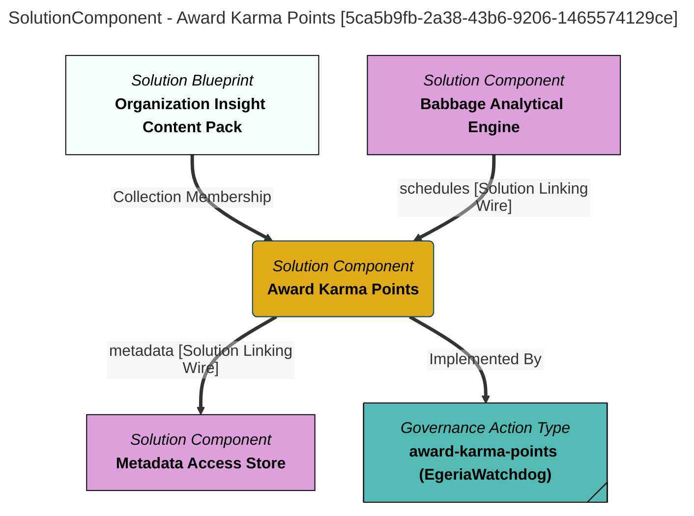

```mermaid
---
title: SolutionComponent - Award Karma Points [5ca5b9fb-2a38-43b6-9206-1465574129ce]
---
flowchart TD
%%{init: {"flowchart": {"htmlLabels": false}} }%%

1@{ shape: rounded, label: "*Solution Component*
**Award Karma Points**"}
2@{ shape: rect, label: "*Solution Blueprint*
**Organization Insight Content Pack**"}
2==>|"Collection Membership"|1
3@{ shape: rect, label: "*Solution Component*
**Babbage Analytical Engine**"}
3==>|"schedules [Solution Linking Wire]"|1
4@{ shape: rect, label: "*Solution Component*
**Metadata Access Store**"}
1==>|"metadata [Solution Linking Wire]"|4
5@{ shape: tag-rect, label: "*Governance Action Type*
**award-karma-points (EgeriaWatchdog)**"}
1==>|"Implemented By"|5
style 1 color:#000000, fill:#e0ab18, stroke:#004563
style 2 color:#000000, fill:#f5fffa, stroke:#000000
style 3 color:#000000, fill:#dda0dd, stroke:#000000
style 4 color:#000000, fill:#dda0dd, stroke:#000000
style 5 color:#000000, fill:#53bbb4, stroke:#000000
click 1 "https://egeria-project.org/concepts/governance-action-type/" "Click for more documentation" _blank
click 3 "https://egeria-project.org/concepts/integration-connector/" "Click for more documentation" _blank
click 4 "https://egeria-project.org/concepts/metadata-access-store/" "Click for more documentation" _blank
```
> Award Karma Points: Monitors contributions to the open metadata ecosystem and awards karma points to the users responsible. (Extracted from 6.0-SNAPSHOT)
