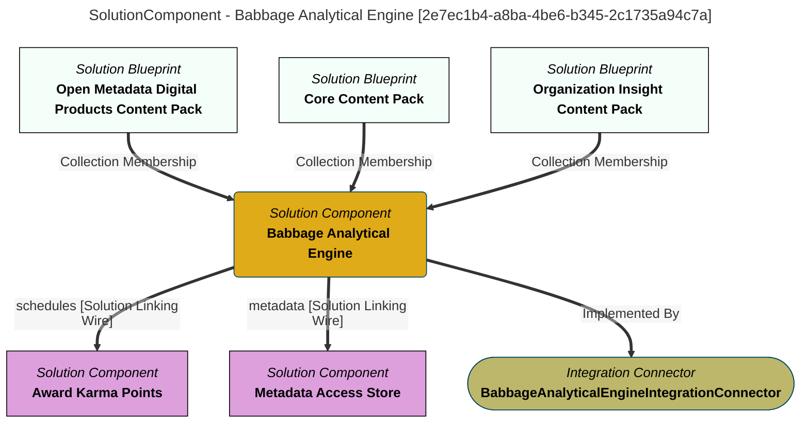

> Babbage Analytical Engine: Initiates analytical processing that generates statistics on the content and operation of the open metadata ecosystem.  The analytical processors are called lovelace analytical services. (Extracted from 6.0-SNAPSHOT)
