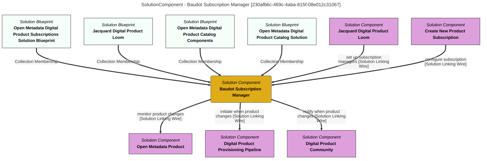

```mermaid
---
title: SolutionComponent - Baudot Subscription Manager [230afb6c-469c-4aba-815f-08e012c31067]
---
flowchart TD
%%{init: {"flowchart": {"htmlLabels": false}} }%%

1@{ shape: rounded, label: "*Solution Component*
**Baudot Subscription Manager**"}
2@{ shape: rect, label: "*Solution Blueprint*
**Open Metadata Digital Product Subscriptions Solution Blueprint**"}
2==>|"Collection Membership"|1
3@{ shape: rect, label: "*Solution Blueprint*
**Jacquard Digital Product Loom**"}
3==>|"Collection Membership"|1
4@{ shape: rect, label: "*Solution Blueprint*
**Open Metadata Digital Product Catalog Components**"}
4==>|"Collection Membership"|1
5@{ shape: rect, label: "*Solution Blueprint*
**Open Metadata Digital Product Catalog Solution**"}
5==>|"Collection Membership"|1
6@{ shape: rect, label: "*Solution Component*
**Open Metadata Product**"}
1==>|"monitor product changes [Solution Linking Wire]"|6
7@{ shape: rect, label: "*Solution Component*
**Digital Product Provisioning Pipeline**"}
1==>|"initiate when product changes [Solution Linking Wire]"|7
8@{ shape: rect, label: "*Solution Component*
**Jacquard Digital Product Loom**"}
8==>|"set up subscription managers [Solution Linking Wire]"|1
9@{ shape: rect, label: "*Solution Component*
**Create New Product Subscription**"}
9==>|"configure subscription [Solution Linking Wire]"|1
10@{ shape: rect, label: "*Solution Component*
**Digital Product Community**"}
1==>|"notify when product changes [Solution Linking Wire]"|10
style 1 color:#000000, fill:#e0ab18, stroke:#004563
style 2 color:#000000, fill:#f5fffa, stroke:#000000
style 3 color:#000000, fill:#f5fffa, stroke:#000000
style 4 color:#000000, fill:#f5fffa, stroke:#000000
style 5 color:#000000, fill:#f5fffa, stroke:#000000
style 6 color:#000000, fill:#dda0dd, stroke:#000000
style 7 color:#000000, fill:#dda0dd, stroke:#000000
style 8 color:#000000, fill:#dda0dd, stroke:#000000
style 9 color:#000000, fill:#dda0dd, stroke:#000000
style 10 color:#000000, fill:#dda0dd, stroke:#000000
```
> Baudot Subscription Manager: This is the service that monitors for changes in registered products and notifies subscribers when changes occur. (Extracted from 6.0-SNAPSHOT)
