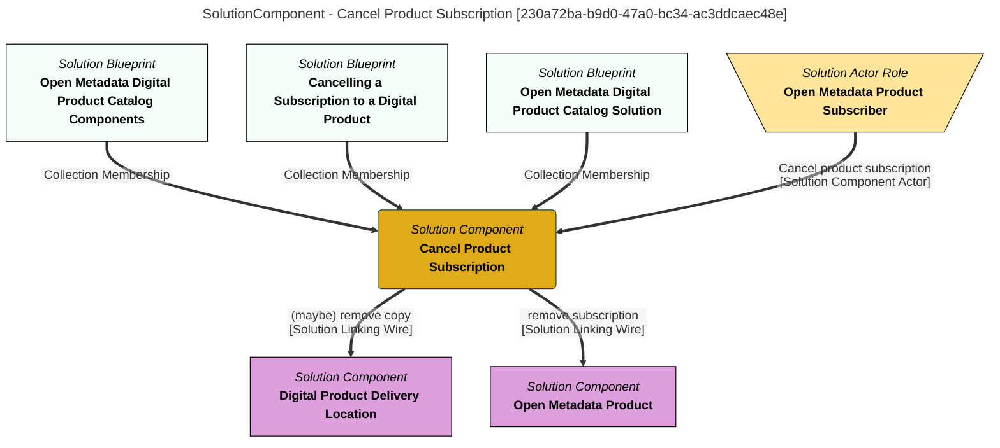

```mermaid
---
title: SolutionComponent - Cancel Product Subscription [230a72ba-b9d0-47a0-bc34-ac3ddcaec48e]
---
flowchart TD
%%{init: {"flowchart": {"htmlLabels": false}} }%%

1@{ shape: rounded, label: "*Solution Component*
**Cancel Product Subscription**"}
2@{ shape: rect, label: "*Solution Blueprint*
**Open Metadata Digital Product Catalog Components**"}
2==>|"Collection Membership"|1
3@{ shape: rect, label: "*Solution Blueprint*
**Cancelling a Subscription to a Digital Product**"}
3==>|"Collection Membership"|1
4@{ shape: rect, label: "*Solution Blueprint*
**Open Metadata Digital Product Catalog Solution**"}
4==>|"Collection Membership"|1
5@{ shape: trap-t, label: "*Solution Actor Role*
**Open Metadata Product Subscriber**"}
5==>|"Cancel product subscription [Solution Component Actor]"|1
6@{ shape: rect, label: "*Solution Component*
**Digital Product Delivery Location**"}
1==>|"(maybe) remove copy [Solution Linking Wire]"|6
7@{ shape: rect, label: "*Solution Component*
**Open Metadata Product**"}
1==>|"remove subscription [Solution Linking Wire]"|7
style 1 color:#000000, fill:#e0ab18, stroke:#004563
style 2 color:#000000, fill:#f5fffa, stroke:#000000
style 3 color:#000000, fill:#f5fffa, stroke:#000000
style 4 color:#000000, fill:#f5fffa, stroke:#000000
style 5 color:#000000, fill:#FFE599, stroke:#000000
style 6 color:#000000, fill:#dda0dd, stroke:#000000
style 7 color:#000000, fill:#dda0dd, stroke:#000000
```
> Cancel Product Subscription: The process of cancelling an existing consumer''s subscription to a digital product. (Extracted from 6.0-SNAPSHOT)
