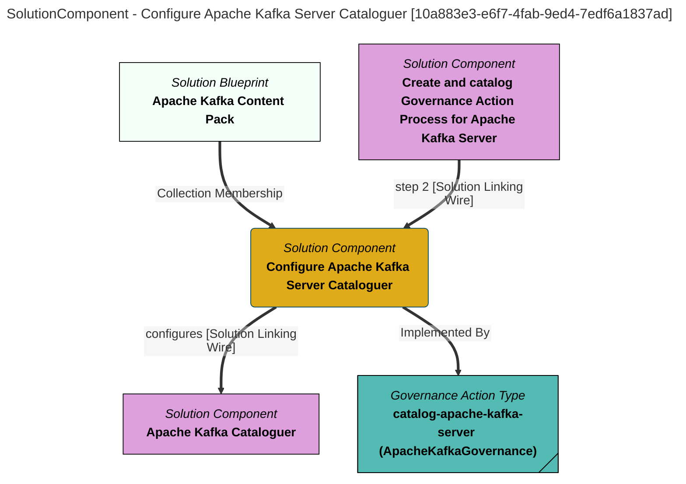

```mermaid
---
title: SolutionComponent - Configure Apache Kafka Server Cataloguer [10a883e3-e6f7-4fab-9ed4-7edf6a1837ad]
---
flowchart TD
%%{init: {"flowchart": {"htmlLabels": false}} }%%

1@{ shape: rounded, label: "*Solution Component*
**Configure Apache Kafka Server Cataloguer**"}
2@{ shape: rect, label: "*Solution Blueprint*
**Apache Kafka Content Pack**"}
2==>|"Collection Membership"|1
3@{ shape: rect, label: "*Solution Component*
**Apache Kafka Cataloguer**"}
1==>|"configures [Solution Linking Wire]"|3
4@{ shape: rect, label: "*Solution Component*
**Create and catalog Governance Action Process for Apache Kafka Server**"}
4==>|"step 2 [Solution Linking Wire]"|1
5@{ shape: tag-rect, label: "*Governance Action Type*
**catalog-apache-kafka-server (ApacheKafkaGovernance)**"}
1==>|"Implemented By"|5
style 1 color:#000000, fill:#e0ab18, stroke:#004563
style 2 color:#000000, fill:#f5fffa, stroke:#000000
style 3 color:#000000, fill:#dda0dd, stroke:#000000
style 4 color:#000000, fill:#dda0dd, stroke:#000000
style 5 color:#000000, fill:#53bbb4, stroke:#000000
click 1 "https://egeria-project.org/concepts/governance-action-type/" "Click for more documentation" _blank
click 3 "https://egeria-project.org/concepts/integration-connector/" "Click for more documentation" _blank
click 4 "https://egeria-project.org/egeria-solutions/leveraging-apache-kafka/overview/" "Click for more documentation" _blank
```
> Configure Apache Kafka Server Cataloguer: Link the Apache Kafka server asset to the Apache Kafka Server cataloguer. (Extracted from 6.0-SNAPSHOT)
