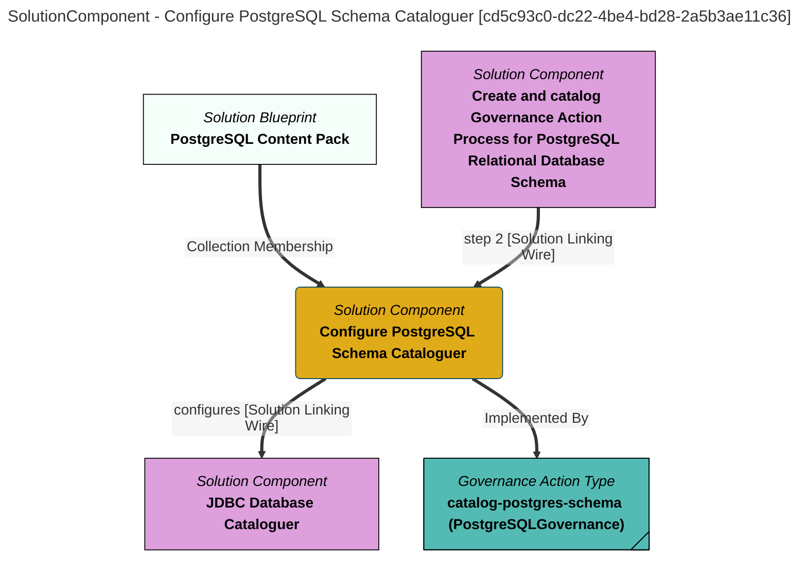

```mermaid
---
title: SolutionComponent - Configure PostgreSQL Schema Cataloguer [cd5c93c0-dc22-4be4-bd28-2a5b3ae11c36]
---
flowchart TD
%%{init: {"flowchart": {"htmlLabels": false}} }%%

1@{ shape: rounded, label: "*Solution Component*
**Configure PostgreSQL Schema Cataloguer**"}
2@{ shape: rect, label: "*Solution Blueprint*
**PostgreSQL Content Pack**"}
2==>|"Collection Membership"|1
3@{ shape: rect, label: "*Solution Component*
**JDBC Database Cataloguer**"}
1==>|"configures [Solution Linking Wire]"|3
4@{ shape: rect, label: "*Solution Component*
**Create and catalog Governance Action Process for PostgreSQL Relational Database Schema**"}
4==>|"step 2 [Solution Linking Wire]"|1
5@{ shape: tag-rect, label: "*Governance Action Type*
**catalog-postgres-schema (PostgreSQLGovernance)**"}
1==>|"Implemented By"|5
style 1 color:#000000, fill:#e0ab18, stroke:#004563
style 2 color:#000000, fill:#f5fffa, stroke:#000000
style 3 color:#000000, fill:#dda0dd, stroke:#000000
style 4 color:#000000, fill:#dda0dd, stroke:#000000
style 5 color:#000000, fill:#53bbb4, stroke:#000000
click 1 "https://egeria-project.org/concepts/governance-action-type/" "Click for more documentation" _blank
click 3 "https://egeria-project.org/concepts/integration-connector/" "Click for more documentation" _blank
click 4 "https://egeria-project.org/egeria-solutions/leveraging-postgres/overview/" "Click for more documentation" _blank
```
> Configure PostgreSQL Schema Cataloguer: Link the PostgreSQL schema asset to the PostgreSQL Schema cataloguer. (Extracted from 6.0-SNAPSHOT)
