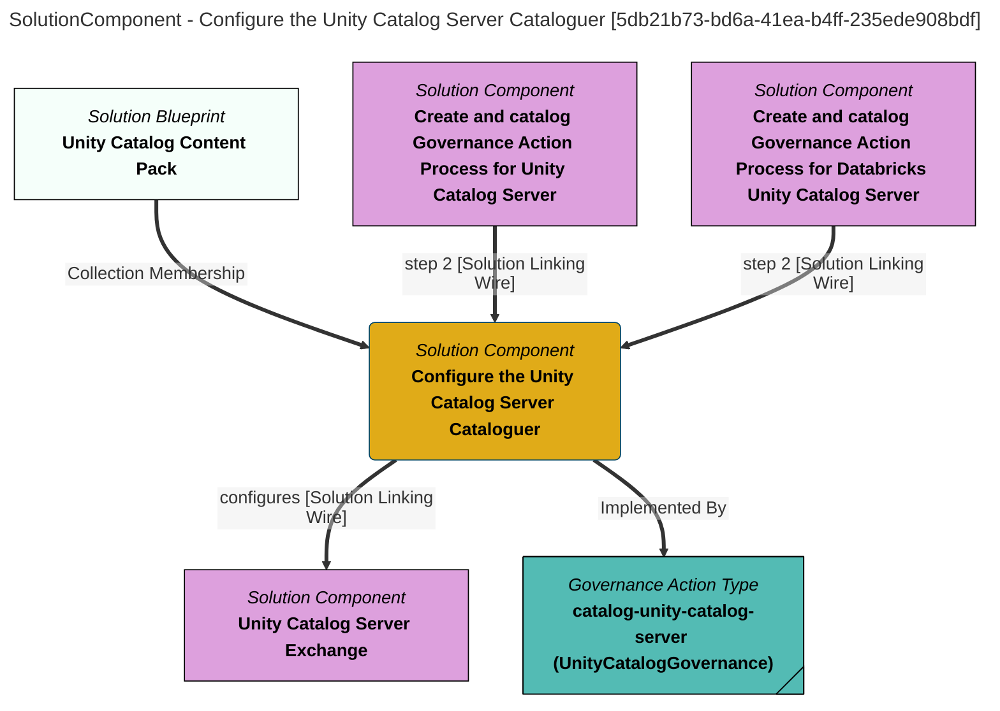

```mermaid
---
title: SolutionComponent - Configure the Unity Catalog Server Cataloguer [5db21b73-bd6a-41ea-b4ff-235ede908bdf]
---
flowchart TD
%%{init: {"flowchart": {"htmlLabels": false}} }%%

1@{ shape: rounded, label: "*Solution Component*
**Configure the Unity Catalog Server Cataloguer**"}
2@{ shape: rect, label: "*Solution Blueprint*
**Unity Catalog Content Pack**"}
2==>|"Collection Membership"|1
3@{ shape: rect, label: "*Solution Component*
**Create and catalog Governance Action Process for Unity Catalog Server**"}
3==>|"step 2 [Solution Linking Wire]"|1
4@{ shape: rect, label: "*Solution Component*
**Unity Catalog Server Exchange**"}
1==>|"configures [Solution Linking Wire]"|4
5@{ shape: rect, label: "*Solution Component*
**Create and catalog Governance Action Process for Databricks Unity Catalog Server**"}
5==>|"step 2 [Solution Linking Wire]"|1
6@{ shape: tag-rect, label: "*Governance Action Type*
**catalog-unity-catalog-server (UnityCatalogGovernance)**"}
1==>|"Implemented By"|6
style 1 color:#000000, fill:#e0ab18, stroke:#004563
style 2 color:#000000, fill:#f5fffa, stroke:#000000
style 3 color:#000000, fill:#dda0dd, stroke:#000000
style 4 color:#000000, fill:#dda0dd, stroke:#000000
style 5 color:#000000, fill:#dda0dd, stroke:#000000
style 6 color:#000000, fill:#53bbb4, stroke:#000000
click 1 "https://egeria-project.org/concepts/governance-action-type/" "Click for more documentation" _blank
click 3 "https://egeria-project.org/egeria-solutions/leveraging-unity-catalog/overview/" "Click for more documentation" _blank
click 4 "https://egeria-project.org/concepts/integration-connector/" "Click for more documentation" _blank
click 5 "https://egeria-project.org/egeria-solutions/leveraging-unity-catalog/overview/" "Click for more documentation" _blank
```
> Configure the Unity Catalog Server Cataloguer: Link the Unity Catalog Server asset to the Unity Catalog Server cataloguer. (Extracted from 6.0-SNAPSHOT)
