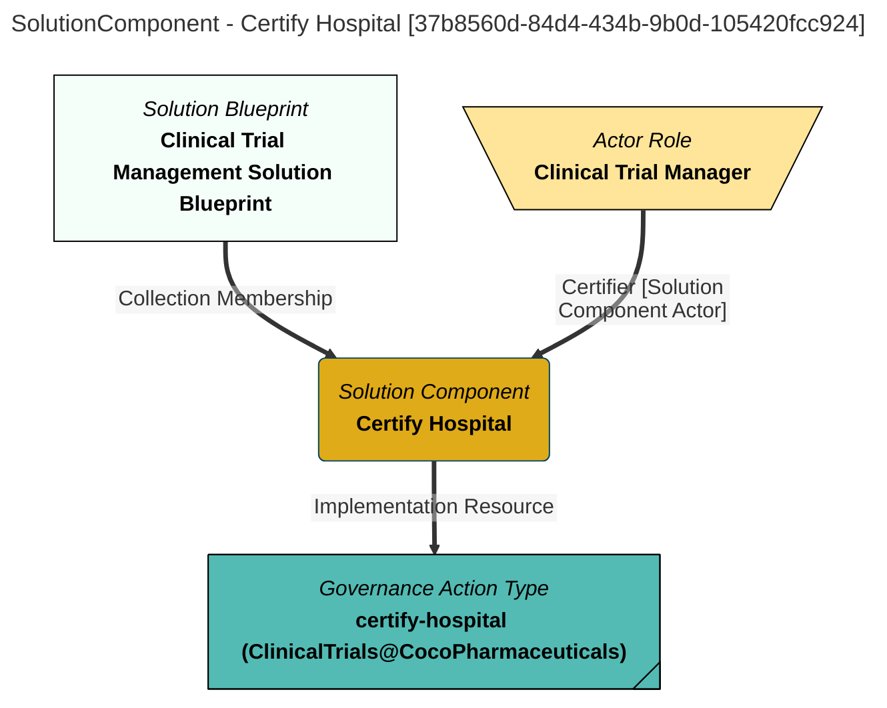

```mermaid
---
title: SolutionComponent - Certify Hospital [37b8560d-84d4-434b-9b0d-105420fcc924]
---
flowchart TD
%%{init: {"flowchart": {"htmlLabels": false}} }%%

1@{ shape: rounded, label: "*Solution Component*
**Certify Hospital**"}
2@{ shape: rect, label: "*Solution Blueprint*
**Clinical Trial Management Solution Blueprint**"}
2==>|"Collection Membership"|1
3@{ shape: trap-t, label: "*Actor Role*
**Clinical Trial Manager**"}
3==>|"Certifier [Solution Component Actor]"|1
4@{ shape: tag-rect, label: "*Governance Action Type*
**certify-hospital (ClinicalTrials@CocoPharmaceuticals)**"}
1==>|"Implementation Resource"|4
style 1 color:#000000, fill:#e0ab18, stroke:#004563
style 2 color:#000000, fill:#f5fffa, stroke:#000000
style 3 color:#000000, fill:#FFE599, stroke:#000000
style 4 color:#000000, fill:#53bbb4, stroke:#000000
```
> Certify Hospital: Confirm that a hospital has met all of the criteria to participate in the clinical trial. (Extracted from V1.0)
