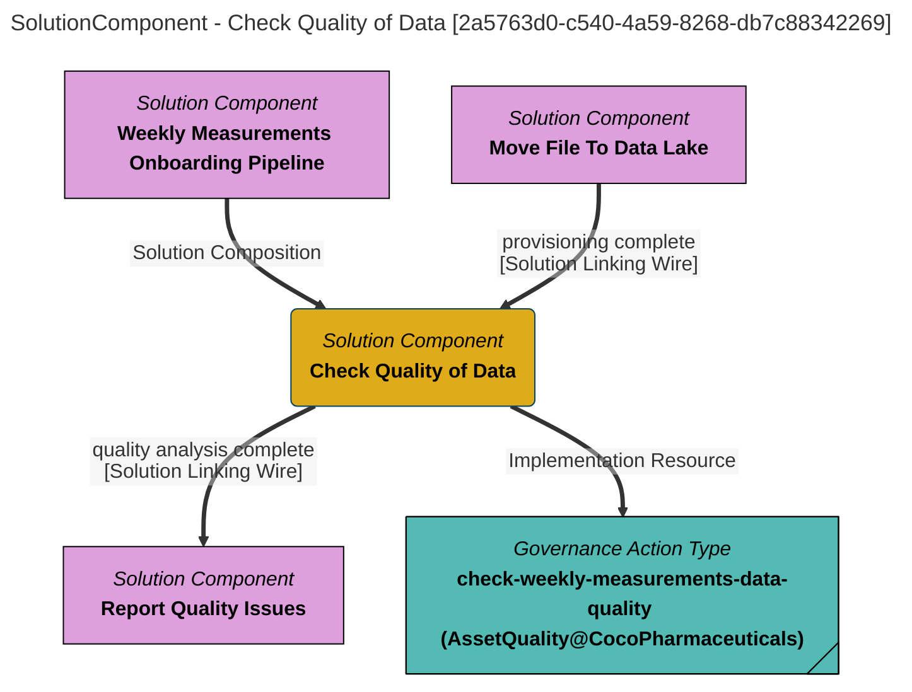

> Check Quality of Data: Validate that the data contains valid values. The quality validation survey will add a certification to the file asset if the data contains valid values. (Extracted from V1.0)
