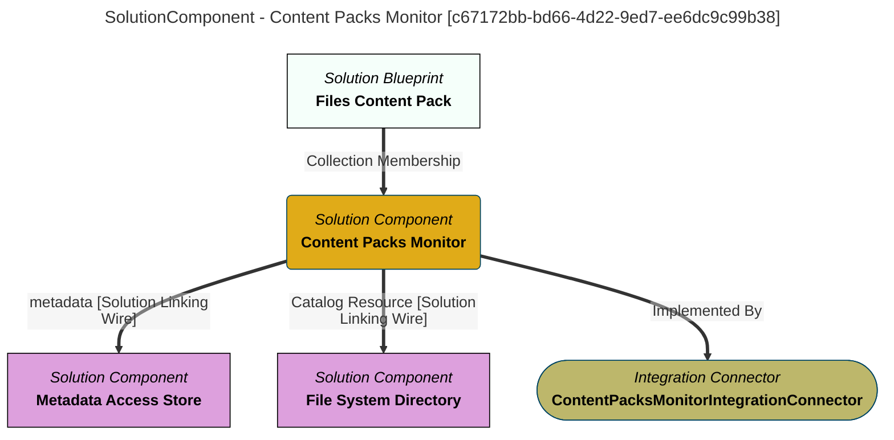

> Content Packs Monitor: Catalogs open metadata archive files located in the ''content-packs'' directory.  This includes cataloguing the header information from the archive file.  This includes a description of its content.  The resulting open metadata elements are used to list the content packs that are available to load into the Open Metadata Ecosystem. (Extracted from 6.0-SNAPSHOT)
