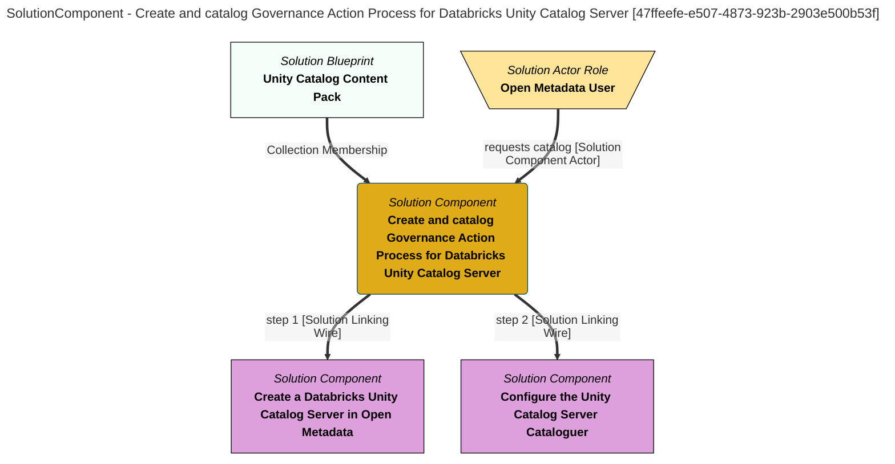

> Create and catalog Governance Action Process for Databricks Unity Catalog Server: Create a Databricks Unity Catalog Server and configure an integration connector to catalog its contents. (Extracted from 6.0-SNAPSHOT)
