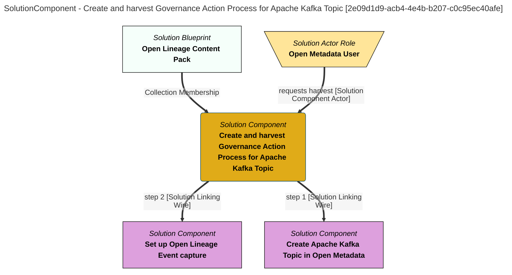

```mermaid
---
title: SolutionComponent - Create and harvest Governance Action Process for Apache Kafka Topic [2e09d1d9-acb4-4e4b-b207-c0c95ec40afe]
---
flowchart TD
%%{init: {"flowchart": {"htmlLabels": false}} }%%

1@{ shape: rounded, label: "*Solution Component*
**Create and harvest Governance Action Process for Apache Kafka Topic**"}
2@{ shape: rect, label: "*Solution Blueprint*
**Open Lineage Content Pack**"}
2==>|"Collection Membership"|1
3@{ shape: trap-t, label: "*Solution Actor Role*
**Open Metadata User**"}
3==>|"requests harvest [Solution Component Actor]"|1
4@{ shape: rect, label: "*Solution Component*
**Set up Open Lineage Event capture**"}
1==>|"step 2 [Solution Linking Wire]"|4
5@{ shape: rect, label: "*Solution Component*
**Create Apache Kafka Topic in Open Metadata**"}
1==>|"step 1 [Solution Linking Wire]"|5
style 1 color:#000000, fill:#e0ab18, stroke:#004563
style 2 color:#000000, fill:#f5fffa, stroke:#000000
style 3 color:#000000, fill:#FFE599, stroke:#000000
style 4 color:#000000, fill:#dda0dd, stroke:#000000
style 5 color:#000000, fill:#dda0dd, stroke:#000000
click 1 "https://egeria-project.org/egeria-solutions/leveraging-open-lineage/overview/" "Click for more documentation" _blank
click 4 "https://egeria-project.org/concepts/governance-action-type/" "Click for more documentation" _blank
click 5 "https://egeria-project.org/concepts/governance-action-type/" "Click for more documentation" _blank
```
> Create and harvest Governance Action Process for Apache Kafka Topic: Create a Apache Kafka Topic and configure an integration connector to harvest its contents. (Extracted from 6.0-SNAPSHOT)
