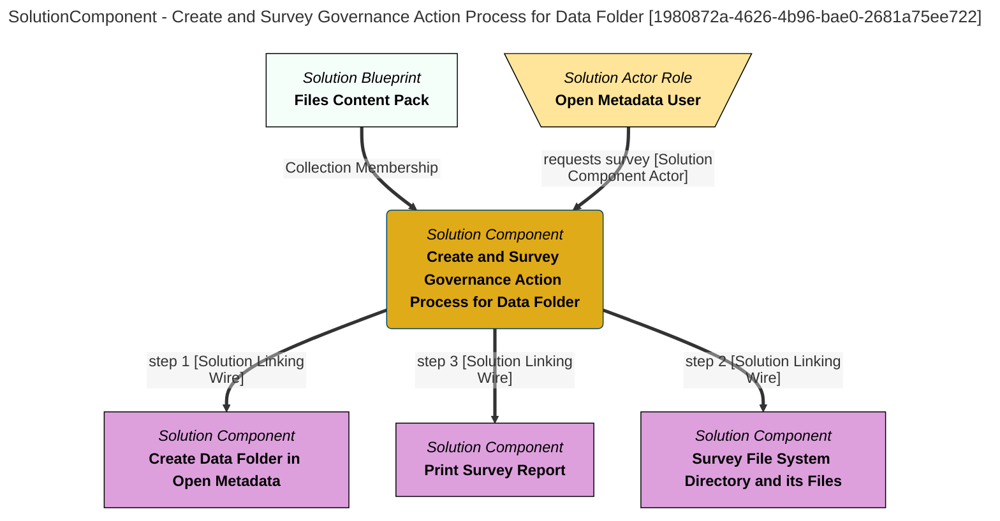

```mermaid
---
title: SolutionComponent - Create and Survey Governance Action Process for Data Folder [1980872a-4626-4b96-bae0-2681a75ee722]
---
flowchart TD
%%{init: {"flowchart": {"htmlLabels": false}} }%%

1@{ shape: rounded, label: "*Solution Component*
**Create and Survey Governance Action Process for Data Folder**"}
2@{ shape: rect, label: "*Solution Blueprint*
**Files Content Pack**"}
2==>|"Collection Membership"|1
3@{ shape: trap-t, label: "*Solution Actor Role*
**Open Metadata User**"}
3==>|"requests survey [Solution Component Actor]"|1
4@{ shape: rect, label: "*Solution Component*
**Create Data Folder in Open Metadata**"}
1==>|"step 1 [Solution Linking Wire]"|4
5@{ shape: rect, label: "*Solution Component*
**Print Survey Report**"}
1==>|"step 3 [Solution Linking Wire]"|5
6@{ shape: rect, label: "*Solution Component*
**Survey File System Directory and its Files**"}
1==>|"step 2 [Solution Linking Wire]"|6
style 1 color:#000000, fill:#e0ab18, stroke:#004563
style 2 color:#000000, fill:#f5fffa, stroke:#000000
style 3 color:#000000, fill:#FFE599, stroke:#000000
style 4 color:#000000, fill:#dda0dd, stroke:#000000
style 5 color:#000000, fill:#dda0dd, stroke:#000000
style 6 color:#000000, fill:#dda0dd, stroke:#000000
click 1 "https://egeria-project.org/egeria-solutions/leveraging-files/overview/" "Click for more documentation" _blank
click 4 "https://egeria-project.org/concepts/governance-action-type/" "Click for more documentation" _blank
click 5 "https://egeria-project.org/concepts/governance-action-type/" "Click for more documentation" _blank
click 6 "https://egeria-project.org/concepts/governance-action-type/" "Click for more documentation" _blank
```
> Create and Survey Governance Action Process for Data Folder: Create a Data Folder, run a survey against it, and print out the resulting report. (Extracted from 6.0-SNAPSHOT)
