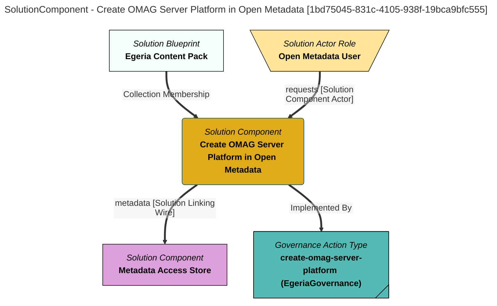

```mermaid
---
title: SolutionComponent - Create OMAG Server Platform in Open Metadata [1bd75045-831c-4105-938f-19bca9bfc555]
---
flowchart TD
%%{init: {"flowchart": {"htmlLabels": false}} }%%

1@{ shape: rounded, label: "*Solution Component*
**Create OMAG Server Platform in Open Metadata**"}
2@{ shape: rect, label: "*Solution Blueprint*
**Egeria Content Pack**"}
2==>|"Collection Membership"|1
3@{ shape: trap-t, label: "*Solution Actor Role*
**Open Metadata User**"}
3==>|"requests [Solution Component Actor]"|1
4@{ shape: rect, label: "*Solution Component*
**Metadata Access Store**"}
1==>|"metadata [Solution Linking Wire]"|4
5@{ shape: tag-rect, label: "*Governance Action Type*
**create-omag-server-platform (EgeriaGovernance)**"}
1==>|"Implemented By"|5
style 1 color:#000000, fill:#e0ab18, stroke:#004563
style 2 color:#000000, fill:#f5fffa, stroke:#000000
style 3 color:#000000, fill:#FFE599, stroke:#000000
style 4 color:#000000, fill:#dda0dd, stroke:#000000
style 5 color:#000000, fill:#53bbb4, stroke:#000000
click 1 "https://egeria-project.org/concepts/governance-action-type/" "Click for more documentation" _blank
click 4 "https://egeria-project.org/concepts/metadata-access-store/" "Click for more documentation" _blank
```
> Create OMAG Server Platform in Open Metadata: Create an asset that represents the platform. (Extracted from 6.0-SNAPSHOT)
