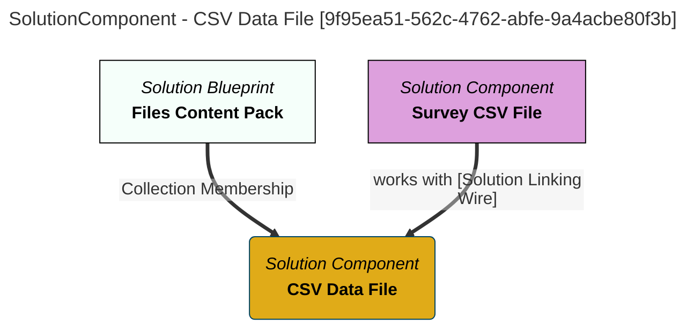

```mermaid
---
title: SolutionComponent - CSV Data File [9f95ea51-562c-4762-abfe-9a4acbe80f3b]
---
flowchart TD
%%{init: {"flowchart": {"htmlLabels": false}} }%%

1@{ shape: rounded, label: "*Solution Component*
**CSV Data File**"}
2@{ shape: rect, label: "*Solution Blueprint*
**Files Content Pack**"}
2==>|"Collection Membership"|1
3@{ shape: rect, label: "*Solution Component*
**Survey CSV File**"}
3==>|"works with [Solution Linking Wire]"|1
style 1 color:#000000, fill:#e0ab18, stroke:#004563
style 2 color:#000000, fill:#f5fffa, stroke:#000000
style 3 color:#000000, fill:#dda0dd, stroke:#000000
click 1 "https://egeria-project.org/types/2/0220-Files-and-Folders/" "Click for more documentation" _blank
click 3 "https://egeria-project.org/concepts/governance-action-type/" "Click for more documentation" _blank
```
> CSV Data File: A file containing comma-separated (or similar delimited) data. (Extracted from 6.0-SNAPSHOT)
