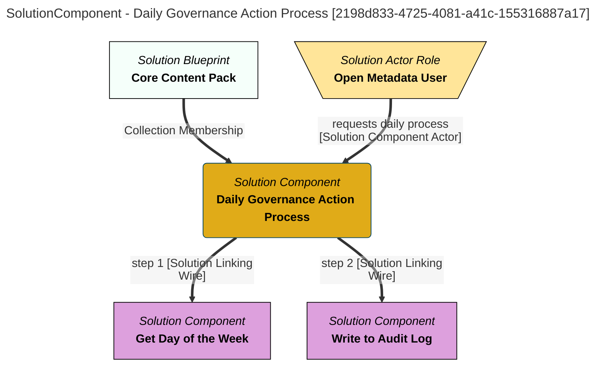

> Daily Governance Action Process: Determines which day of the week it is today, and puts out a message on the audit log matching the assigned task for the day of the week. (Extracted from 6.0-SNAPSHOT)
