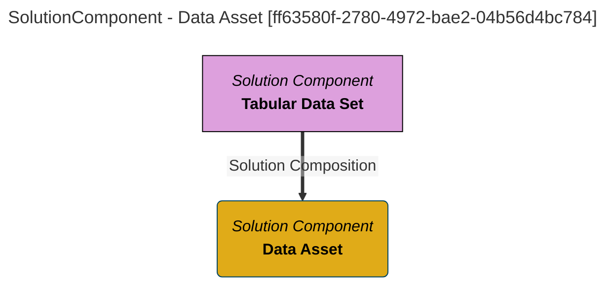

```mermaid
---
title: SolutionComponent - Data Asset [ff63580f-2780-4972-bae2-04b56d4bc784]
---
flowchart TD
%%{init: {"flowchart": {"htmlLabels": false}} }%%

1@{ shape: rounded, label: "*Solution Component*
**Data Asset**"}
2@{ shape: rect, label: "*Solution Component*
**Tabular Data Set**"}
2==>|"Solution Composition"|1
style 1 color:#000000, fill:#e0ab18, stroke:#004563
style 2 color:#000000, fill:#dda0dd, stroke:#000000
click 1 "https://egeria-project.org/concepts/asset/" "Click for more documentation" _blank
click 2 "https://egeria-project.org/concepts/tabular-data-set/" "Click for more documentation" _blank
```
> Data Asset: A collection of data, either at rest or in motion. (Extracted from 6.0-SNAPSHOT)
