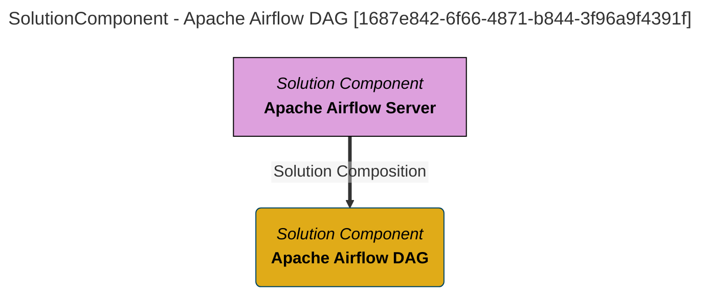

> Apache Airflow DAG: A python component that implements a micro-workflow that runs in Apache Airflow.  DAG stands for Directed Acyclic Graph, which describes the structure of its implementation. (Extracted from 6.0-SNAPSHOT)
